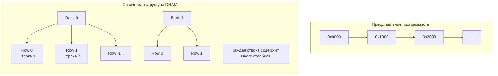
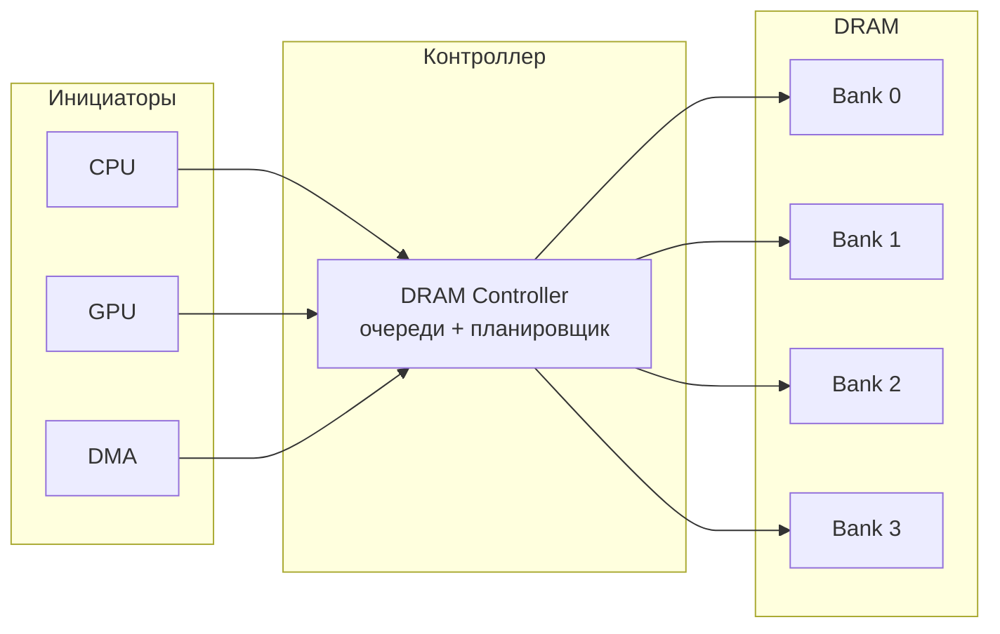
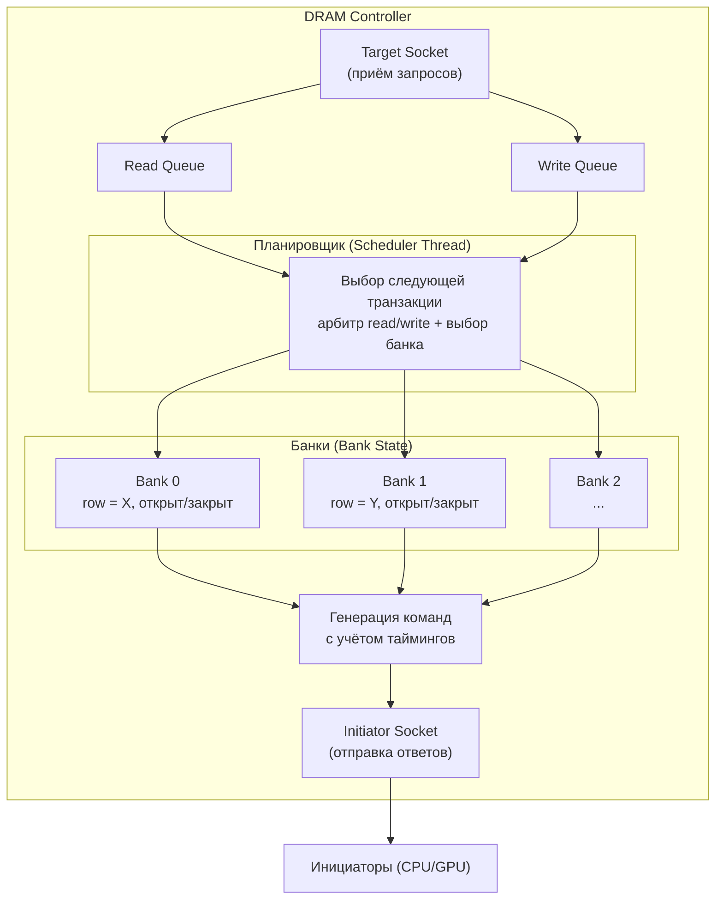
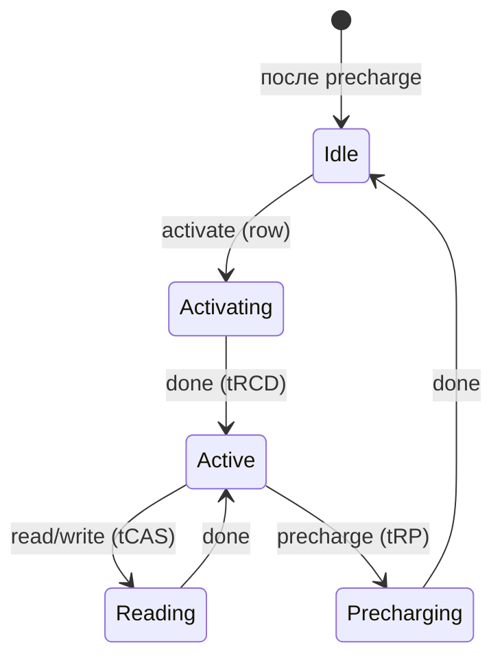
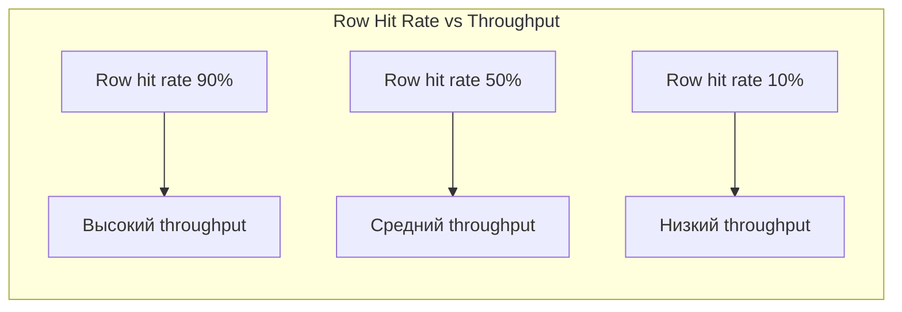
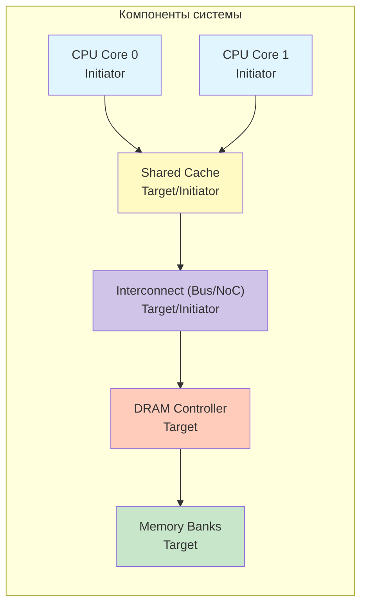
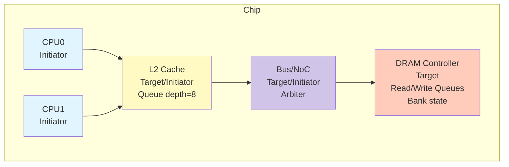

Моделирование вычислительных систем

# Каркас модели производительности

<div class="abs-b">
Москва 2026
</div>

<div class="abs-br m-6 text-xl">
  <a href="https://github.com/cesarus777/perf-modeling-lectures" target="_blank" class="slidev-icon-btn">
    <carbon:logo-github />
  </a>
</div>

<!--
любой не-trivial компонент (контроллер памяти, кэш, шина, акселератор) строится по единому шаблону "очередь + автомат + задержка"
-->

---

# Повторение

<div class="m-16"/>

На прошлом занятии мы рассмотерли простую модель памяти:
- Взять запрос
- Сделать `memcpy` и посчитать задержку
- Вернуть ответ

**Вопрос**: Что произойдет, если два процессора одновременно пошлют запросы в эту модель?

<!--
Вывод: Идеальная память не работает в реальной системе. Любое реальное устройство имеет ограниченный ресурс (порт, шина, внутренний конвейер).

Главный тезис лекции: Производительность рождается из конфликтов за эти ограниченные ресурсы. Чтобы моделировать производительность, нам нужно моделировать ожидание. А значит — нужны очереди.
-->

---

# Производительность == управление конфликтами

<div class="m-16"/>

- Один запрос: Latency = 10 ns
- Десять запросов подряд: Throughput = ?
- Если устройство может обрабатывать только один запрос за раз, то через каждые 10 ns — один ответ, пропускная способность = 100 млн запросов/сек
- Но если запросы приходят быстрее (каждые 5 ns), образуется очередь, latency для последнего запроса вырастет

<!--
В реальном мире производительность — это не только скорость обработки одного запроса, но и то, как система ведёт себя под нагрузкой. Ключевое явление — конфликт за разделяемый ресурс. В нашем случае ресурс — это порт памяти, шина данных, внутренний конвейер. Пока ресурс занят, остальные запросы вынуждены ждать. Именно это ожидание и создаёт задержки, которые мы хотим моделировать.»

Если мы не моделируем очереди и конфликты, мы не увидим эффекта от изменения нагрузки. Мы не сможем ответить на вопрос: «Что произойдёт, если мы удвоим количество ядер?» Упадёт ли производительность из-за возросших конфликтов или шина справится?

Сегодня мы научимся строить модели, в которых есть внутренняя очередь и процесс-обработчик. Это базовый шаблон для любого компонента, который сталкивается с конфликтами.
-->

---
layout: two-cols-header
---

# Шаблон

<div class="m-16"/>

::left::

Queue + Processing Unit = Core of any performance model

<div class="m-8"/>

Сегодня рассмотрим:
- Как устроена очередь в TLM (PEQ)
- Как отделить приём запроса от его обработки
- Как параметризовать задержки

::right::

Универсальный шаблон перфоманс-моделей

<div class="m-8"/>

1. Входной порт
1. Очередь (PEQ)
1. Поток обработки (SC_THREAD)
1. Выходной порт

<!--
Итак, наша задача на сегодня — превратить «идеальную память» в реалистичную модель, которая умеет ставить запросы в очередь, обрабатывать их с разными задержками в зависимости от состояния и выдавать ответы. Мы разберём этот шаблон на примере контроллера DRAM — потому что он наглядно показывает, как состояние устройства влияет на задержки. После этой лекции вы сможете самостоятельно собрать модель любого блока: от простого FIFO до сложного кэша или сетевого интерфейса.

А теперь давайте заглянем под капот и разберём этот шаблон по косточкам: откуда берётся очередь, как её организовать в SystemC TLM 2.0 и как заставить её работать.
-->

---
layout: two-cols-header
---

# Четыре элемента шаблона

::left::

<div class="m-8"/>

1. Входной порт — точка приёма запросов (обычно `simple_target_socket`)
1. Очередь (PEQ) — буфер для временного хранения транзакций, которые не могут быть обработаны немедленно
1. Блок обработки — независимый поток (`SC_THREAD`), который забирает транзакции из очереди и моделирует работу устройства
1. Задержка — механизм симуляции времени (аннотация `sc_time` или `wait()`)

::right::

<div class="flex items-center justify-center h-full w-full">
  <div class="h-full">
    
  </div>
</div>

<!--
Этот шаблон — архитектурный паттерн для любого компонента, который обрабатывает запросы не мгновенно и может сталкиваться с перегрузкой. Он отделяет интерфейс (приём запросов) от реализации (обработка).

Входной порт должен быть максимально быстрым: его задача — принять транзакцию и, если возможно, поставить в очередь. Никакой длительной работы здесь быть не должно.

Очередь — это место, где запросы ждут своей очереди. Именно здесь возникает "обратное давление" (back-pressure). Если очередь переполнена, мы можем либо заблокировать отправителя, либо вернуть ошибку.

Блок обработки — "сердце" модели. Это отдельный поток, который живёт всё время симуляции. Он просыпается, когда в очереди появляются элементы, и начинает их обрабатывать один за другим.

Задержка определяет, сколько времени занимает обработка одной транзакции. В простейшем случае это константа, но в реальности она может зависеть от многих факторов. Мы рассмотрим это отдельно.
-->

---
layout: two-cols
---

# Входной порт и очередь

::left::

<div class="flex items-center justify-center h-full w-full">
  <div class="h-full">
    
  </div>
</div>

::right::

**Входной порт** (`b_transport`):
- Проверяет, есть ли место в очереди
- Помещает транзакцию в очередь вместе с текущей временной аннотацией
- Будит поток обработки (`notify()`)
- Немедленно возвращает управление

**Очередь** (PEQ):
- Хранит транзакции в порядке поступления (FIFO) или с приоритетом
- Позволяет планировать обработку на определённое время (с помощью `peq_with_get`)
- Снимает "обратное давление": инициатор не блокируется на время обработки

---

# Входной порт и очередь

<div class="m-16"/>

```cpp
// Входной порт (b_transport)
void Memory::b_transport(tlm_gp& trans, sc_time& delay) {
    if (queue.size() >= max_queue_size) {
        trans.set_response_status(TLM_GENERIC_ERROR_RESPONSE);
        return; // или wait(free_slot)
    }
    queue.push_back(trans, delay);  // сохраняем транзакцию и время
    process_event.notify();         // будим поток обработки
    // возвращаемся, ничего не ждём!
}
```

<!--
Обратите внимание: b_transport возвращается практически мгновенно. Вся тяжёлая работа происходит в фоновом потоке.

Очередь в TLM 2.0 реализована через специальный класс tlm_utils::peq_with_get. Это "payload event queue", которая позволяет хранить транзакции и автоматически планировать их доставку в будущем с заданной задержкой. Но для простоты мы пока используем обычный std::queue плюс ручное уведомление.

Вопрос: «Что произойдёт, если запросов приходит больше, чем может обработать устройство?» (Ответ: очередь растёт, latency увеличивается. В какой-то момент очередь переполняется — мы либо блокируем инициатор, либо отвечаем ошибкой.)
-->

---

# Блок обработки (`SC_THREAD`)

<div class="m-8"/>

- Поток обработки — это `SC_THREAD`, запускаемый один раз в начале симуляции
- Он бесконечно ждёт события `process_event`
- При пробуждении забирает все транзакции из очереди (или одну) и обрабатывает их
- Обработка может включать:
  - Симуляцию времени: `wait(processing_delay)`
  - Изменение внутреннего состояния
  - Отправку ответа обратно инициатору (через `initiator_socket->b_transport`)

<div class="flex items-center justify-center h-full w-full">
  <div class="h-full">
    
  </div>
</div>

---

# Блок обработки (`SC_THREAD`)

<div class="m-8"/>

```cpp
void Memory::process_thread() {
    while (true) {
        wait(process_event);               // ждём появления работы

        while (!queue.empty()) {
            tlm_gp* trans = queue.front(); // берём транзакцию
            queue.pop();

            sc_time delay = processing_delay; // получаем задержку (может зависеть от состояния)
            wait(delay);                    // моделируем работу

            // отправляем ответ (если это целевое устройство)
            // Для простоты предположим, что ответ отправляется через тот же сокет
            // В реальности может использоваться другой сокет или nb_transport
            socket->b_transport(*trans, delay); // обратите внимание: здесь используется задержка!
        }
    }
}
```

<!--
Поток обработки отделён от интерфейса. Он работает в своём темпе, определяемом задержками.

Обратите внимание на вызов socket->b_transport для отправки ответа. В TLM 2.0 ответ может быть послан как новая транзакция обратно инициатору. Здесь важно использовать задержку, чтобы смоделировать время обратного пути.

**Важно**: Этот же поток может обслуживать несколько входных портов, если они разделяют одну очередь и один ресурс. Это естественным образом моделирует разделяемый ресурс.
-->

---

# Параметризация задержек: зачем и как

<div class="m-8"/>

| Метод | Описание | Пример | Когда использовать |
|---|---|---|---|
| **Фиксированная** | Константа, не меняется | delay = 10 ns | Грубые оценки, ранние стадии |
| **Случайная** | Генерируется по распределению | delay = `5 + rand()%5` ns | Моделирование флуктуаций, помех |
| **Табличная** | Зависит от режима/состояния | delay = `(row_hit) ? tCL : tRCD+tCL` | Контроллеры памяти, кэши |
| **На основе состояния** | Зависит от истории запросов | delay = `f(history, queue_length)` | Префетчеры, сложные алгоритмы |

<!--
Зачем нам разные способы? Дело в том, что на разных этапах проектирования нам нужна разная точность. На ранних этапах (architectural exploration) мы можем обойтись фиксированными задержками, чтобы быстро перебрать много конфигураций.

Случайные задержки полезны, когда мы моделирует помехи, например, на шине, где возможны арбитражные задержки, которые варьируются от транзакции к транзакции.

Табличная параметризация — самый популярный метод в моделях памяти. Например, в DRAM задержка чтения зависит от того, открыта ли нужная строка (row hit) или нет (row miss). Это легко представить в виде таблицы
-->

---
layout: two-cols-header
---

# Пример: реализация табличной задержки в DRAM

::left::

<div class="m-8"/>

```cpp
sc_time DRAM::process_request(tlm_gp& trans) {
    uint64 addr = trans.get_address();
    int row = addr >> 6; // допустим, строка 64 байта
    
    sc_time delay;
    if (open_row == row) {
        delay = tCAS;           // row hit
    } else {
        if (open_row != -1) {
            delay += tRP;       // закрыть старую строку
        }
        delay += tRCD + tCAS;   // открыть новую + чтение
        open_row = row;         // обновить состояние
    }
    return delay;
}
```

::right::

<div class="flex items-center justify-center h-full w-full">
  <div class="h-full">
    
  </div>
</div>

<!--
Здесь мы впервые видим, как состояние компонента (текущая открытая строка) влияет на задержку. Это ключевой момент: производительность зависит от паттерна обращений.

Такая модель уже позволяет отвечать на вопросы: если программа обращается к данным с хорошей локальностью (частые row hits), то эффективная задержка будет низкой. Если же программа прыгает по разным строкам (row misses), то производительность резко падает.

Обратите внимание: мы моделируем только то, что важно для производительности. Нам не нужно знать точное напряжение на конденсаторах. Достаточно задержек и состояний.
-->

---

# Универсальность шаблона

<div class="m-16"/>

- **DRAM-контроллер**: очередь запросов, планировщик, состояние банков
- **Кэш-память**: очередь к порту, конечный автомат (tag lookup, hit/miss)
- **Шина/NoC**: очередь к порту, арбитр, временные слоты
- **Акселератор**: очередь команд, конвейер

<!--
Этот шаблон настолько универсален, что вы будете встречать его повсюду. Любой компонент, который имеет дело с конкуренцией за ресурсы, может быть представлен как "очередь + обработчик".

Разница будет только в правилах обработки: алгоритме арбитража, способе вычисления задержки, внутреннем состоянии. Но структура остаётся неизменной.

Шаблон «Queue + Processing Unit» — основа любой перфоманс-модели.

Позволяет:
- Разделить приём запросов и их обработку.
- Моделировать конфликты и очереди.
- Гибко настраивать задержки (фиксированные, случайные, табличные, на основе состояния).

Универсален для разных типов устройств.

Мы заложили фундамент. Теперь у нас есть инструмент для построения реалистичных моделей. В следующей части применим его к конкретному примеру — DRAM-контроллеру, и увидим, как из этих кирпичиков собирается сложная система.
-->

---
layout: two-cols-header
---

# DRAM — это не просто массив байтов



::left::

- **Для программиста:** `память[адрес] = значение` — плоское пространство
- **Для архитектора:** DRAM — это трёхмерная структура:
  - **Банки (Banks)** — независимые массивы, могут работать параллельно
  - **Строки (Rows)** — внутри банка, доступ к строке требует её активации
  - **Столбцы (Columns)** — данные внутри строки
  
::right::
- **Ключевые тайминги:**
  - `tRCD` (Row to Column Delay) — время активации строки
  - `tCAS` или `tCL` (CAS Latency) — время чтения столбца
  - `tRP` (Row Precharge) — время закрытия строки
  - `tRC` (Row Cycle) — минимальное время между активациями одной строки

<!--
Почему программисту должно быть дело до этой сложности? Потому что **производительность памяти зависит от порядка обращений**. Если вы обращаетесь к данным в пределах одной открытой строки — это быстро (row hit). Если приходится закрывать одну строку и открывать другую — это медленно (row miss). Разница может быть в 3-5 раз.

Оптимизации циклов (loop tiling, loop interchange) напрямую влияют на количество row hits. Без понимания DRAM вы не сможете объяснить, почему одна версия кода работает быстрее другой.

Модель DRAM-контроллера должна учитывать эти состояния, чтобы предсказывать производительность реальных приложений.
-->

---
layout: two-cols-header
---

# DRAM-контроллер как чёрный ящик

::left::

<div class="mt-16"/>



::right::

- **Функция контроллера:**
  - Принимать запросы от нескольких инициаторов
  - Преобразовывать их в команды для DRAM-чипов (activate, read, write, precharge)
  - Соблюдать тайминги (нельзя нарушить tRCD, tCAS и др.)
  - Оптимизировать порядок выполнения для максимизации пропускной способности (row hit, банковый parallelism)
- **Вход:** транзакции чтения/записи с адресами
- **Выход:** данные (для чтения) и подтверждения

<style>
.two-cols-header {
  column-gap: 2rem;
}
</style>

<!--
Контроллер — это не просто мост. Это интеллектуальный планировщик, который решает, какой запрос от какого инициатора выполнить следующим, чтобы минимизировать задержки и не нарушить электрические ограничения чипов.

С точки зрения перфоманс-модели, контроллер — идеальный пример шаблона "Queue + Processing Unit", но с несколькими очередями и сложным состоянием.
-->

---
layout: two-cols-header
---

# Архитектура модели DRAM-контроллера

::left::

<div class="flex items-center justify-center h-full w-full">
  <div class="w-80%">



  </div>
</div>

::right::

- **Очереди:** отдельные для чтения и записи (записи часто могут буферизоваться, чтение — более чувствительно к задержке)
- **Планировщик (`SC_THREAD`):** выбирает следующую транзакцию на основе приоритетов (например, отдаёт предпочтение чтению, чтобы не задерживать CPU)
- **Состояние банков:** для каждого банка храним, какая строка открыта (если есть), и таймеры занятости
- **Генерация задержки:** на основе текущего состояния банка вычисляем время выполнения (табличная параметризация)

<!--
Мы расширяем базовый шаблон: теперь у нас не одна очередь, а две. Это позволяет моделировать разные политики обслуживания. Например, можно дать приоритет чтению, но если очередь записи переполняется — переключиться на запись, чтобы избежать потери данных.

Планировщик — ключевой элемент. Он работает в бесконечном цикле, забирает транзакции из очередей, обращается к состоянию банков, вычисляет задержку, "выполняет" команды и отправляет ответы.

Состояние банков — это и есть та самая "память", от которой зависит задержка. Без неё модель была бы примитивной.
-->

---

# Реализация: очереди и планировщик

```cpp
class DramController : public sc_module {
public:
    tlm_utils::simple_target_socket<DramController> socket;
    
    SC_HAS_PROCESS(DramController);
    DramController(sc_module_name name);
private:
    // Очереди
    tlm_utils::peq_with_get<tlm_generic_payload> read_peq;
    tlm_utils::peq_with_get<tlm_generic_payload> write_peq;
    // Состояние банков (упрощённо)
    struct BankState {
        int open_row;
        sc_time last_activate; // время последней активации
        bool is_busy;
    };
    std::vector<BankState> banks;
    // Поток планировщика
    void scheduler_thread();
    // Обработчик входящих транзакций (b_transport)
    void b_transport(tlm_generic_payload& trans, sc_time& delay);
    // Вспомогательные функции
    sc_time get_delay(tlm_command cmd, int bank, int row);
};
```

<!--
- **Очереди:** используем `peq_with_get` из TLM utilities — она автоматически хранит транзакции и позволяет получать их с временными метками
- **`b_transport`:** быстро помещает транзакцию в соответствующую очередь и будит планировщик
- **`scheduler_thread`:** основной цикл обработки

Мы используем `peq_with_get`, потому что она хранит транзакции вместе с их временем и позволяет извлекать их в порядке поступления. Это удобно, но можно использовать и обычный `std::queue` с ручным управлением.

Планировщик работает в цикле: пока есть запросы, он выбирает один, обрабатывает, ждёт задержку, и так далее. Это моделирует последовательную обработку запросов контроллером.

В реальности контроллер может выполнять несколько команд параллельно (разные банки). Для более точной модели пришлось бы усложнять планировщик, но для целей обучения достаточно последовательной обработки.

Функция `get_delay` — сердце параметризации. Мы рассмотрим её дальше.
-->

---

# Реализация: `b_transport`

<div class="mt-16"/>

```cpp
void DramController::b_transport(tlm_gp& trans, sc_time& delay) {
    if (trans.get_command() == TLM_WRITE_COMMAND) {
        write_peq.notify(trans, delay);
    } else {
        read_peq.notify(trans, delay);
    }
    // Будим планировщик
    scheduler_event.notify(SC_ZERO_TIME);
    // Возвращаемся, не ждём
}
```

<!--
Мы используем `peq_with_get`, потому что она хранит транзакции вместе с их временем и позволяет извлекать их в порядке поступления. Это удобно, но можно использовать и обычный `std::queue` с ручным управлением.

Планировщик работает в цикле: пока есть запросы, он выбирает один, обрабатывает, ждёт задержку, и так далее. Это моделирует последовательную обработку запросов контроллером.

В реальности контроллер может выполнять несколько команд параллельно (разные банки). Для более точной модели пришлось бы усложнять планировщик, но для целей обучения достаточно последовательной обработки.

Функция `get_delay` — сердце параметризации. Мы рассмотрим её дальше.
-->

---

# Реализация: планировщик (упрощенно)

```cpp
void DramController::scheduler_thread() {
    while (true) {
        wait(scheduler_event); // ждём появления работы
        // Арбитр: пока есть запросы в очередях
        while (!read_peq.empty() || !write_peq.empty()) {
            // Простейший арбитр: приоритет чтению
            tlm_gp* trans = nullptr;
            sc_time delay;
            trans = !read_peq.empty() ? read_peq.get_next_transaction(delay)
                                      : write_peq.get_next_transaction(delay);
            // Определяем банк и строку по адресу
            uint64 addr = trans->get_address();
            int bank = (addr >> 12) & 0x3; // пример декодирования
            int row = addr >> 16;
            // Вычисляем задержку
            sc_time processing_delay = get_delay(trans->get_command(), bank, row);
            // Ждём (симулируем работу)
            wait(processing_delay);
            // Отправляем ответ (если нужно)
            trans->set_response_status(TLM_OK_RESPONSE);
            // В реальности ответ может быть отправлен через nb_transport или другой сокет
        }
    }
}
```

<!--
Мы используем `peq_with_get`, потому что она хранит транзакции вместе с их временем и позволяет извлекать их в порядке поступления. Это удобно, но можно использовать и обычный `std::queue` с ручным управлением.

Планировщик работает в цикле: пока есть запросы, он выбирает один, обрабатывает, ждёт задержку, и так далее. Это моделирует последовательную обработку запросов контроллером.

В реальности контроллер может выполнять несколько команд параллельно (разные банки). Для более точной модели пришлось бы усложнять планировщик, но для целей обучения достаточно последовательной обработки.

Функция `get_delay` — сердце параметризации. Мы рассмотрим её дальше.
-->

---
layout: two-cols
---

# Реализация: табличная параметризация задержек

| Состояние банка при запросе | Задержка |
|-----------------------------|----------|
| Банк idle (нет открытой строки) | `tRCD + tCAS` |
| Банк active, запрос к той же строке (row hit) | `tCAS` |
| Банк active, запрос к другой строке (row miss) | `tRP + tRCD + tCAS` |

::right::



<!--
Это классическая табличная параметризация. Мы смотрим на состояние банка и на основе простых правил получаем задержку. В реальных контроллерах таблица сложнее: учитываются timing parameters для разных операций, может быть несколько банков, работающих параллельно. Но принцип тот же.

Обратите внимание: мы не моделируем точное время выполнения каждой микро-операции. Мы агрегируем их в одну задержку, достаточную для перфоманс-модели.

После завершения транзакции банк остаётся в состоянии ACTIVE с открытой строкой. Это важно: следующий запрос к той же строке получит row hit.

Также нужно учитывать, что банк не может принимать новые команды, пока не пройдут минимальные интервалы (например, после активации нельзя сразу читать — нужен tRCD). В нашей модели мы это учли, добавляя задержку перед выполнением. В более точных моделях пришлось бы использовать таймеры для каждого банка.
-->

---
layout: two-cols
---

# Реализация: табличная параметризация задержек

- Для каждого банка храним:
  - `open_row` (текущая открытая строка, -1 если нет)
  - `state` (IDLE, ACTIVE, PRECHARGING и т.п.)
- При получении запроса определяем требуемый банк и строку
- Вычисляем задержку по правилам выше
- Обновляем состояние банка (теперь открыта новая строка, или та же)

::right::


<!--
Это классическая табличная параметризация. Мы смотрим на состояние банка и на основе простых правил получаем задержку. В реальных контроллерах таблица сложнее: учитываются timing parameters для разных операций, может быть несколько банков, работающих параллельно. Но принцип тот же.

Обратите внимание: мы не моделируем точное время выполнения каждой микро-операции. Мы агрегируем их в одну задержку, достаточную для перфоманс-модели.

После завершения транзакции банк остаётся в состоянии ACTIVE с открытой строкой. Это важно: следующий запрос к той же строке получит row hit.

Также нужно учитывать, что банк не может принимать новые команды, пока не пройдут минимальные интервалы (например, после активации нельзя сразу читать — нужен tRCD). В нашей модели мы это учли, добавляя задержку перед выполнением. В более точных моделях пришлось бы использовать таймеры для каждого банка.
-->

---

# Реализация: `get_delay`

```cpp
sc_time DramController::get_delay(tlm_command cmd, int bank, int row) {
    BankState& bs = banks[bank];
    sc_time delay = SC_ZERO_TIME;

    if (bs.open_row == -1) { // Банк пуст: нужно активировать строку
        delay += tRCD;
        bs.open_row = row;
        bs.state = ACTIVE;
    } else if (bs.open_row == row) { // Row hit, строка остаётся открытой
        delay += tCAS;
    } else {// Row miss: нужно закрыть старую и открыть новую
        delay += tRP;       // precharge
        delay += tRCD;      // activate new row
        delay += tCAS;      // read/write
        bs.open_row = row;
        bs.state = ACTIVE;
    }
    // Для записи можно добавить дополнительные задержки (например, tWR)
    if (cmd == TLM_WRITE_COMMAND) {
        delay += tWR; // write recovery time
    }
    return delay;
}
```

<!--
Это классическая табличная параметризация. Мы смотрим на состояние банка и на основе простых правил получаем задержку. В реальных контроллерах таблица сложнее: учитываются timing parameters для разных операций, может быть несколько банков, работающих параллельно. Но принцип тот же.

Обратите внимание: мы не моделируем точное время выполнения каждой микро-операции. Мы агрегируем их в одну задержку, достаточную для перфоманс-модели.

После завершения транзакции банк остаётся в состоянии ACTIVE с открытой строкой. Это важно: следующий запрос к той же строке получит row hit.

Также нужно учитывать, что банк не может принимать новые команды, пока не пройдут минимальные интервалы (например, после активации нельзя сразу читать — нужен tRCD). В нашей модели мы это учли, добавляя задержку перед выполнением. В более точных моделях пришлось бы использовать таймеры для каждого банка.
-->

---

# Учёт параллельности банков

```mermaid
gantt
    title Операции в банках
    dateFormat HH:mm:ss
    axisFormat %M:%S
    
    section Bank 0
    Activate Bank0 Row A :a0, 0, 10ms
    Read Bank0 Col X   :r0, after a0, 5ms
    
    section Bank 1
    Activate Bank1 Row B :a1, 0, 10ms
    Read Bank1 Col Y   :r1, after a1, 5ms
```

<div class="mt-8"/>



<div class="mt-8"/>

- Разные банки могут работать параллельно
- Если запросы идут к разным банкам, они могут перекрываться, увеличивая пропускную способность
- Для моделирования этого планировщик должен:
  - Отслеживать, когда каждый банк освободится
  - Выдавать команды в банки, не дожидаясь завершения всех предыдущих операций
- В нашей упрощённой модели мы обрабатываем запросы строго последовательно, что даёт консервативную (пессимистичную) оценку производительности

<!--
Если вы хотите более точную модель, нужно усложнить планировщик. Он может отправлять команды в разные банки, не блокируясь. Например, пока Bank 0 занят чтением, можно активировать строку в Bank 1.

Это требует хранения для каждого банка времени, когда он станет доступен. Планировщик выбирает следующий запрос, проверяя, не конфликтует ли он с занятыми банками.

Для большинства архитектурных исследований последовательная модель может быть достаточной, но для детального анализа конфликтов нужна параллельная. Мы не будем углубляться в реализацию, но важно знать о такой возможности.
-->

---

# Что даёт такая модель?

<div/>

**Что можно анализировать:**
- Влияние row buffer hit rate на пропускную способность
- Эффективность разных политик арбитража (read priority vs write priority)
- Оценку latency при различных нагрузках (сколько запросов в очереди)
- Влияние количества банков на параллелизм
- Оценку энергопотребления (грубо, по числу активаций/precharge)

**Пример вопроса:** "Увеличится ли производительность, если добавить ещё один банк?"

<div class="flex items-center justify-center h-40% w-full">
  <div class="w-70%">



  </div>
</div>

<!--
С такой моделью мы можем отвечать на конкретные архитектурные вопросы. Например, запустить трассу обращений от реальной программы, посчитать row hit rate и предсказать среднюю задержку.

Можно сравнить два алгоритма: один генерирует случайные адреса (низкий hit rate), другой — последовательные (высокий hit rate). Модель покажет разницу в производительности.

Это уже не абстрактные рассуждения, а конкретные числа, которые можно использовать при проектировании системы.

Вы можете прогнать через модель код, оптимизированный разными способами, и увидеть, какой даёт лучший row hit rate. Это мощный инструмент обратной связи.
-->

---
layout: two-cols
---

# Композиция: система как сеть компонентов

<div class="flex items-center justify-center h-75% w-full">
<div class="w-55%">



  </div>
</div>

::right::

- Каждый компонент — экземпляр шаблона «Queue + Processing Unit»
- Компоненты могут быть
  - **Initiator** — CPU, DMA
  - **Target** — память, периферия
  - **Initiator/Target** (транзитные узлы) — кэш, шина, контроллер
- Соединение через **сокеты** TLM 2.0 (одним вызовом `bind` связываются инициатор и таргет)
- Транзакция путешествует от инициатора к конечному таргету, на каждом узле
  - Встаёт в очередь (если узел занят)
  - Обрабатывается с задержкой
  - Передаётся дальше или возвращается ответ
        
<!--
Мы научились строить отдельные компоненты. Теперь посмотрим, как из них собирается целая система. Это похоже на конструктор Lego: каждый блок имеет стандартные интерфейсы (сокеты) и внутреннюю логику.

Важно, что компоненты могут быть как инициаторами (сами создают запросы), так и таргетами (только отвечают), а многие — и тем и другим (например, кэш принимает запросы от CPU и сам обращается к памяти).

Соединение в TLM 2.0 тривиально: `socket.bind(target_socket)`. Это связывает два компонента в обоих направлениях.

Транзакция, начатая CPU, проходит через кэш (где может быть попадание и немедленный ответ, или промах и запрос дальше), через interconnect (где возможен арбитраж и очереди), через DRAM-контроллер (с его состоянием банков) и наконец к памяти. На обратном пути — то же самое, но в обратном порядке. Вся задержка суммируется.
-->


---
layout: two-cols
---

# Моделируем реальный сценарий: двухъядерная система с общей памятью

<div class="mt-16"/>



::right::

- **Сценарий:** Оба CPU интенсивно обращаются к памяти
- **Что моделируем:**
  - В CPU: генератор запросов (можно по трассе реальной программы)
  - В L2 кэше: проверка тега, hit/miss, задержка попадания, очередь при промахе
  - В шине: арбитр (round-robin), очередь к памяти
  - В DRAM-контроллере: две очереди, состояние банков, задержки row hit/miss
- **Результаты симуляции:**
  - Загрузка каждого компонента (utilization)
  - Средняя и максимальная задержка доступа
  - Пропускная способность системы
  - Где возникают пробки (back-pressure)

<style>
.two-cols-header {
  column-gap: 2rem;
}
</style>

<!--
Теперь мы можем задавать вопросы: "Что произойдёт, если увеличить частоту CPU, но оставить ту же шину?" — модель покажет, что шина станет узким местом, очереди вырастут, задержки увеличатся.

Или: "Как изменится производительность, если добавить ещё один банк в DRAM?" — мы увидим, снизится ли конфликт за банки.

Для таких экспериментов не нужно ждать RTL. Мы можем получить ответы за часы или дни, а не за месяцы.

Важно: производительность системы не равна сумме производительностей компонентов. Взаимодействия (конфликты, обратное давление) создают нелинейные эффекты. Моделирование позволяет их увидеть.
-->

---

# Сборка системы: иерархия и соединения

```cpp
int sc_main(int argc, char* argv[]) {
    // Создаём модули
    CPU cpu0("cpu0");
    CPU cpu1("cpu1");
    L2Cache l2("l2_cache", 1024*1024); // 1 MB
    SimpleBus bus("bus", 2, 1); // 2 initiators, 1 target
    DramController dram("dram", 1024*1024*1024); // 1 GB
    
    // Соединяем
    cpu0.socket.bind(l2.cpu_socket);
    cpu1.socket.bind(l2.cpu_socket);
    l2.mem_socket.bind(bus.target_socket[0]);
    bus.initiator_socket[0].bind(dram.socket);
    
    sc_start();
    return 0;
}
```

- Каждый модуль — C++ класс, наследующий `sc_module`
- Сокеты — публичные члены, доступны для связывания
- Один вызов `bind()` соединяет пару сокетов (инициатор-таргет)
- Можно создавать массивы сокетов для многосвязных компонентов (шина, коммутатор)

<!--
Сборка системы тривиальна: мы просто создаём объекты и связываем их сокеты. Это можно делать конфигурационно, например, читать описание системы из файла.

Обратите внимание: у L2 кэша два сокета: один для CPU (таргет), другой для памяти (инициатор). Это типичный транзитный узел.

В шине мы используем массивы сокетов: target_socket[N] для подключения инициаторов, initiator_socket[M] для подключения таргетов. Это удобно для моделирования interconnect с несколькими портами.

Всё остальное — внутренняя реализация каждого модуля по шаблону, который мы разобрали.
-->

---

# Зачем это нужно разным специалистам

<div class="mt-16"/>

| Разработчик компилятора | Разработчик ПО / архитектор |
|-------------------------|------------------------------|
| • Оценка влияния оптимизаций (tiling, prefetching) на реальную производительность.<br>• Сравнение разных стратегий векторизации с учётом конфликтов в памяти.<br>• Понимание, почему "быстрый" на бумаге код может тормозить из-за row buffer misses. | • Прогнозирование узких мест до появления железа.<br>• Обоснование требований к аппаратуре (размер кэша, количество банков).<br>• Быстрое прототипирование драйверов и ОС на виртуальной платформе. |

<!--
Для разработчика компилятора: вы пишете оптимизацию циклов. Как узнать, действительно ли она ускорит код? Можно прогнать тестовую программу через нашу модель и посмотреть на количество row hits, загрузку шины. Это даст объективные метрики, а не догадки.

Пример: вы оптимизируете умножение матриц. Модель DRAM-контроллера покажет, что при tile size = 64KB (размер строки кэша) row hit rate выше, чем при tile size = 128KB. Вы сможете выбрать оптимальный размер, не запуская код на реальном железе (которого ещё нет).

Для разработчика системного ПО: вы хотите знать, справится ли будущая SoC с вашим приложением. Собираете модель системы, запускаете на ней свою программу (например, в эмуляторе QEMU, который мы будем обсуждать позже) и видите загрузку компонентов. Если CPU простаивает 70% времени в ожидании памяти — значит, нужно либо ускорять память, либо менять алгоритмы.

Модель позволяет принимать решения до того, как потрачены миллионы на производство чипа.
-->

---
layout: fact
---
 
# Q&A

<!--
*   **Лекция 7: Моделирование конфликтов и арбитража** — углубляемся в interconnect, справедливые и приоритетные арбитры, влияние на QoS.
*   **Лекция 8: Иерархия памяти и предсказание** — кэши, префетчеры, модели согласованности. Когда нужна детализация, а когда — стохастика.
-->
