Моделирование вычислительных систем

# Конфликты и арбитраж

<div class="abs-b">
Москва 2026
</div>

<div class="abs-br m-6 text-xl">
  <a href="https://github.com/cesarus777/perf-modeling-lectures" target="_blank" class="slidev-icon-btn">
    <carbon:logo-github />
  </a>
</div>

---
layout: default
---

# Напоминание: каркас модели (из лекции 6)

<div class="mt-16"/>

Любая модель производительности строится по шаблону:

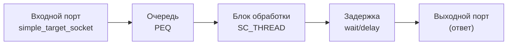

- Модель умеет принимать запрос, ставить его в очередь и обрабатывать с некоторой задержкой.
- **Мы уже знаем:** задержка может зависеть от состояния (как в DRAM‑контроллере).

---
layout: center
---

# Почему «простая сумма» не всегда работает?

---
layout: default
---

# Проблема: больше одного инициатора

<div class="mt-8"/>

Рассмотрим систему из двух CPU, подключённых к **одной** памяти.

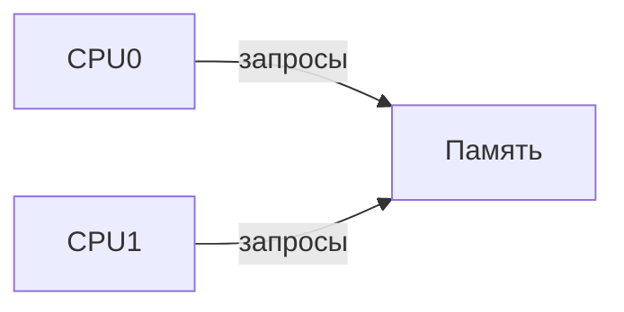

**Вопрос:** Что произойдёт, если оба процессора пошлют запросы одновременно (или почти одновременно)?

- Память может обрабатывать только **один запрос за раз**.
- Если память занята – новый запрос должен **ждать**.

---
layout: two-cols-header
---

# Временная диаграмма: конфликт на входе

::left::

<div class="mt-16"/>

Пусть обработка одного запроса занимает **10 нс**.

<div class="mt-16"/>

- **Latency A** = 10 нс  
- **Latency B** = 15 нс (5 нс ожидания + 10 нс обработки)

::right::

<div class="flex items-center justify-center h-full w-full">
  <div class="w-100%">

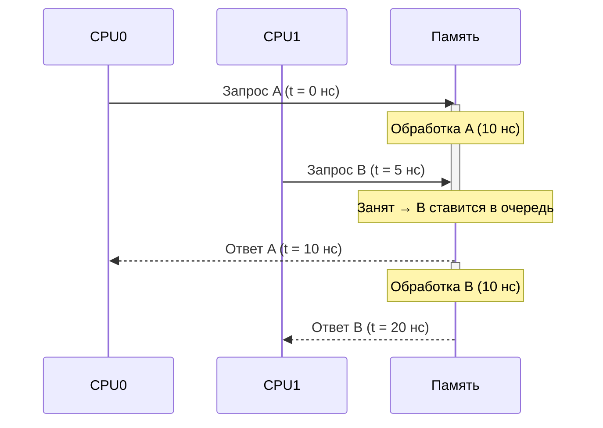

  </div>
</div>

---
layout: default
---

# Эффект накопления очереди

<div class="mt-16"/>

Если запросы приходят **чаще**, чем память успевает обрабатывать, очередь растёт

- Пусть **интервал между запросами** от каждого CPU = 8 нс
- Тогда каждые 4 нс (в среднем) приходит новый запрос
- Память обрабатывает один за 10 нс → очередь не убывает, **latency** для последних запросов постоянно увеличивается

Это явление называется **contention** – состязание за общий ресурс

---
layout: default
---

# Почему нельзя просто сложить задержки?

<div class="mt-16"/>

Наивная формула для оценки latency системы:

$$
\begin{aligned}
Latency_{системы} = Latency_{памяти} × N
\end{aligned}
$$
где $N$ -- количество запросов

**Но она не работает**, потому что:

1. Запросы **перекрываются во времени** – ожидание зависит от момента прихода
2. В реальных системах запросы приходят **не строго по очереди**, а в случайные моменты
3. Очередь создаёт **обратную связь**: чем дольше обрабатывается текущий запрос, тем больше новых успевает прийти, и latency для следующих растёт ещё сильнее

---
layout: default
---

# Промежуточный итог

<div class="mt-16"/>

- Чтобы предсказать реальную производительность, недостаточно знать только **время обработки одного запроса**
- Нужно моделировать **арбитраж** – кто получает доступ к ресурсу, когда он занят
- Первый шаг к этому – введение **арбитра** (регулировщика) на входе в разделяемый ресурс

Давайте построим модель шины с арбитром и увидим, как учёт конфликтов меняет картину

---
layout: center
---

# Моделирование разделяемой шины

---
layout: two-cols-header
---

# Концепция арбитража

::left::

<div class="mt-16"/>

**Арбитр** – устройство, которое в каждый момент времени выбирает, какой из нескольких запросов получит доступ к общему ресурсу

<div class="mt-16"/>

- **Аналогия:** перекрёсток со светофором
- **Политика арбитража** – правило, по которому принимается решение

::right::

<div class="flex items-center justify-center h-full w-full">
  <div class="w-100%">

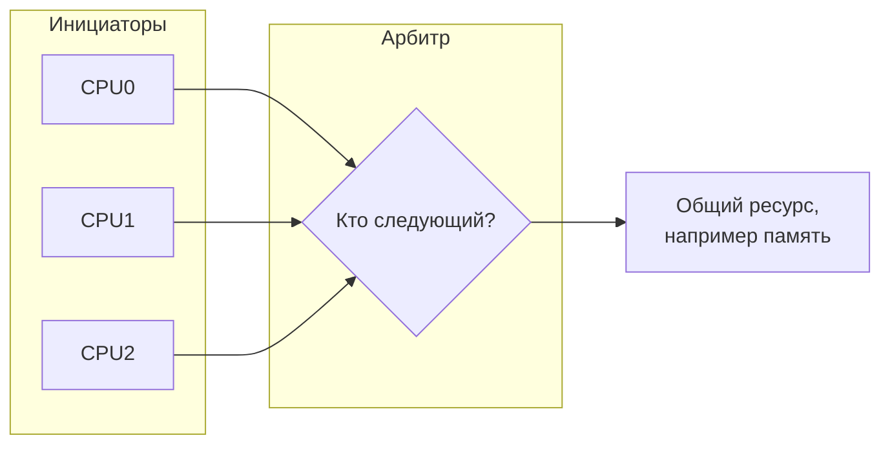

  </div>
</div>

---
layout: default
---

# Основные политики арбитража

| Политика | Принцип | Когда применять |
|----------|---------|-----------------|
| **Фиксированный приоритет (Fixed Priority)** | Всегда выбирается инициатор с наивысшим приоритетом | Реальное время, критичные задачи |
| **Round Robin (циклическая)** | Инициаторы получают доступ по очереди | Честное распределение, предотвращение голодания |
| **TDMA** | Каждому инициатору выделяется строгий временной слот | Сети, гарантированная пропускная способность |
| **Случайный** | Выбор случайного инициатора | Моделирование, симуляция случайных событий |

**Важно:** политика определяет не только справедливость, но и максимальную достижимую пропускную способность

---
layout: default
---

# Архитектура TLM-модели шины

<div/>

Шина – это **транзитный узел**. У неё есть:
- Несколько **входных портов** (target-сокеты) – к ним подключаются инициаторы (CPU, DMA)
- Один (или несколько) **выходных портов** (initiator-сокеты) – к ним подключаются целевые устройства (память, периферия)

```cpp
template<int N_INITIATORS, int N_TARGETS> class SimpleBus : public sc_module {
public:
    tlm_utils::simple_target_socket<SimpleBus> target_socket[N_INITIATORS];
    tlm_utils::simple_initiator_socket<SimpleBus> initiator_socket[N_TARGETS];

    SimpleBus(sc_module_name name);
private:
    void b_transport(int id, tlm_gp& trans, sc_time& delay); // обработчик для target_socket[i]
    void arbiter_thread(); // SC_THREAD для обработки очереди
    tlm_utils::peq_with_get<tlm_gp> request_queue; // единая очередь запросов
};
```

- Каждый target-сокет имеет свой `id`, чтобы различать отправителя
- Все входящие запросы сначала попадают в общую очередь `request_queue`

---
layout: default
---

# Обработка входящего запроса (b_transport)

<div/>

Когда инициатор вызывает `b_transport` шины, она **не вызывает сразу** целевое устройство, а ставит запрос в свою внутреннюю очередь

```cpp
void SimpleBus::b_transport(int id, tlm_gp& trans, sc_time& delay) {
    // 1. Проверка, есть ли место в очереди (обратное давление)
    if (request_queue.size() >= MAX_QUEUE_SIZE) {
        // Блокируем инициатора – он будет ждать
        wait(free_slot_event);
    }
    // 2. Сохраняем транзакцию и идентификатор входного порта (id)
    //    Время delay из вызова уже учитывает путь до шины
    request_queue.notify(trans, delay);
    // 3. Будим поток арбитража
    arbiter_event.notify();
    // 4. Возвращаем управление – инициатор не ждёт завершения!
    //    (в LT-модели он продолжит работу)
}
```

- **Ключевой момент:** шина не блокируется на время обработки в памяти, она только принимает запрос
- Это позволяет моделировать **конвейеризацию** запросов

---
layout: default
---

# Поток арбитража (SC_THREAD)

<div class="mt-16"/>

В отдельном потоке шина разбирает очередь и отправляет запросы целевому устройству.

```cpp
void SimpleBus::arbiter_thread() {
    while (true) {
        wait(arbiter_event); // ждём, пока очередь не пуста
        while (!request_queue.empty()) {
            // 1. Извлекаем транзакцию и временную метку из PEQ
            tlm_gp* trans;
            sc_time delay;
            request_queue.get_next_transaction(trans, delay);
            // 2. Применяем политику арбитража (например, Round Robin)
            int target_id = select_target(trans); // может быть несколько выходов
            // 3. Добавляем задержку на арбитраж (например, 1 нс)
            delay += sc_time(1, SC_NS);
            ...
        }
    }
}
```

---
layout: default
---

# Поток арбитража (SC_THREAD)

<div class="mt-8"/>

```cpp
void SimpleBus::arbiter_thread() {
...
            // 4. Вызываем целевое устройство через initiator-сокет
            //    (блокирующий вызов – target будет обрабатывать сам)
            initiator_socket[target_id]->b_transport(*trans, delay);
            // 5. Ответ от целевого устройства уже записан в trans
            //    (delay теперь содержит полное время пути)
            //    Мы не отправляем ответ назад – он вернётся автоматически,
            //    потому что b_transport инициатора всё ещё ждёт
        }
    }
}
```

- На самом деле в LT-модели с блокирующим транспортом (`b_transport`) шина должна **ждать** ответа от цели и потом **возвращать** управление инициатору.
- Для этого проще использовать неблокирующий интерфейс (AT), но в рамках LT можно сделать так: шина сама вызывает target, а когда target возвращает управление, шина отправляет ответ инициатору, вызывая его target-сокет. Но это требует двусторонней связи.

<!--

Внимание: в LT-модели b_transport инициатора уже вернулся, поэтому нужно организовать отдельный механизм ответа

Упрощённо: будем считать, что целевое устройство само вызывает ответ через тот же сокет, но это требует пересмотра.

Лучше: шина сама вызывает b_transport цели и затем вызывает ответный b_transport инициатора

В LT-модели часто используют сквозную передачу: инициатор вызывает `b_transport` шины, шина вызывает `b_transport` цели, и ответ возвращается по цепочке. Тогда шина не имеет своей очереди, но тогда она не может накапливать запросы, если цель занята. Чтобы добавить очередь, нужно использовать `nb_transport` или сложные механизмы.

В TLM 2.0 есть два стиля – Loosely Timed (LT) с блокирующими вызовами и Approximately Timed (AT) с неблокирующими и фазами. Для моделирования арбитража с очередью LT недостаточно – нужна хотя бы простейшая очередь и обратное давление. Мы показываем концепцию, а в реальности пришлось бы использовать AT или расширенный LT с ожиданием.
-->

---
layout: two-cols
---

# Back-pressure

<div class="mt-16"/>

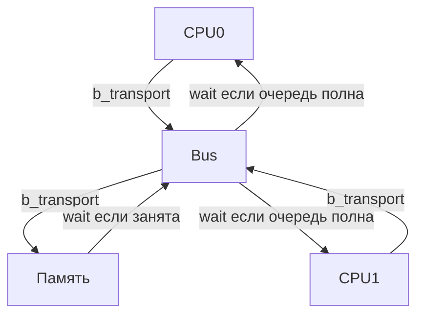

::right::

Что происходит, если целевое устройство (память) **занято** и его очередь переполнена?

- В нашей модели шина вызывает блокирующий метод памяти, но если у неё нет места в очереди, то может **заблокировать** запрос
- Тогда поток арбитража шины **заблокируется**, пока память не освободится
- В это время новые запросы от инициаторов продолжают поступать в шину и могут заполнить её очередь под завязку
- Когда очередь шины заполнится, шина начнёт **блокировать** инициаторов – это и есть обратное давление
- Так происходит распространение "заторов" от узкого места к инициаторам запросов

---
layout: default
---

# Скрытая сложность: голодание и дедлоки

<div class="mt-8"/>

При моделировании арбитража важно учитывать возможные проблемы:

- **Starvation (голодание):** низкоприоритетный инициатор может никогда не получить доступ, если постоянно приходят высокоприоритетные запросы
- **Deadlock (взаимная блокировка):** например, когда шина ждёт память, память ждёт шину, а оба ждут друг друга 
- **Livelock:** инициаторы постоянно уступают друг другу, но ни один не продвигается

<v-clicks>

**Как бороться:**
- Использовать честные политики (Round Robin)
- Вводить тайм-ауты
- Проверять модель на отсутствие циклов ожидания

</v-clicks>

---
layout: default
---

# Выводы по разделяемой шине

<div class="mt-16"/>

1. **Арбитр** необходим для разрешения конфликтов при доступе к общему ресурсу
2. Модель шины в TLM строится на базе каркаса «очередь + поток» с несколькими входными портами
3. **Обратное давление** – естественный механизм распространения перегрузки в системе
4. Простая LT-модель с блокирующими вызовами плохо подходит для очередей; на практике используют AT или расширения
5. Политика арбитража напрямую влияет на производительность и справедливость

<!--
Перейдём к более сложному примеру – сети-на-кристалле (NoC), где конфликты возникают на каждом узле
-->

---
layout: center
---

# Cложный пример: Сеть-на-кристалле (NoC)

---
layout: two-cols-header
---

# От шины к сети: почему шины перестают работать

::left::

**Шина** хороша для 2–3 инициаторов, но для 10+ ядер и множества блоков она становится узким местом

- **Проблема:** пропускная способность шины ограничена, все ядра конкурируют за одну линию
- **Решение:** перейти от общей шины к сети с множеством параллельных путей

**Аналогия:** шина – это просёлочная дорога с одним перекрёстком, NoC – сеть дорог с перекрёстками (роутерами), позволяющая ехать разным машинам разными маршрутами одновременно

::right::

<div class="mt-16"/>

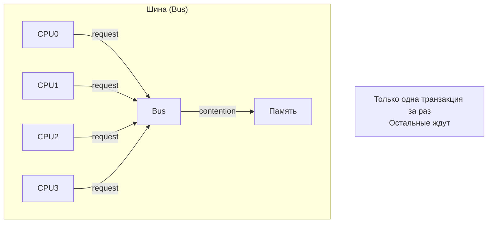

---
layout: default
---

# Что такое сеть-на-кристалле (NoC)?

<div/>

NoC – это коммуникационная инфраструктура на чипе, состоящая из:

- **Роутеров (маршрутизаторов)** – узлов, принимающих и направляющих пакеты.
- **Каналов (линий связи)** – физических соединений между роутерами.
- **Топологии** – способа соединения роутеров (mesh, torus, ring и др.).

<div class="flex items-center justify-center w-full">
  <div class="w-60%">

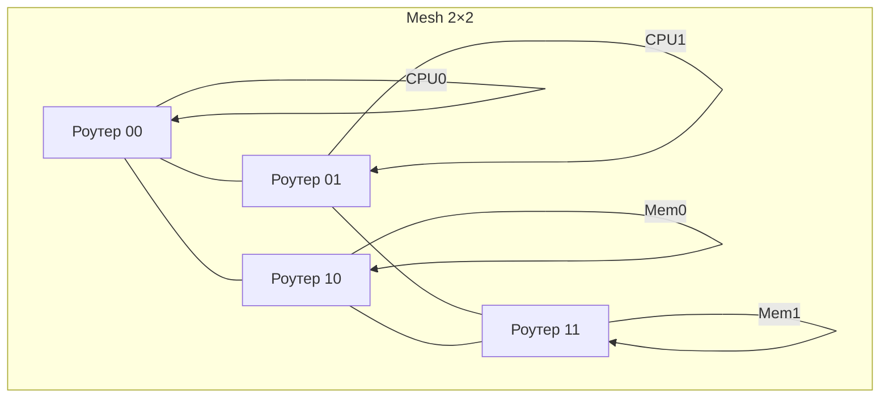

  </div>
</div>

- Каждый роутер обслуживает свой вычислительный или памятьный блок.
- Пакеты могут передаваться параллельно, если их пути не пересекаются.

---
layout: default
---

# Ключевая идея NoC: параллелизм транзакций

<div class="mt-16"/>

Если CPU0 общается с Mem0, а CPU1 – с Mem1, они могут идти одновременно, не мешая друг другу

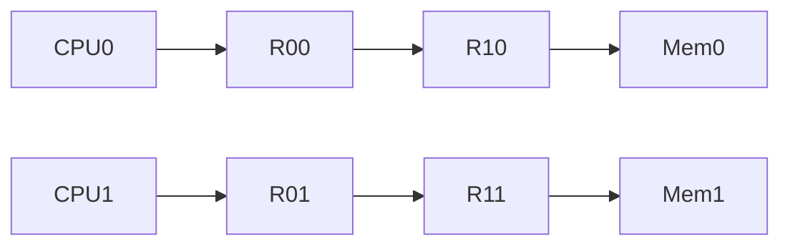

- **Пропускная способность** системы увеличивается за счёт параллельных маршрутов
- Но если два пакета хотят в один и тот же выходной порт роутера, возникает **конфликт**, и нужен арбитраж

---
layout: default
---

# Архитектура роутера

<div/>

Роутер – это, по сути, тот же «каркас модели» (очередь + обработчик), но с несколькими входами и выходами

```cpp
template<int PORTS>
class Router : public sc_module {
public:
    // Входные порты от соседних роутеров или локальных модулей
    tlm_utils::simple_target_socket<Router> in_socket[PORTS];
    // Выходные порты к соседям или модулям
    tlm_utils::simple_initiator_socket<Router> out_socket[PORTS];

    SC_HAS_PROCESS(Router);
    Router(sc_module_name name);

private:
    void b_transport(int port_id, tlm_gp& trans, sc_time& delay);
    void route_thread(); // SC_THREAD для обработки
    tlm_utils::peq_with_get<tlm_gp> input_queues[PORTS]; // очередь для каждого входа
};
```

- У каждого входного порта своя очередь (или общая, но это усложняет арбитраж)
- Поток `route_thread` забирает пакеты из очередей, определяет выходной порт и передаёт дальше

---
layout: two-cols-header
---

# Два вида арбитража в роутере

::left::

<div class="mt-16"/>

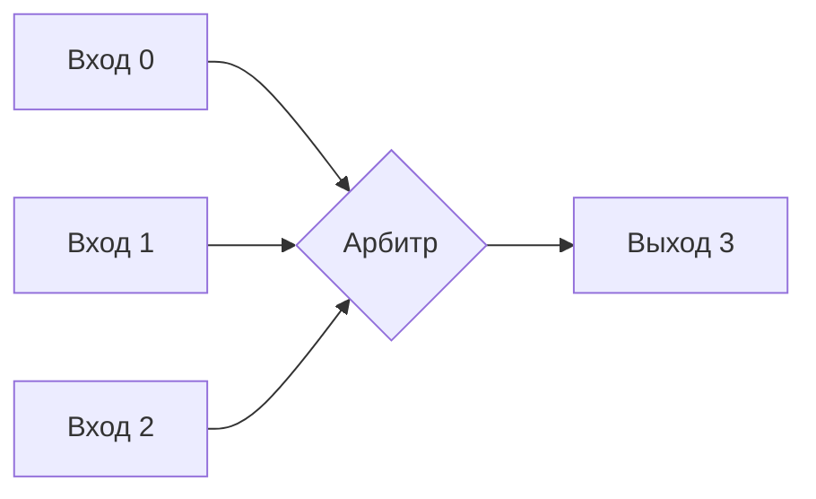

::right::

<div class="mt--6"/>

В роутере возникает два типа состязаний:

1. **Входной арбитраж (Input Arbitration):** несколько пакетов на разных входах хотят в один и тот же выход. Нужно выбрать, какой пойдёт первым.
1. **Коммутация (Switching):** как передать пакет от входа к выходу. Два основных режима:
   - **Store-and-forward:** роутер получает весь пакет, потом отправляет (высокая задержка, но просто).
   - **Wormhole (червоточина):** пакет разбивается на мелкие порции (flit'ы), которые передаются конвейерно – низкая задержка, но может блокировать каналы.

---
layout: default
---

# Моделирование задержки в роутере

<div/>

Задержка пакета в роутере складывается из:

- **Времени арбитража** (несколько тактов)
- **Времени коммутации** (зависит от режима)
- **Времени ожидания** в очереди (если выход занят)

```cpp
sc_time Router::get_router_delay(tlm_gp& trans) {
    sc_time delay = SC_ZERO_TIME;
    // Добавляем фиксированную задержку роутера (pipeline delay)
    delay += sc_time(2, SC_NS); // например, 2 нс
    // Учитываем время арбитража (если есть конкуренция)
    if (contested_output) {
        delay += arbitration_latency;
    }
    return delay;
}
```

- В LT-модели эту задержку добавляют к параметру `delay` перед вызовом следующего роутера или цели
- В AT-модели задержка распределяется по фазам

---
layout: two-cols-header
---

# Проблема: блокировка головы очереди (HoL)

::left::

<div class="mt-16"/>

**HoL (Head-of-Line blocking)** – ситуация, когда пакет в начале очереди заблокирован (ждёт занятый выход), и все следующие за ним пакеты (даже идущие на свободные выходы) тоже вынуждены ждать

- **Решение:** использовать **виртуальные каналы (Virtual Channels, VC)**.

::right::

<div class="flex items-center justify-center w-full">
  <div class="w-90%">

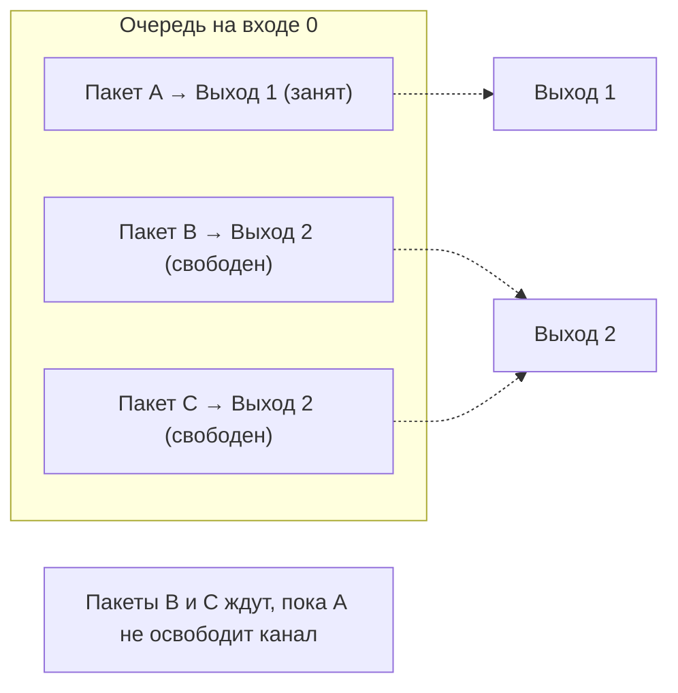

  </div>
</div>

---
layout: default
---

# Виртуальные каналы (VC)

<div/>

VC – это несколько логических очередей на одном физическом входе, каждая со своим буфером

<div class="flex items-center justify-center w-full">
  <div class="w-70%">

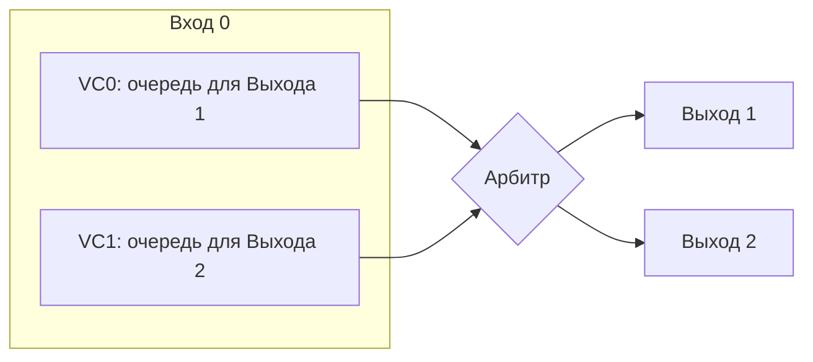

  </div>
</div>

- Пакеты, идущие на разные выходы, не блокируют друг друга
- **Цена:** дополнительная аппаратура (буферы), но значительное повышение пропускной способности при неравномерном трафике
- Для моделирования нужно хранить состояние каждого VC и арбитр между ними

---
layout: two-cols-header
---

# Конфликты в NoC: пример

<div/>

::left::

Рассмотрим mesh 2×2. Пусть:
- CPU0 → Mem0 (маршрут: R00→R10)
- CPU1 → Mem0 (маршрут: R01→R11→R10)
- CPU2 → Mem1 (маршрут: R10→R11)

<div class="mt-4"/>

- В роутере R10 конкурируют A и B (оба идут к Mem0). Арбитр выберет один, второй встанет в очередь
- В роутере R11 конкурируют B (транзитом) и C (к Mem1). Если у R11 нет VC, C будет ждать, пока B не пройдёт, даже если B уже ждёт в R10. Это может создать обратное давление
- С VC пакет C мог бы обойти B

::right::

<div class="flex items-center justify-center w-full">
  <div class="w-full">

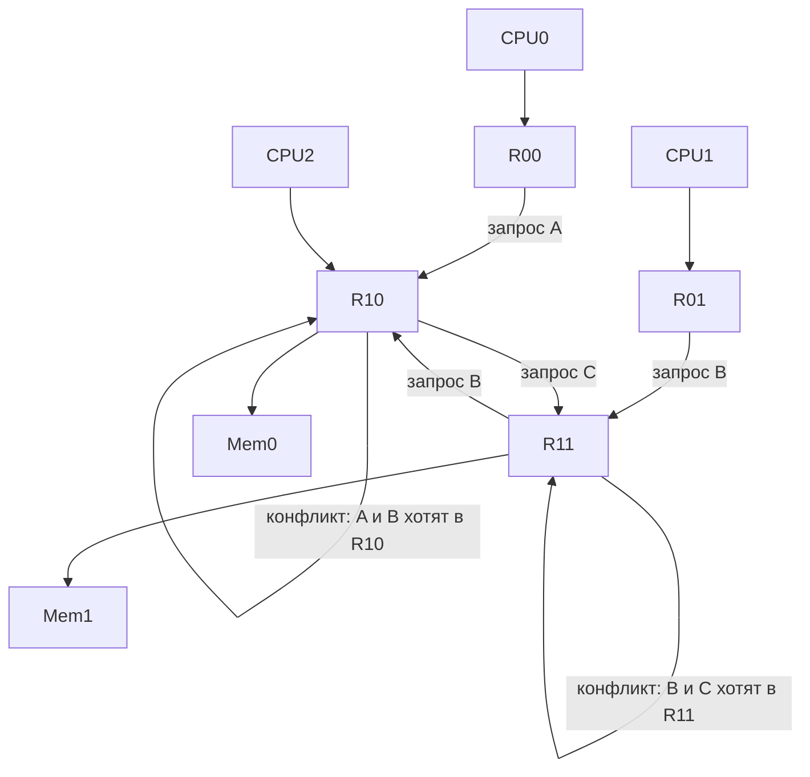

  </div>
</div>

---
layout: default
---

# Как моделировать такие эффекты?

- Каждый роутер – экземпляр нашего шаблона с очередями и потоком
- Для VC – несколько очередей на входной порт
- Необходимо отслеживать состояние каналов между роутерами (занят/свободен)
- В LT-модели это сложно, проще использовать AT с фазами

**Уровни абстракции для NoC:**
- **LT (Loosely Timed):** только примерная задержка, без учёта конфликтов
- **AT (Approximately Timed):** фазы (begin_req, end_req, begin_resp, end_resp), можно моделировать конвейер и блокировки
- **CA (Cycle Accurate):** точное поведение каждого такта (медленно, но точно)

В наших целях (обучение) достаточно концептуальной AT-модели с фазами

---
layout: default
---

# Влияние топологии и трафика на производительность

<div class="mt-16"/>

- **Локальный трафик** (ядро общается со своей локальной памятью) – высокая пропускная способность, малая задержка
- **Глобальный трафик** (все к одному контроллеру памяти) – все пакеты собираются в одном роутере, возникает очередь, latency растёт
- **Паттерн "transpose"** (каждый с каждым) – создаёт множество конфликтов в центре сети

<!--

Важно понимать, как размещение данных влияет на трафик. Если два часто взаимодействующих потока поместить в ядра, соединённые коротким путём, задержка уменьшится.

-->

---
layout: default
---

# Выводы по NoC

- NoC обеспечивает масштабирование системы за счёт параллелизма
- Ключевые элементы: роутеры, каналы, топология
- Конфликты возникают внутри роутеров при совпадении выходных портов
- Виртуальные каналы – важный механизм для снижения HoL-блокировки
- Выбор уровня детализации модели (LT/AT/CA) зависит от целей анализа
- Моделирование NoC позволяет оценивать влияние трафика и принимать решения по размещению ядер и данных

<!--

Рассмотрим, как все эти компоненты (шина, NoC, память) собираются в полную системную модель и как анализировать полученные результаты

-->

---
layout: center
---

# Сквозной пример: Анализ конфликтов в разделяемой памяти

---
layout: default
---

# Тестовая система

<div class="mt-4"/>

Соберём вместе компоненты, которые мы рассматривали:

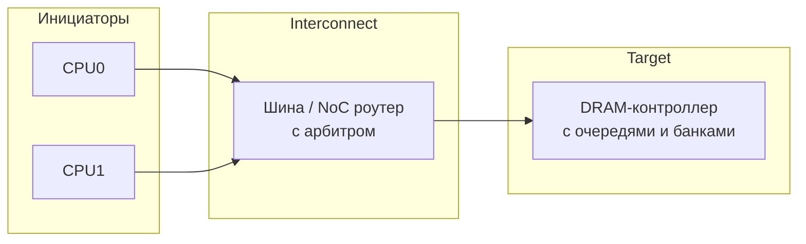

- **CPU0, CPU1** – генераторы запросов (чтение/запись).
- **Шина** – простой арбитр (Fixed Priority или Round Robin) с очередью.
- **DRAM** – модель из лекции 6: банки, tRCD, tCAS, tRP, очередь команд.

---
layout: default
---

# Параметры модели для эксперимента

| Компонент | Параметр | Значение |
|-----------|----------|----------|
| CPU | Интервал между запросами | 50 нс (активная нагрузка) |
| CPU | Тип запросов | Чтение, 64 байта |
| Шина | Задержка арбитража | 1 нс |
| Шина | Глубина очереди | 4 |
| DRAM | tRCD / tCAS / tRP | 10 нс / 10 нс / 10 нс |
| DRAM | Количество банков | 4 |
| DRAM | Политика закрытия строки | После каждого доступа (open-page) |

- open-page – строка остаётся открытой после доступа, если следующий запрос к той же строке – hit

---
layout: default
---

# Сценарии нагрузки

<div class="mt-16"/>

Чтобы увидеть разные эффекты, рассмотрим три типовых паттерна обращений:

1. **Случайный доступ** – адреса равномерно распределены по всей памяти
2. **Последовательный доступ (streaming)** – каждый CPU читает свой непрерывный массив (в разных банках)
3. **Конфликтный доступ** – оба CPU обращаются к одному и тому же банку (конкуренция за строки)

---
layout: default
---

# Сценарий А: Round‑Robin арбитр

<div class="mt-16"/>

При равномерном чередовании запросов:

- **Случайный доступ:** частые row misses (из‑за случайности), средняя latency = tRP + tRCD + tCAS ≈ 30 нс плюс ожидание в очереди шины.
- **Стриминг по разным банкам:** идеальный случай – пока CPU0 занят в банке 0, CPU1 работает с банком 1. Latency близка к tCAS = 10 нс (хиты), очередь в шине минимальна.
- **Конфликтный доступ к одному банку:** запросы чередуются, каждый раз row miss (так как другой CPU выбил строку). Latency = tRP + tRCD + tCAS ≈ 30 нс + ожидание.

**Вывод:** Round Robin обеспечивает равномерную нагрузку, но не защищает от конфликтов в банке.

---
layout: default
---

# Сценарий Б: Фиксированный приоритет

<div class="mt-8"/>

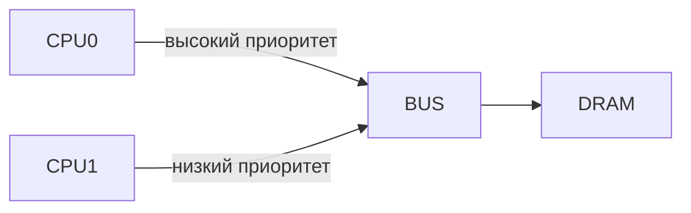

<div class="mt-8"/>

- **Стриминг по разным банкам:** CPU0 занимает шину, его latency низкая (≈ 10 нс). CPU1 вынужден ждать, пока очередь шины не заполнится, затем его latency резко растёт (накапливается очередь в шине). Возможно **голодание (starvation)** CPU1 при высокой активности CPU0.
- **Конфликтный доступ:** CPU0 постоянно держит открытой свою строку в банке, CPU1 при доступе всегда вызывает row miss и ещё ждёт в очереди шины – latency может достигать сотен наносекунд.

---
layout: two-cols-header
---

# Визуализация: Загрузка шины и очереди

::left::

<div class="mt-6"/>

Проанализируем производительность при высокой интенсивности запросов (интервал 30 нс) и Round Robin политике:

- При конфликтном доступе CPU1 с низким приоритетом страдает значительно сильнее
- В стриминге с разными банками Round Robin даёт минимальную latency для всех

Легенда:
- Fixed Priority (CPU0)
- Fixed Priority (CPU1)
- Round Robin

::right::

<div class="mt-16"/>

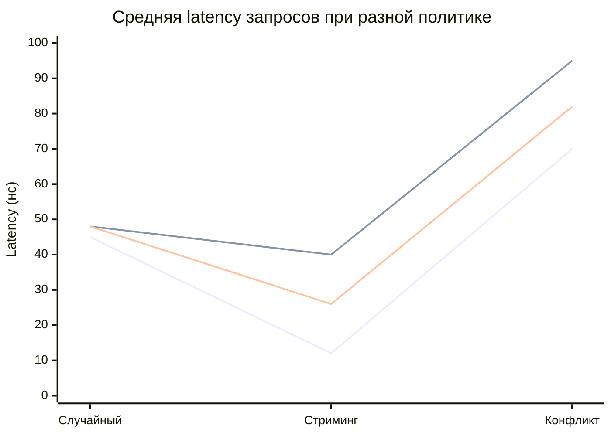

---
layout: default
---

# Влияние на DRAM: Row Buffer Hit Rate

<div class="mt-8"/>

Политика арбитража напрямую определяет, какие запросы приходят в DRAM подряд

- **Round Robin при стриминге:** запросы от CPU0 и CPU1 чередуются, каждый идёт в свой банк → банки работают параллельно, hit rate высокий (часто строка уже открыта)
- **Приоритет CPU0 при стриминге:** длинная серия запросов от CPU0 в банк A, затем серия от CPU1 в банк B. Но пока CPU0 активен, банк B простаивает, а когда CPU1 получает доступ, банк B уже закрыт (нужно открывать строку). Hit rate падает

Hit rate для CPU1 может упасть с 90% до 10% при смене политики

---
layout: default
---

# Back-pressure в действии

<div class="mt-8"/>

При переполнении очереди в шине:

1. Шина перестаёт принимать новые запросы от инициаторов
1. `b_transport` CPU блокируется (внутри `wait`)
1. В симуляторе это видно как остановка прогресса CPU
1. Как только DRAM освобождается и шина отправляет очередной запрос, освобождается слот в очереди шины, и заблокированный CPU просыпается

Загрузка ядер падает, хотя они хотели бы работать – это и есть **throttling** из‑за обратного давления

<!--
Backpressure throttling vs thermal throttling
-->

---
layout: default
---

# Что даёт такой анализ разработчику ПО?

<div class="mt-8"/>

- **Оптимизация размещения данных:** Если два потока активно обмениваются данными через общую память, лучше разместить их рабочие множества в **разных банках** DRAM и обеспечить чередование доступа (например, через выравнивание адресов)
- **Выбор количества потоков:** При фиксированной пропускной способности памяти добавление ещё одного ядра может не увеличить, а даже снизить общую производительность из‑за конфликтов
- **Настройка политик ОС:** Привязка потоков к ядрам с учётом топологии (например, чтобы два конкурирующих потока не делили один банк)
- **Оценка влияния компиляторных оптимизаций:** Например, разворачивание циклов может увеличить локальность, но если это приводит к монопольному захвату банка, другие потоки пострадают

---
layout: default
---

# Заключение по сквозному примеру

- Мы увидели, как **арбитраж** и **конфликты** на разных уровнях (шина, банки DRAM) влияют на итоговую производительность
- Простая модель из «каркаса» + арбитра позволила количественно оценить эффекты, которые невозможно предсказать аналитически
- Разные политики арбитража приводят к разному распределению задержек и могут вызывать голодание
- Взаимодействие с детальной моделью DRAM выявило, как паттерн запросов влияет на row hit rate
- **Ключевой вывод:** Только совместное моделирование всех компонентов даёт реалистичную картину узких мест системы

---
layout: default
---

# Вопросы для размышления

1. Как изменится картина, если вместо шины использовать NoC с виртуальными каналами?
2. Какие метрики, кроме средней latency, важны для QoS?
3. Можно ли предсказать эффект от изменения политики арбитража без симуляции, только теоретически?
4. Как учесть влияние кэшей (следующая тема) на поток запросов к памяти?

---
layout: default
---

# Ключевые выводы лекции

1. **Конфликты неизбежны** при разделении ресурсов (шина, память, NoC). Они являются главной причиной нелинейного падения производительности
1. **Арбитр** — необходимый элемент любой модели системы с общими ресурсами. Политика арбитража (Fixed Priority, Round Robin, TDMA) напрямую определяет:
   - справедливость доступа
   - максимальную задержку
   - возможность голодания (starvation)
1. **Обратное давление (back-pressure)** — механизм распространения перегрузки от узкого места к источникам. Без его учёта модель будет оптимистичной
1. **От шины к NoC** — эволюция, позволяющая увеличить параллелизм, но требующая более сложных моделей роутеров, виртуальных каналов и учёта топологии
1. **Сквозное моделирование** (CPU + шина/NoC + DRAM) позволяет увидеть, как локальные конфликты (арбитраж в шине) влияют на глобальные метрики (row buffer hit rate в DRAM)

---
layout: default
---

# Польза разработчикам ПО

<div class="mt-8"/>

- **Размещение данных (data layout):**
  - Если два часто взаимодействующих потока поместить в ядра, разделяющие один банк памяти, производительность упадёт из‑за конфликтов, модель позволяет оптимизировать data layout
- **Оценка многопоточности:**
  - Добавление ещё одного потока может не ускорить, а замедлить систему из‑за насыщения шины/памяти. Модель позволяет найти точку насыщения
- **Оптимизация доступа к памяти:**
  - Компиляторные оптимизации меняют паттерны обращений. Модель может показать, улучшают ли они row hit rate или создают дополнительные конфликты
- **Обоснование аппаратных требований:**
  - Если модель показывает, что узкое место — недостаточное количество банков DRAM, это аргумент для архитекторов добавить банки
  
<!--
Моделирование конфликтов даёт понимание, почему код, выглядящий эффективно на бумаге, может тормозить на реальном железе
-->

---
layout: default
---

# Аналогия: Городской трафик

<div class="mt-8"/>

Представим СнК как город:

- **Ядра (CPU)** — жилые районы, где генерируются поездки (запросы)
- **Шина/NoC** — дорожная сеть (одна полоса / многополосная с перекрёстками)
- **Память (DRAM)** — деловой центр с парковками (банки)
- **Арбитр** — светофоры и регулировщики
- **Row buffer** — въезд на парковку: если машина (запрос) едет на ту же стоянку, что и предыдущая, заезд быстрый (hit), иначе нужно открывать шлагбаум заново (miss)

**Вывод:** Чтобы город не стоял в пробках, нужно не только строить широкие дороги (шина), но и управлять светофорами (арбитраж), распределять потоки по разным стоянкам (банки) и предсказывать, куда поедут люди (паттерны доступа).

---
layout: default
---

# Ограничения примеров

<div class="mt-8"/>

В рамках лекции мы рассмотрели **базовую модель** конфликтов. Однако в реальности есть дополнительные факторы:

- **Кэширование** — кардинально меняет паттерны обращений к памяти (большинство запросов отсекаются на уровнях L1/L2)
- **Когерентность кэшей** — создаёт дополнительный трафик (snarfing, invalidates), который мы пока не учитывали
- **Неблокирующие кэши** и **префетчеры** — усложняют временные диаграммы
- **QoS (Quality of Service)** — в современных SoC арбитры учитывают приоритеты потоков и гарантируют доступность ресурсов

---
layout: default
---

# Мостик к следующей лекции: Иерархия памяти

- Мы научились моделировать **конфликты на пути к памяти**
- Теперь заглянем внутрь самой памяти, точнее — в кэши

**Что будем изучать:**
- Как моделировать кэш (tag array, data array, hit/miss latency)
- Влияние ассоциативности, размера линии, политики замещения
- **Prefetcher** — как предсказывать будущие обращения и скрывать задержки
- **Когерентность** в многоядерных системах — протоколы MESI и их влияние на производительность
- Проблема масштабирования точности: детальные модели кэшей против стохастических (аналитических) аппроксимаций

**Ключевой вопрос:** Как учесть, что бóльшая часть обращений не доходит до DRAM, а обслуживается кэшами, и как это меняет картину конфликтов?

<!--

Как кэши меняют нагрузку на память

Пусть два ядра выполняют один и тот же код, работающий с массивом.

- **Без кэшей:** все обращения идут в DRAM → высокая конкуренция за шину и банки.
- **С кэшами:** после первого промаха данные попадают в кэш, следующие обращения — хиты, нагрузка на память резко падает.
- Однако когерентность может создавать дополнительный трафик (если одно ядро пишет, другое читает ту же линию).

Наша следующая модель должна уметь это учитывать.

-->


---
layout: default
---

# Заключение

- Сегодня мы научились моделировать **арбитраж и конфликты** — ключевые факторы реальной производительности
- Мы увидели, как простые компоненты (очередь + обработчик) превращаются в шину и роутер NoC
- Поняли важность **обратного давления** и политик арбитража
- Связали эти знания с задачами разработчиков ПО и компиляторов

**На следующей лекции:** углубимся в иерархию памяти и узнаем, как моделировать кэши, префетчеры и когерентность
