Моделирование вычислительных систем

# Подсистема памяти

<div class="abs-b">
Москва 2026
</div>

<div class="abs-br m-6 text-xl">
  <a href="https://github.com/cesarus777/perf-modeling-lectures" target="_blank" class="slidev-icon-btn">
    <carbon:logo-github />
  </a>
</div>

---

# Что мы уже умеем моделировать?

<div class="mt-16"/>

- **Лекция 5–6:** Транзакционная модель (TLM 2.0) — сокеты, generic payload, временная аннотация
- **Лекция 6:** Каркас производительности — **очередь + блок обработки**
- **Лекция 7:** Конфликты и арбитраж — шина, NoC, **обратное давление (back-pressure)**

<div class="mt-8"/>

- #### Мы строили модели, в которых каждый запрос рано или поздно доходил до целевого устройства (например, DRAM)

<!-- 
Этот слайд — краткое напоминание, чтобы задать контекст. Студенты уже знакомы с TLM и базовыми компонентами. Важно подчеркнуть, что раньше мы моделировали "прямой путь" запроса к памяти.
-->

---

# Парадокс

<div class="mt-8"/>

В реальной системе **большинство запросов никогда не доходят до DRAM**.

<div class="grid grid-cols-2 gap-4 mt-8">
<div>

**В наших предыдущих моделях:**
- Каждый запрос CPU → шина → DRAM
- Задержка = сумма всех задержек на пути
- Нагрузка на шину и DRAM = все запросы

</div>
<div>

**В реальной SoC:**
- L1 кэш отсекает **90–99%** запросов
- L2/L3 отсекают ещё часть
- К DRAM идут только **промахи** (miss)

</div>
</div>

<div class="mt-12"/>

- Если смоделировать систему, где каждый запрос идёт в DRAM, производительность будет катастрофически низкой

<!-- 
Показать противоречие между упрощённой моделью (всё идёт в DRAM) и реальностью. Это мотивирует необходимость моделирования кэша.
-->

---

# Ключевое отличие: кэш — это не просто очередь

<div class="mt-8"/>

В наших предыдущих моделях блок обработки был **простым**:
- Принять запрос
- Подождать фиксированное время
- Вернуть ответ

<div class="mt-4"></div>

**Кэш — это устройство с состоянием:**
- Не просто "обрабатывает", а **принимает решение**: hit или miss?
- Решение зависит от **истории обращений** (какие данные уже загружены).
- При промахе порождает **новую транзакцию** к нижележащей памяти.
- Может обрабатывать несколько запросов одновременно (неблокирующий кэш).

<!-- 
Сравнить с простым "обработчиком" из лекции 6. Подчеркнуть, что кэш требует нового подхода к моделированию.
-->

---

# Новые эффекты, которых не было в простой модели

| Эффект | Описание |
|--------|----------|
| **Хит/промах (hit/miss)** | Время доступа зависит от того, попали данные в кэш или нет. |
| **Замещение (replacement)** | При промахе нужно вытеснить старую линию — это влияет на будущие хиты. |
| **Когерентность (coherency)** | В многоядерных системах кэши обмениваются служебными сообщениями (инвалидации, snarfing), создавая дополнительный трафик. |
| **Ложное разделение (false sharing)** | Два ядра пишут в разные переменные, лежащие в одной линии кэша — вызывают "пинг-понг" линии между кэшами. |

<div class="mt-4 text-sm">
Ни один из этих эффектов не может быть смоделирован простой парой "очередь + фиксированная задержка"
</div>

<!-- 
Перечислить новые сложности, которые мы будем рассматривать в лекции. Это помогает студентам понять, почему предыдущих знаний недостаточно.
-->

---

# Как встроить кэш в нашу модель?

<div class="grid grid-cols-2 gap-4 mt-8">
<div>

**Раньше:**

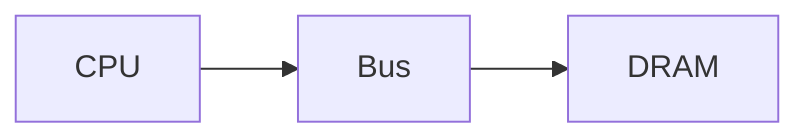

</div>
<div class="flex items-center justify-center h-full w-full">
  <div class="w-full">

**Теперь:**

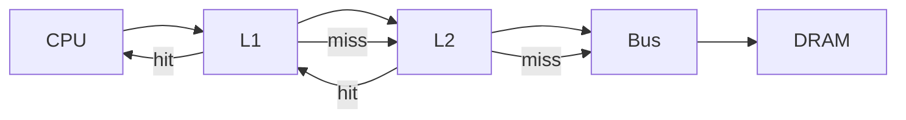

</div>
</div>
</div>

<div class="mt-16"/>

Кэш становится **транзитным узлом**, который может:
- ответить сам (hit)
- переслать запрос дальше (miss) и потом ответить
- генерировать дополнительные запросы (например, на инвалидацию)

---

# Что нас ждёт в этой лекции?

<div class="mt-16"/>

1. **Обзор модели кэша** — от простой tag‑точной до статистической.
2. **Когерентность** — протокол MESI и его моделирование.
3. **Prefetching** — как добавить предсказатель в модель.
4. **Сборка системы** — кэш + шина + DRAM (сквозной пример).
5. **Связь с workloads** — как правильно генерировать запросы для оценки кэша.

---
layout: section
---

# Почему RTL-модели плохо подходят для моделирования кэшей?

---

# RTL-модель кэша: что внутри?

<div class="mt-8"/>

В RTL кэш — это сложный автомат:

- **Tag RAM** и **Data RAM** — сотни тысяч ячеек памяти
- **Конечный автомат** управления (FSM) с десятками состояний
- **Логика сравнения тегов** (fully parallel)
- **Алгоритм замещения** (LRU, pseudo‑LRU) — реализуется сложными схемами
- **Механизм когерентности** (MESI) — дополнительные FSM для каждого кэш-блока

<div class="mt-8"/>

Такую модель пишут на Verilog/VHDL, она **точно** описывает поведение на уровне тактов

---

# Проблема: RTL-симуляция слишком медленная

<div class="mt-8"/>

**RTL-симулятор** (например, на основе SystemC RTL или Verilog) работает так:

- Каждое изменение сигнала — событие
- Для кэша: каждое обращение к RAM, каждый такт FSM — событие
- Миллионы событий на одну транзакцию памяти

<div class="mt-4 grid grid-cols-2 gap-4">
<div>

**Типичные цифры:**
- RTL-симуляция: **1–100 тысяч тактов/сек** (в лучшем случае)
- Перфоманс-модель: **миллионы/сек** (десятки MIPS)

</div>
<div>

**Для оценки производительности:**
- Нам нужно смоделировать **миллиарды обращений** к памяти (запуск ОС, сложные приложения)
- RTL-симуляция заняла бы **месяцы**
- Хотелось бы, чтобы перфоманс-модель делала это за **часы**

</div>
</div>

<!-- 
Подчеркнуть, что скорость — главная причина отказа от RTL. Студенты должны осознать масштаб.
-->

---

# Что мы теряем, отказываясь от RTL?

<div class="mt-8"/>

| **RTL-модель** | **Что нужно перфоманс-модели** |
|----------------|--------------------------------|
| Такт-точное поведение (cycle‑accurate) | Статистически достоверное время отклика |
| Детальная логика замещения (LRU) | Приближённый hit/miss с учётом ассоциативности |
| Полный протокол когерентности (FSM) | Учёт служебного трафика и задержек |
| Моделирование электрических параметров | Только функционально‑временные характеристики |

<!-- 
Перечислить, чем мы жертвуем. Это поможет студентам понять границы применимости перфоманс-моделей.
-->

---

# Абстракция: от RTL к перфоманс-модели

<div class="mt-8"/>

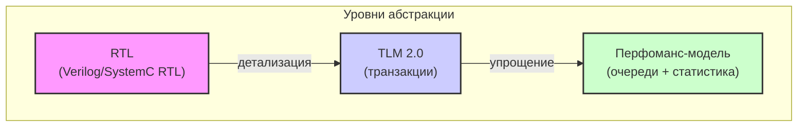

<div class="mt-8"/>

- **RTL** — такт-точный, медленный, используется для финальной верификации.
- **TLM 2.0** — транзакционный, быстрее, но всё ещё может быть детальным (например, AT-модель кэша).
- **Перфоманс-модель** — высокоуровневая, оперирует очередями и вероятностями.

<!-- 
Показать иерархию абстракций. Отметить, что TLM 2.0 может быть использован и для детальных моделей (AT), и для более грубых (LT).
-->

---

# Пример: что считает RTL, а что — перфоманс-модель

<div class="mt-4 grid grid-cols-2 gap-4">
<div>

**RTL:**  
`always @(posedge clk) if (hit) data_out <= ...`

- Эмулирует каждый такт.
- Трассирует каждую линию кэша.

</div>

<div>

**Перфоманс-модель (наша цель):**  
```cpp
void cache::access(tlm_gp& trans, sc_time& delay) {
    if (hit(addr)) {
        delay += HIT_LATENCY;
    } else {
        delay += MISS_LATENCY;
        update_state(addr); // возможно, вытеснение
        // генерация запроса к следующему уровню
    }
}
```

- Работает на уровне транзакций
- Время моделируется **явно** через `sc_time`, без тактов
- Состояние кэша хранится в упрощённом виде

</div>
</div>

<!-- 
Сравнить код RTL и SystemC/TLM. Подчеркнуть, что в перфоманс-модели нет тактового домена, время — это просто числовая метка.
-->

---

# Следующий шаг: как построить модель кэша?

<div class="mt-8"/>

Мы уже знаем базовый каркас (очередь + обработчик)

Теперь нужно:

- Заменить простой обработчик на **логику hit/miss**.
- Добавить **хранение состояния** (теги, состояние когерентности).
- Реализовать **генерацию запросов к памяти** при промахе.
- Учесть **неблокирующее поведение** (опционально).

---

# Что такое модель кэша с точки зрения производительности?

<div class="mt-8"/>

Модель кэша — это **упрощённое, но статистически достоверное** описание поведения кэш-памяти

**Она должна отвечать на вопросы:**
- Будет ли обращение **хитом** или **промахом**?
- Какова **задержка** в каждом случае?
- Что происходит при промахе: какие **новые транзакции** генерируются?
- Как **замещение** влияет на будущие хиты?

В отличие от RTL-модели, мы **не моделируем каждый такт**, а оперируем **транзакциями** и **явным временем** (`sc_time`)

<!-- 
Определяем цель модели кэша в контексте производительности. Акцент на принятии решений (hit/miss) и генерации новых транзакций.
-->

---

# Ключевые компоненты модели кэша

| Компонент | Назначение |
|-----------|------------|
| **Входной сокет** | Принимает запросы от вышестоящего уровня (CPU, L1) |
| **Tag Store** | Хранит теги и состояние когерентности (упрощённо) |
| **Data Store** | (Опционально) Может хранить данные для функциональной точности |
| **Логика hit/miss** | Определяет, находится ли адрес в кэше |
| **Логика замещения** | Выбирает, какую линию вытеснить при промахе |
| **Генератор запросов** | При промахе формирует транзакцию к следующему уровню памяти |
| **Поток обработки (SC_THREAD)** | (Опционально) Обрабатывает очередь промахов в неблокирующем режиме |

<!-- 
Перечислить основные структурные элементы, которые мы будем реализовывать.
-->

---

# Структурная схема модели кэша

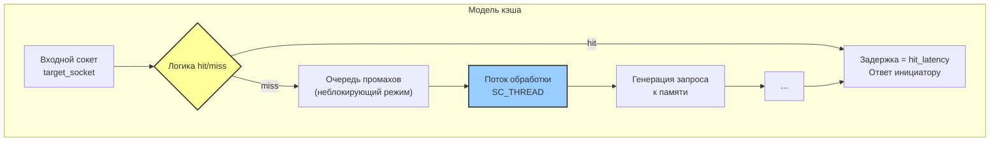

<!-- 
Схема показывает поток транзакции через модель кэша. Акцент на двух путях: hit (быстрый) и miss (медленный с генерацией запроса).
-->

---

# Структурная схема модели кэша

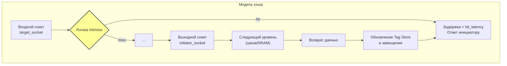

<!-- 
Схема показывает поток транзакции через модель кэша. Акцент на двух путях: hit (быстрый) и miss (медленный с генерацией запроса).
-->

---

# Реализация Tag Store: выбор структуры данных

<div class="mt-8"/>

Для перфоманс-модели мы **не обязаны** хранить полный массив тегов, как в RTL. Достаточно **ассоциативного контейнера**, который позволит быстро проверять принадлежность адреса.

**Варианты:**
1. **Хэш-таблица** (например, `std::unordered_map`): ключ = адрес линии, значение = состояние
   Плюсы: Просто, быстро, не требует разбиения на сеты
   Минусы: Не учитывает ассоциативность (не ограничивает количество линий в сете)
2. **Массив с сет-ассоциативностью** (`std::vector<std::vector<Line>>`)
   Плюсы: Соответствует реальной архитектуре
   Минусы: Медленнее при поиске

---

# Реализация Tag Store: выбор структуры данных

<div class="mt-8"/>

Для учебной модели часто используют **упрощённую хэш-таблицу** с ограничением размера (полностью ассоциативный кэш)

```cpp
struct CacheLine {
    uint64_t tag;
    bool valid;
    // состояние когерентности, если нужно
};
std::unordered_map<uint64_t, CacheLine> tag_store;
```

<!-- 
Объяснить выбор структуры данных, подчеркнуть, что для перфомодели важна скорость симуляции, а не точное аппаратное соответствие.
-->

---
layout: two-cols-header
---

# Определение hit/miss: вычисление тега и сета

<div class="mt-8"/>

Для **сет-ассоциативного** кэша нужно вычислить индекс сета и тег

::left::

```cpp
class Cache {
private:
    uint64_t num_sets;
    uint64_t associativity;
    uint64_t line_size;
    
    uint64_t get_set(uint64_t addr) const {
        return (addr / line_size) % num_sets;
    }
    
    uint64_t get_tag(uint64_t addr) const {
        return addr / (line_size * num_sets);
    }
};
```

::right::

**Проверка попадания:**
- Найти сет по индексу
- Перебрать все линии сета, сравнить теги

Если используется хэш-таблица (полностью ассоциативный кэш), то просто ищем `addr / line_size`

<style>
.two-cols-header {
  column-gap: 2rem;
}
</style>

<!-- 
Показать, как адрес разбивается на поля. Это базовые знания, но их нужно повторить для контекста кэша.
-->

---

# Обработка hit в методе b_transport

<div class="mt-8"/> 

При попадании всё просто:

```cpp
void Cache::b_transport(tlm_gp& trans, sc_time& delay) {
    uint64_t addr = trans.get_address();
    uint64_t line_addr = addr / line_size;
    
    if (is_hit(line_addr)) {
        // Хит: добавляем задержку и возвращаем ответ
        delay += hit_latency;
        trans.set_response_status(TLM_OK_RESPONSE);
        return;
    }
    
    // Промах: обрабатываем дальше...
}
```

- Время доступа при хите фиксированное (`hit_latency`)
- Мы **не ждём** ничего, просто добавляем задержку к `delay`. Это корректно для **блокирующего** интерфейса (LT)

<!-- 
Показать, что hit не требует генерации новых транзакций. Это самый быстрый путь.
-->

---

# Обработка miss: что происходит?

<div class="mt-8"/> 

При промахе кэш должен:
1. Сформировать запрос к следующему уровню памяти (L2, шина, DRAM)
2. Дождаться ответа
3. Обновить свой Tag Store (загрузить новую линию, возможно, вытеснив старую)
4. Вернуть ответ инициатору

---

# Обработка miss: что происходит?

<div class="mt-8"/> 

В **блокирующей** модели (LT) это выглядит так:

```cpp
void Cache::b_transport(tlm_gp& trans, sc_time& delay) {
    // ... hit проверка ...
    
    // Промах: вызываем следующий уровень
    sc_time miss_delay = SC_ZERO_TIME;
    mem_socket->b_transport(trans, miss_delay); // блокирующий вызов к памяти
    
    // После возврата данные уже в trans, обновляем кэш
    update_cache(line_addr);
    
    // Добавляем полную задержку промаха (включая время ожидания данных)
    delay += miss_delay;
}
```

**Важно:** В реальности кэш может быть **неблокирующим** — это усложнит модель

<!-- 
Показать простейший блокирующий вариант. Подчеркнуть, что при промахе транзакция "углубляется" в иерархию памяти.
-->

---

# Учёт замещения (replacement)

<div class="mt-16"/>

При промахе нужно **выбрать линию для вытеснения**, если кэш полон

**Простые политики для модели:**
- **LRU (Least Recently Used)** — храним порядок использования в каждом сете
- **Псевдо‑LRU** (битовая маска) — проще для моделирования
- **Случайное замещение** — очень просто, но менее точно

---

# Учёт замещения (replacement)

<div class="mt-8"/>

Наивный LRU на C++:

```cpp
struct Set {
    ...
    std::list<uint64_t> lru_list;
    std::unordered_map<uint64_t, std::list<uint64_t>::iterator> map;
    
    void touch(uint64_t line) {
        auto it = map.find(line);
        if (it != map.end()) lru_list.erase(it->second);
        lru_list.push_front(line);
        map[line] = lru_list.begin();
    }
    
    uint64_t evict() {
        uint64_t victim = lru_list.back();
        lru_list.pop_back();
        map.erase(victim);
        return victim;
    }
};
```

<!-- 
Показать, что даже упрощённая модель может учитывать политику замещения, что важно для точности hit rate.
-->

---

# Неблокирующий кэш: зачем это нужно?

<div/>

В реальных процессорах кэш может обслуживать **несколько промахов одновременно**
Если кэш блокируется на время ожидания данных от памяти, пропускная способность падает

**В перфоманс-модели неблокируемость реализуется через:**

- **Очередь промахов** (Miss Status Holding Register, MSHR)
- **Поток обработки (SC_THREAD)**, который асинхронно отправляет запросы к памяти и ждёт ответов
- При получении ответа — обновляет кэш и возвращает результат ожидающим инициаторам

```cpp
void Cache::process_miss_queue() {
    while (true) {
        wait(miss_queue_ready);
        auto& trans = miss_queue.front();
        sc_time delay;
        mem_socket->b_transport(*trans, delay);
        update_cache(trans->get_address());
        trans->set_response_status(TLM_OK_RESPONSE);
        // уведомить ожидающий инициатор (через событие)
        miss_queue.pop();
    }
}
```

<!-- 
Ввести понятие неблокируемости, показать, как это моделируется через отдельный поток. Это важно для точности в многоядерных системах.
-->

---

# Сравнение блокирующей и неблокирующей моделей

<div class="text-sm">

| **Характеристика** | Блокирующая (**LT**) | Неблокирующая (**AT**) |
|----------------|------------------|-------------------|
| **Поведение при промахе** | b_transport ждёт ответа от памяти | Запрос ставится в очередь, управление возвращается |
| **Одновременные промахи** | Нет | Да (до глубины MSHR) |
| **Скорость симуляции** | Высокая | Средняя (из-за дополнительных событий) |
| **Точность** | Грубая (последовательная обработка) | Более точная (учёт параллелизма) |
| **Применение** | Раннее прототипирование ПО | Анализ производительности |

</div>

<div class="mt-8"/>

Для большинства задач **блокирующая модель достаточна**, если мы не моделируем сложные взаимодействия

<!-- 
Сравнить два подхода, дать рекомендации, когда какой использовать.
-->

---

# Итоги: что мы научились моделировать?

<div class="mt-16"/>

- **Tag Store** — упрощённое хранение линий кэша (хэш-таблица или массивы)
- **Hit/miss logic** — быстрое определение попадания
- **Обработка hit** — добавление задержки `hit_latency`
- **Обработка miss** — генерация запроса к памяти, обновление кэша
- **Замещение** — учёт политики (LRU, random)
- **Неблокируемость** — опциональное усложнение для точности

<!-- 
Подвести итог, перейти к следующей теме (когерентность).
-->

---
layout: section
---

# Многообразие моделей кэша

---

# Зачем нам разные модели кэша?

<div class="mt-8"/>

Не существует единой «идеальной» модели кэша — выбор зависит от целей:

| Цель | Требования к модели |
|------|---------------------|
| Запуск ОС и драйверов | **Функциональная точность**, корректная когерентность, высокая скорость |
| Оценка производительности | **Статистическая достоверность** hit/miss, учёт конфликтов, умеренная скорость |
| Детальный анализ архитектуры | **Цикло-точность**, моделирование очередей и арбитража на уровне тактов |
| Быстрая прикидка (what‑if) | **Макроскопические модели** (hit‑rate функции, аналитические формулы) |

<!-- 
Показать, что модели кэша — это спектр, а не одна жесткая конструкция.
-->

---

# Спектр моделей кэша: от точности к скорости

<div class="mt-8"/>

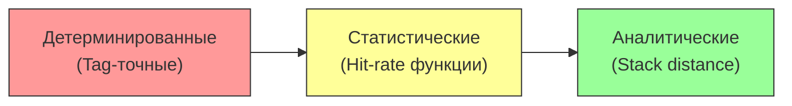

| Тип | Описание | Точность | Скорость | Пример использования |
|-----|----------|----------|----------|---------------------|
| **Tag‑точные** | Реально хранят теги, состояние MESI | Высокая | Низкая | Запуск ОС, верификация когерентности |
| **Статистические** | Предсказывают hit rate по параметрам | Средняя | Высокая | Оценка производительности приложений |
| **Аналитические** | Используют формулы (reuse distance) | Грубая | Очень высокая | Быстрая оценка влияния размера кэша |

<!-- 
Дать обзор трёх основных классов. Подчеркнуть trade‑off.
-->

---

# Детерминированные (Tag‑точные) модели

<div/>

**Как работают:**
- Хранят полный массив тегов (или ассоциативный контейнер с ограничением по ассоциативности)
- При каждом обращении обновляют состояние (LRU, псевдо‑LRU, состояние когерентности)
- Точно определяют hit/miss и генерируют корректные запросы к памяти

**Преимущества:**
- Можно запускать реальное ПО, ОС, драйверы — функционально точно
- Моделируют **когерентность** (протокол MESI)
- Пригодны для **смешанных симуляций** с RTL‑модулями

**Недостатки:**
- Медленнее статистических моделей (особенно при большом количестве ядер)
- Требуют больше памяти

**Применение:** pre‑silicon software development, bring‑up, верификация и тестирование

<!-- 
Это самая «честная» модель, но плата за точность — скорость.
-->

---

# Пример: упрощённая tag‑точная модель на C++

```cpp
class TagAccurateCache {
    struct Line {
        uint64_t tag;
        bool valid;
        MESIState state; // Modified, Exclusive, Shared, Invalid
    };
    // Для каждого сета — вектор линий (ассоциативность)
    std::vector<std::vector<Line>> sets;
    
    bool access(uint64_t addr, MESIState new_state) {
        auto [set_idx, tag] = decode(addr);
        auto& set = sets[set_idx];
        // Поиск тега
        for (auto& line : set) {
            if (line.valid && line.tag == tag) {
                // Хит: обновляем состояние
                line.state = new_state;
                update_lru(set, &line); // если нужно
                return true;
            }
        } // Промах
        ...
    }
};
```

<!-- 
Показать, что tag‑точная модель не обязательно должна быть такт‑точной — она может быть реализована в TLM.
-->

---

# Пример: упрощённая tag‑точная модель на C++

```cpp
class TagAccurateCache {
    struct Line {
        uint64_t tag;
        bool valid;
        MESIState state; // Modified, Exclusive, Shared, Invalid
    };
    // Для каждого сета — вектор линий (ассоциативность)
    std::vector<std::vector<Line>> sets;
    
    bool access(uint64_t addr, MESIState new_state) {
        auto [set_idx, tag] = decode(addr);
        auto& set = sets[set_idx];
        // Поиск тега
        ...
        
        // Промах: замещение
        auto& victim = select_victim(set);
        victim.tag = tag;
        victim.valid = true;
        victim.state = new_state;
        return false;
    }
};
```

<!-- 
Показать, что tag‑точная модель не обязательно должна быть такт‑точной — она может быть реализована в TLM.
-->

---

# Статистические (стохастические) модели

<div/>

**Идея:** Вместо хранения всех тегов, предсказываем **вероятность попадания** как функцию от параметров кэша и свойств трассы доступа

**Основные подходы:**
- **Hit‑rate функция:** `hit_rate = f(cache_size, associativity, line_size, ...)`
- **Модели на основе reuse distance:** анализируют расстояние между повторными обращениями к одному адресу
- **Статистическое усреднение:** агрегируют поведение множества обращений

<div class="mt-4 grid grid-cols-2 gap-4">
<div>

**Преимущества:**

<div class="text-sm">

- **Очень быстрые** — могут обрабатывать миллиарды обращений за секунды
- Не требуют хранения состояния всех линий
- Позволяют быстро «пробежаться» по пространству параметров (what‑if)

</div>
</div>
<div>

**Недостатки:**

<div class="text-sm">

- Не учитывают **конкретные конфликты** (только в среднем)
- Не пригодны для запуска ОС (нет функциональности)

</div>
</div>
</div>

<!-- 
Объяснить, почему статистические модели важны для архитектурного исследования.
-->

---

# Статистическая модель на основе hit‑rate функции

<div/>

Пусть у нас есть **известная hit‑rate функция** (полученная из профилирования или аналитически):

```cpp
double get_hit_rate(uint64_t cache_size, uint64_t associativity) {
    // Пример: для случайного доступа hit_rate ≈ cache_size / working_set_size
    // В реальности — более сложная функция
}
```

Тогда при симуляции транзакции:
- Генерируем случайное число `r`.
- Если `r < hit_rate`, считаем hit, иначе miss.
- При miss добавляем задержку и генерируем запрос к памяти.

```cpp
void Cache::b_transport(tlm_gp& trans, sc_time& delay) {
    double hr = get_hit_rate(cache_size, associativity);
    if (dist(rng) < hr) { delay += hit_latency; } else {
        delay += miss_latency;
        mem_socket->b_transport(trans, delay); // Генерируем запрос к следующему уровню
    }
}
```

<!-- 
Показать простейший случай. Отметить ограничения — усреднение теряет корреляции и не зависит от последовательности обращений.
-->

---

# Более точные статистические модели: reuse distance

<div/>

**Reuse distance (stack distance)** — количество различных адресов между двумя обращениями к одному и тому же адресу

- Если reuse distance < associativity × num_sets → **hit**
- Иначе → **miss**

**Как используется:**
1. Собираем трассу обращений (или генерируем синтетическую)
2. Для каждого обращения вычисляем reuse distance (алгоритмом с хэш‑таблицей)
3. Для заданного кэша определяем hit/miss по порогу
4. Агрегируем hit rate

<!-- 
Ввести понятие reuse distance — это основа многих аналитических моделей.
-->

---

# Более точные статистические модели: reuse distance

<div/>

```cpp
int64_t reuse_distance(const std::vector<uint64_t>& trace) {
    std::unordered_map<uint64_t, int64_t> last_pos;
    std::vector<int64_t> distances;
    for (size_t i = 0; i < trace.size(); ++i) {
        auto it = last_pos.find(trace[i]);
        if (it != last_pos.end()) {
            distances.push_back(i - it->second);
        } else {
            distances.push_back(-1); // первое обращение
        }
        last_pos[trace[i]] = i;
    }
    return distances;
}
```

<!-- 
Ввести понятие reuse distance — это основа многих аналитических моделей.
-->

---

# Аналитические модели: когда скорость критична

<div/>

**Аналитические модели** используют **формулы** для оценки производительности без симуляции трассы

Пример: модель **miss rate** для кэша с LRU (упрощённая аппроксимация):
```
miss_rate ≈ (1 - cache_size / working_set_size) ^ associativity
```

**Достоинства:**
- Результат за миллисекунды
- Позволяют быстро исследовать огромное пространство параметров

**Недостатки:**
- Не учитывают детали паттерна доступа
- Применимы только к регулярным паттернам (циклы, стримы)

**Применение:** ранние этапы проектирования, сравнение архитектурных альтернатив

<!-- 
Для студентов, интересующихся компиляторами, это может быть особенно важно — они могут оценивать влияние своих оптимизаций без полной симуляции.
-->

---

# Когда какую модель выбирать?

| Задача | Рекомендуемая модель |
|--------|---------------------|
| Запуск ОС и драйверов | **Tag‑точная** (функциональность важна) |
| Оценка производительности приложения | **Статистическая** (быстрая, достаточно точная) |
| Исследование влияния ассоциативности / размера линии | **Аналитическая** или **статистическая** |
| Детальный анализ конфликтов (например, false sharing) | **Tag‑точная** (нужна точная когерентность) |
| Моделирование сотен ядер | **Статистическая** (иначе не хватит ресурсов) |

В реальных проектах часто используют **гибридные** подходы: tag‑точная модель для L1, статистическая для L3 и выше

<!-- 
Дать практические рекомендации.
-->

---
layout: section
---

# Скрытая ~~угроза~~ сложность: Когерентность

---

# Многоядерность меняет правила игры

<div class="mt-16"/>

В одноядерной системе кэш — это просто «ускоритель памяти»

В многоядерной системе **кэши начинают взаимодействовать**:

- Каждое ядро имеет свой локальный кэш
- Данные могут дублироваться в нескольких кэшах
- Если одно ядро пишет в данные, копии в других кэшах становятся недействительными

<div class="mt-16"/>

### Это явление называется **когерентностью кэшей** (cache coherency).

<!-- 
Показать, почему в предыдущих лекциях (где была шина и DRAM) мы не учитывали когерентность — там была только одна копия данных.
-->

---
layout: two-cols-header
---

# Когерентность: проблема «свежести» данных

::left::

<div class="mt-16"/>

**Проблема:**
- Ядро 0 читает переменную X → данные попадают в его кэш
- Ядро 1 пишет новое значение в X
- Ядро 0 снова читает X — оно должно получить **новое** значение, а не старое из своего кэша

**Без когерентности** — некорректное поведение.

::right::

<div class="flex items-center justify-center h-full w-110%">
  <div class="w-full">

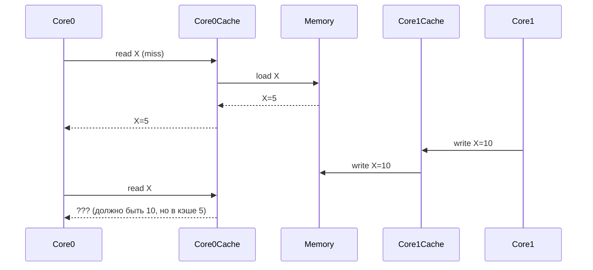

  </div>
</div>

<!-- 
Проиллюстрировать проблему простым сценарием. Это основа для понимания необходимости протоколов.
-->

---

# Решение: протокол MESI

MESI — самый распространённый протокол когерентности.

| Состояние | Значение | Где находится |
|-----------|----------|---------------|
| **M**odified | Линия изменена, данные действительны только в этом кэше, в памяти устарели | Только в этом кэше |
| **E**xclusive | Линия не изменена, только в этом кэше, в памяти актуальна | Только в этом кэше |
| **S**hared | Линия не изменена, может быть в нескольких кэшах, в памяти актуальна | В нескольких кэшах |
| **I**nvalid | Линия недействительна | Нет |

Каждая линия кэша имеет одно из этих состояний.

<!-- 
Ввести состояния MESI. Это ключевой протокол.
-->

---

# Диаграмма переходов состояний MESI

<div class="flex items-center justify-center h-full w-full">
  <div class="h-full w-50%">

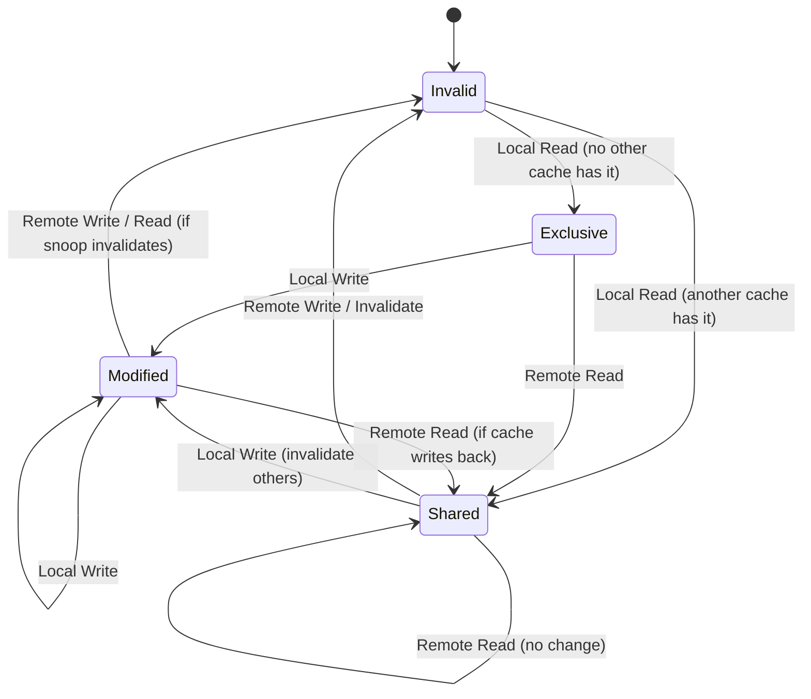

</div>
</div>

<!-- 
Показать основные переходы. Это сложно, но важно для понимания служебного трафика.
-->

---

# Как когерентность влияет на трафик?

<div class="mt-8"/>

Когерентность добавляет **служебные сообщения** (coherency traffic):

- **Invalidate** — «эта линия больше недействительна»
- **Read with intent to modify** — «хочу читать и писать, отдайте эксклюзивный доступ»
- **Snoop** — «кто ещё держит эту линию?»

Эти сообщения передаются по той же шине/NoC, что и обычные транзакции, и создают **дополнительную нагрузку**

<div class="mt-8"/>

В наших предыдущих моделях шины мы учитывали только запросы данных. Теперь нужно добавить служебные пакеты

<!-- 
Подчеркнуть, что когерентность — это не просто состояние, а дополнительные транзакции, которые мы должны моделировать.
-->

---

# Моделирование когерентности: два подхода

| Подход | Описание | Плюсы | Минусы |
|--------|----------|-------|--------|
| **Snooping (шина)** | Все кэши «подслушивают» транзакции на шине. При записи рассылаются инвалидации. | Простая модель, легко добавить к существующей шине | Не масштабируется (шина — узкое место) |
| **Directory‑based** | Центральный каталог отслеживает, у каких кэшей есть линия. | Масштабируется на сотни ядер | Сложнее реализовать, добавляет задержки на обращение к каталогу |

Для перфоманс-модели часто используют **snooping**, так как он проще и хорошо ложится на уже имеющуюся модель шины.

<!-- 
Дать обзор подходов, указать, что для учебных целей проще взять snooping.
-->

---

# Моделирование snooping в TLM

<div />

В нашей модели шины нужно добавить:

1. **Отслеживание состояния линий** в каждом кэше (MESI)
2. **Дополнительные транзакции** для инвалидаций
3. **Прослушивание (snooping)** — при транзакции записи шина рассылает уведомления всем кэшам

```cpp
void Bus::b_transport(int id, tlm_gp& trans, sc_time& delay) {
    // ... арбитраж ...
    
    // Если это write транзакция, рассылаем инвалидации
    if (trans.get_command() == TLM_WRITE_COMMAND) {
        for (auto& cache : caches) {
            cache->invalidate(trans.get_address());
        }
    }
    
    // Отправляем запрос к памяти
    mem_socket->b_transport(trans, delay);
}
```

<!-- 
Показать, как инвалидация встраивается в шину. Это добавляет служебные сообщения и увеличивает задержки.
-->

---

# Ложное разделение (False sharing)

<div />

- Два ядра пишут в **разные переменные**, но они находятся в **одной линии кэша**.
- При записи одного ядра линия инвалидируется в другом ядре.
- При следующем обращении — промах, хотя данные формально не конфликтовали.

**Эффект на производительность:**
- Резкое увеличение промахов (miss rate).
- Дополнительный трафик когерентности.
- Снижение масштабируемости.

<div class="mt-4 text-center text-sm">
⚠️ Это одна из главных «ловушек» для многопоточных программ.
</div>

<!-- 
Ключевое понятие. Студенты-софтверщики должны понять, как их код может страдать от этого.
-->

---

# Визуализация false sharing

<div class="flex items-center justify-center h-full w-full">
  <div class="h-full w-70%">

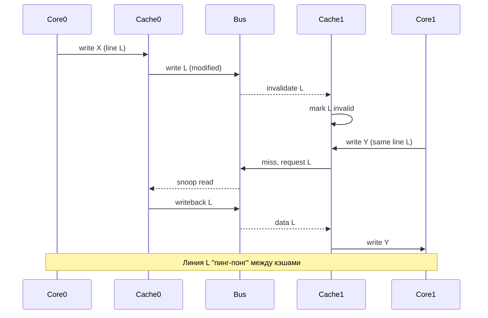

</div>
</div>

<!-- 
Показать циклический обмен линии.

Каждое обращение к X или Y вызывает промах и пересылку линии, что резко увеличивает latency.
-->

---

# Как false sharing проявляется в модели?

<div />

В перфоманс-модели false sharing даёт:

- **Рост miss rate** в кэшах (каждое обращение — промах)
- **Увеличение задержки** за счёт пересылки линии между кэшами
- **Дополнительная нагрузка на шину/NoC** из-за служебного трафика

**Что нужно смоделировать:**
- При записи в линию, которая находится в состоянии **Shared** → генерация **invalidates** всем кэшам, где эта линия есть
- При последующем обращении другого ядра к той же линии — **miss** и запрос данных из другого кэша

<!-- 
Объяснить, как это отражается в метриках.
-->

---

# Как разработчику ПО бороться с false sharing?

1. **Выравнивание данных** (alignment) — размещать часто изменяемые переменные на отдельных линиях кэша
   ```cpp
   struct alignas(64) Data { int x; };
   ```

2. **Использование локальных переменных** вместо глобальных, где возможно

3. **Минимизация общего состояния** между потоками

4. **Инструменты профилирования** для обнаружения false sharing (например, Intel VTune, perf)

<!-- 
Дать практические советы, акцентировать пользу модели.
-->

---

# Моделирование когерентности в нашей системе

<div/>

Вспомним нашу систему: два CPU, шина, DRAM

**Добавляем кэши L1 для каждого CPU:**

```cpp
class CPU : public sc_module {
    tlm_utils::simple_initiator_socket<CPU> socket; // к кэшу
    // ... генератор запросов
};

class L1Cache : public sc_module {
    tlm_utils::simple_target_socket<L1Cache> cpu_socket;
    tlm_utils::simple_initiator_socket<L1Cache> mem_socket; // к шине
    
    // MESI состояние для каждой линии
    std::unordered_map<uint64_t, MESIState> lines;
    
    void b_transport(tlm_gp& trans, sc_time& delay) {
        // ... обработка с учётом MESI
        // При записи в Shared — рассылка invalidates через шину
    }
};
```

**Шина** должна поддерживать snooping и передавать invalidates

<!-- 
Конкретный пример, как расширить существующую модель.
-->

---

# Сложность моделирования когерентности

| Аспект | Сложность |
|--------|-----------|
| **Состояние** | Нужно хранить MESI для каждой линии (в tag‑точной модели). |
| **Служебный трафик** | Добавляются новые типы транзакций (invalidate, snoop response). |
| **Задержки** | Invalidate занимает время (шина), добавление задержки к транзакции. |
| **Масштабирование** | С ростом числа ядер растёт и сложность (сравните 2 vs 64 ядра). |

В **статистических моделях** когерентность часто **упрощают**: вводят дополнительный фактор увеличения miss rate для линий, которые могут быть в нескольких кэшах.

<!-- 
Признать, что полная модель когерентности сложна, и показать, где можно упростить.
-->

---
layout: section
---

# Моделирование Prefetcher

---

# Зачем нужен prefetcher?

<div class="mt-8"/>

**Проблема:**  
Кэши уменьшают задержку при повторных обращениях, но **первое обращение к данным (cold miss)** всё равно идёт в медленную память

**Идея prefetcher:**  
Предсказать, какие данные понадобятся в будущем, и **загрузить их заранее** в кэш, чтобы к моменту обращения они уже были там

<div class="mt-4 grid grid-cols-2 gap-4">
<div>

**Без prefetcher:**
```
CPU запрос → miss → ожидание 100 нс → hit
```

</div>
<div>

**С prefetcher:**
```
Prefetcher → запрос в память (100 нс)
CPU запрос → hit → задержка 1 нс
```

</div>
</div>

Prefetcher **скрывает** задержку первого доступа к памяти

<!-- 
Ввести концепцию. Prefetcher — это механизм предсказания, позволяющий "перекрыть" латентность памяти.
-->

---

# Типы prefetcher'ов

<div class="flex items-center justify-center h-95% w-full">
  <div class="w-full">

| Тип | Принцип | Пример |
|-----|---------|--------|
| **Stride** | Обнаруживает регулярные приращения адресов (например, +64 байта) | Массивы, итерация по указателям |
| **Пространственный** | Загружает соседние линии кэша | При чтении адреса A загружает A+line_size |
| **Марковский** | Анализирует последовательности обращений, строит граф переходов | Сложные неправильные паттерны |
| **На основе инструкций** | Использует информацию из программы (компилятор вставляет prefetch) | `__builtin_prefetch` |
| **Адаптивный** | Переключается между стратегиями | Современные процессоры |

В перфоманс-моделях чаще всего моделируют **stride** и **пространственный** prefetcher'ы, так как они дают наибольший выигрыш при умеренной сложности

</div>
</div>

<!-- 
Дать обзор основных типов, подчеркнуть, что для учебной модели достаточно простых.
-->

---

# Как prefetcher встраивается в модель кэша?

<div class="mt-16"/>

**Схема с prefetcher:**

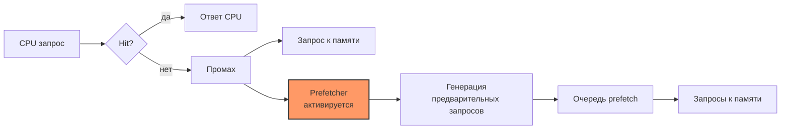

Prefetcher **параллельно** с основным запросом может отправлять дополнительные запросы к памяти

**Важно:** Prefetcher не должен замедлять основные запросы (обычно имеет низкий приоритет)

<!-- 
Показать место prefetcher'а в потоке обработки.
-->

---

# Уровни детализации модели prefetcher

| Уровень | Описание | Применение |
|---------|----------|------------|
| **Аналитический** | Prefetcher задаётся параметрами: coverage (доля промахов, которые он предсказывает), accuracy (доля полезных prefetch) | Быстрые what‑if оценки |
| **Поведенческий (TLM)** | Простая логика: при промахе сгенерировать prefetch для следующего адреса (stride) | Оценка влияния на hit rate |
| **Детальный (AT)** | Моделирование очередей prefetch, учёт задержек, конфликтов с обычными запросами | Точный анализ производительности |
| **Цикло-точный (RTL)** | Полная реализация конечного автомата prefetcher | Верификация, крайне медленно |

<!-- 
Подчеркнуть, что в перфоманс-моделях можно использовать упрощённые модели prefetcher.
-->

---

# Простая модель stride prefetcher

<div/>

**Алгоритм:**
- Отслеживаем последний адрес обращения к памяти для каждого потока/ядра
- Если разница между текущим и предыдущим адресом постоянна (stride), то предсказываем следующий адрес
- Генерируем prefetch запрос на следующий адрес

```cpp
class StridePrefetcher {
    struct Stream {
        uint64_t last_addr;
        uint64_t stride;
        bool active;
    };
    std::unordered_map<uint64_t, Stream> streams; // key: core/thread ID
    
    ...
```

---

# Простая модель stride prefetcher

```cpp
class StridePrefetcher {
    ...
    
    void on_miss(uint64_t addr, uint64_t core_id) {
        auto& stream = streams[core_id];
        if (!stream.active) {
            stream.last_addr = addr;
            stream.active = true;
            return;
        }
        uint64_t diff = addr - stream.last_addr;
        if (stream.stride == 0) {
            stream.stride = diff;
        } else if (diff == stream.stride) {
            // устойчивый stride
            uint64_t prefetch_addr = addr + stream.stride;
            issue_prefetch(prefetch_addr);
        } else {
            stream.stride = diff; // stride изменился, сбрасываем
        }
        stream.last_addr = addr;
    }
};
```

<!-- 
Конкретная реализация на C++. Важно показать, как отслеживается stride.
-->

---

# Моделирование пространственного prefetcher

<div/>

**Идея:** При обращении к адресу A, загрузить также соседние линии (A+1, A+2, ...).

```cpp
void SpatialPrefetcher::on_access(uint64_t addr) {
    uint64_t line = addr / line_size;
    for (int i = 1; i <= prefetch_distance; ++i) {
        uint64_t prefetch_line = line + i;
        issue_prefetch(prefetch_line * line_size);
    }
}
```

**Настройки:**
- `prefetch_distance` — сколько линий вперёд загружать
- Ограничение на количество активных prefetch (чтобы не переполнить очередь)

**Важно:** Пространственный prefetcher может приводить к **загрязнению кэша** (pollution) — загрузке ненужных данных, которые вытесняют полезные

<!-- 
Пространственный prefetcher прост в реализации, но требует учёта загрязнения.
-->

---

# Добавление prefetcher в модель кэша (TLM)

<div/>

Расширим класс кэша:

```cpp
class Cache : public sc_module {
    tlm_utils::simple_target_socket<Cache> cpu_socket;
    tlm_utils::simple_initiator_socket<Cache> mem_socket;
    
    StridePrefetcher prefetcher;
    bool prefetch_enabled;
    
    void b_transport(tlm_gp& trans, sc_time& delay) {
        uint64_t addr = trans.get_address();
        if (is_hit(addr)) {
            delay += hit_latency;
            return;
        }
        
        // Промах: обрабатываем основной запрос
        sc_time miss_delay = SC_ZERO_TIME;
        ...
    }
};
```

---

# Добавление prefetcher в модель кэша (TLM)

<div/>

Расширим класс кэша:

```cpp
class Cache : public sc_module {
    tlm_utils::simple_target_socket<Cache> cpu_socket;
    tlm_utils::simple_initiator_socket<Cache> mem_socket;
    
    StridePrefetcher prefetcher;
    bool prefetch_enabled;
    
    void b_transport(tlm_gp& trans, sc_time& delay) {
        ...
        // Промах: обрабатываем основной запрос
        sc_time miss_delay = SC_ZERO_TIME;
        mem_socket->b_transport(trans, miss_delay);
        delay += miss_delay;
        // Активируем prefetcher при промахе
        if (prefetch_enabled) {
            prefetcher.on_miss(addr, get_core_id());
            // Prefetch запросы идут асинхронно (например, в отдельном потоке)
        }
        update_cache(addr);
    }
};
```

---

# Асинхронная обработка prefetch

<div/>

Prefetch не должен блокировать основной запрос. Используем **отдельный поток** (SC_THREAD) для очереди prefetch:

```cpp
void Cache::prefetch_thread() {
    while (true) {
        wait(prefetch_queue_ready);
        auto [addr, core_id] = prefetch_queue.pop();
        
        // Отправляем prefetch запрос к памяти (с низким приоритетом)
        tlm_gp trans;
        trans.set_address(addr);
        trans.set_command(TLM_READ_COMMAND);
        sc_time delay;
        mem_socket->b_transport(trans, delay);
        
        // Если данные вернулись, обновляем кэш (но не будим CPU)
        update_cache(addr);
    }
}
```

**Важно:** Prefetch запросы могут быть отброшены, если очередь переполнена — это моделирует ограниченные ресурсы аппаратуры

<!-- 
Объяснить, почему prefetch должен быть асинхронным, и как это реализовать в SystemC.
-->

---

# Метрики эффективности prefetcher

| Метрика | Описание | Формула |
|---------|----------|---------|
| **Coverage** | Доля промахов, которые предсказаны prefetcher'ом | `prefetch_hits / total_misses` |
| **Accuracy** | Доля предсказаний, которые оказались полезными (т.е. данные были использованы) | `useful_prefetches / total_prefetches` |
| **Latency reduction** | Сокращение средней задержки доступа | `(baseline_latency - new_latency) / baseline_latency` |
| **Pollution** | Дополнительные промахи из‑за вытеснения полезных данных | качественная оценка |

В перфоманс-модели мы собираем эти метрики во время симуляции

<!-- 
Важно, чтобы студенты понимали, как оценивать эффективность prefetcher.
-->

---

# Влияние prefetcher на систему

<div/>

**Позитивные эффекты:**
- Увеличивается hit rate (особенно для последовательных паттернов)
- Снижается средняя задержка доступа
- Повышается пропускная способность (меньше простоев CPU)

**Негативные эффекты:**
- **Pollution** — prefetch вытесняет из кэша данные, которые скоро понадобятся
- **Дополнительный трафик** на шину/NoC, может создавать конфликты
- **Энергопотребление** — лишние обращения к памяти

В модели нужно уметь включать/выключать prefetcher и сравнивать метрики

<!-- 
Подчеркнуть, что prefetcher — это не всегда хорошо, нужно учитывать компромиссы.
-->

---

# Взаимодействие prefetcher с когерентностью

<div class="mt-8"/>

Prefetch запросы тоже участвуют в когерентности:
- Prefetch на чтение обычно ставит линию в состояние **Shared**
- Prefetch на запись (для предварительной загрузки перед записью) — **Exclusive**

**Особенности:**
- Prefetch может вызывать инвалидации (если линия была в Modified у другого кэша)
- В многоядерных системах prefetch может увеличивать служебный трафик

В простой модели можно игнорировать когерентность для prefetch, но для точности стоит учитывать

<!-- 
Связь с предыдущей частью лекции.
-->

---

# Prefetcher и компилятор

<div class="mt-8"/>

**Программный prefetch:**
- Компилятор может вставлять инструкции `prefetch` в код
- Это позволяет точно указать, какие данные загружать

**Роль модели:**
- Оценить, насколько эффективны программные prefetch по сравнению с аппаратными
- Определить оптимальную дистанцию prefetch (на сколько вперёд)

```cpp
// Пример: компилятор может сгенерировать
for (int i = 0; i < N; i++) {
    __builtin_prefetch(&a[i+100], 0, 0); // prefetch на 100 шагов вперёд
    sum += a[i];
}
```

Модель позволяет подобрать параметры prefetch для конкретной архитектуры

---

# Моделирование prefetcher в нашей системе

<div />

Вернёмся к нашей системе (два CPU, шина, DRAM) с добавленными кэшами и когерентностью

**Добавим prefetcher в L1 кэш:**

```cpp
class L1Cache : public sc_module {
    // ... как раньше
    StridePrefetcher prefetcher;
    
    void b_transport(tlm_gp& trans, sc_time& delay) {
        // ... обработка промаха ...
        if (is_miss && prefetch_enabled) {
            prefetcher.on_miss(addr, core_id);
            // Prefetch запросы отправляем асинхронно
        }
    }
};
```

**Сравнение сценариев:**
- Без prefetcher
- С пространственным prefetcher (загрузка +1 линии)
- Со stride prefetcher

<!-- 
Конкретный пример, чтобы студенты могли реализовать.

Модель покажет изменение hit rate, загрузки шины и средней latency.
-->

---

# Скрытые сложности при моделировании prefetcher

<div class="mt-8"/>

1. **Зависимость от трассы:** Prefetcher может быть эффективен на одних приложениях и бесполезен на других
2. **Выбор параметров:** Дистанция prefetch, глубина очереди, политика замещения prefetch'ами
3. **Взаимодействие с несколькими ядрами:** Prefetch одного ядра может вытеснять данные другого
4. **Оценка загрязнения (pollution):** Сложно измерить, так как требует сравнения с идеальным кэшем

**Решение:** Использовать моделирование с разными конфигурациями и собирать статистику (hit rate, coverage, accuracy)

<!-- 
Предупредить о подводных камнях.
-->

---

# Итоги по моделированию prefetcher

<div class="mt-8"/>

- **Prefetcher** — мощный механизм скрытия задержки памяти
- В перфоманс-моделях prefetcher может быть реализован на уровне **TLM** с асинхронными запросами
- Ключевые метрики: **coverage**, **accuracy**, **latency reduction**
- Prefetcher может как улучшать, так и ухудшать производительность (pollution, дополнительный трафик)
- Моделирование помогает подобрать оптимальную стратегию prefetch для конкретной рабочей нагрузки

---
layout: section
---

# Практический пример: Сборка простой системы

---

# Что мы построим

<div class="mt-16"/>

Соберём систему, объединяющую все компоненты из предыдущих частей:

- **2 CPU** — генераторы запросов
- **L1 кэши** — tag‑точные, с MESI когерентностью
- **Prefetcher** — stride
- **Шина** — с арбитром Round Robin, поддержкой snooping
- **DRAM** — модель с очередями и банками

<!-- 
Перечисляем компоненты, кратко напоминаем, где они были введены.

Цель: увидеть, как взаимодействие компонентов влияет на итоговую производительность.
-->

---
layout: two-cols-header
---

# Архитектура системы

::left::

<div class="mt-16"/>

- CPU → L1 кэш: блокирующий интерфейс (b_transport)
- L1 → шина: также блокирующий (но внутри кэша может быть неблокирующим)
- Шина → DRAM: блокирующий
- Snooping: шина рассылает инвалидации всем кэшам

::right::

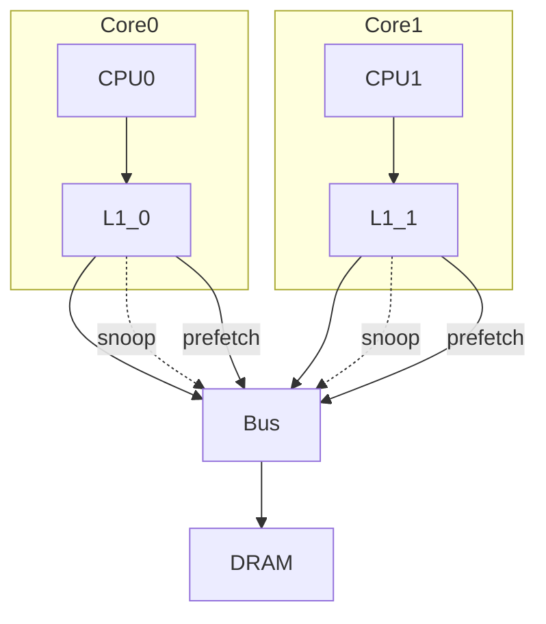

<!-- 
Визуализация системы. Важно показать связи и snooping.
-->

---

# Топ-уровень: sc_main и коммутация

```cpp
int sc_main(int argc, char* argv[]) {
    // Создаём модули
    CPU cpu0("cpu0"), cpu1("cpu1");
    L1Cache l1_0("l1_0"), l1_1("l1_1");
    Bus bus("bus", 2, 1);  // 2 инициатора (кэши), 1 таргет (DRAM)
    DRAM dram("dram", 1024 * 1024 * 1024);  // 1 GB
    
    // Связываем
    cpu0.socket.bind(l1_0.cpu_socket);
    cpu1.socket.bind(l1_1.cpu_socket);
    
    l1_0.mem_socket.bind(bus.target_socket[0]);
    l1_1.mem_socket.bind(bus.target_socket[1]);
    
    bus.initiator_socket[0].bind(dram.socket);
    // Запускаем симуляцию
    sc_start(100000, SC_NS);
    // Выводим статистику
    bus.print_stats();
    l1_0.print_stats();
    l1_1.print_stats();
    dram.print_stats();
    return 0;
}
```

<!-- 
Показать, как собирается система. Обратить внимание на количество сокетов и их типы.
-->

---

# Конфигурации для сравнения

<div class="mt-8"/>

Мы запустим симуляцию в нескольких конфигурациях, чтобы изучить эффекты:

| Конфигурация | L1 кэш | Когерентность | Prefetcher | Описание |
|--------------|--------|---------------|------------|----------|
| **Base** | 32KB, 8‑way | MESI | Нет | Базовый уровень |
| **+Prefetch** | 32KB, 8‑way | MESI | Стридный | Влияние prefetch |
| **+False sharing** | 32KB, 8‑way | MESI | Нет | Специальная нагрузка |
| **+Larger cache** | 128KB, 8‑way | MESI | Нет | Влияние размера |

Сценарии нагрузки: последовательный доступ (streaming), случайный доступ, конфликтный доступ (к одному банку DRAM), false sharing

<!-- 
Обозначаем эксперименты, которые будем проводить.
-->

---

# Нагрузка: генерация запросов в CPU

```cpp
class CPU : public sc_module {
    tlm_utils::simple_initiator_socket<CPU> socket;
    SC_THREAD(generate_requests);
    void generate_requests() { // Выбираем тип нагрузки
        if (workload == "streaming") {
            uint64_t addr = base_addr;
            for (int i = 0; i < num_requests; i++) {
                send_request(addr, TLM_READ_COMMAND);
                addr += line_size; // 64 bytes
                wait(inter_request_delay); // например, 10 ns
            }
        } else if (workload == "random") { // равномерно по всей памяти
            for (int i = 0; i < num_requests; i++) {
                uint64_t addr = rand() % mem_size;
                send_request(addr, TLM_READ_COMMAND);
                wait(inter_request_delay);
            }
        } else if (workload == "false_sharing") { // два ядра пишут в разные переменные в одной линии
            uint64_t line_base = 0x1000;
            uint64_t var0 = line_base;      // переменная ядра 0
            uint64_t var1 = line_base + 4;  // переменная ядра 1 (в той же линии)
            // ...
        }
    }
};
```

<!-- 
Показать, как задаются разные паттерны. Связь с лекцией 10 (подготовка нагрузок).
-->

---

# Ожидаемые результаты: последовательный доступ

<div class="mt-8"/>

**Конфигурация:** оба CPU читают последовательные массивы в разных банках DRAM

| Конфигурация | Средняя latency (ns) | Hit rate L1 | Загрузка шины | Примечание |
|--------------|---------------------|-------------|---------------|------------|
| Base | 12 | 95% | 15% | Хиты в L1, редкие промахи |
| +Prefetch | 8 | 98% | 20% | Prefetch скрывает часть промахов |
| +Larger cache | 10 | 97% | 12% | Больше хитов, меньше промахов |

**Вывод:** Prefetch даёт наибольший выигрыш для предсказуемых паттернов

<!-- 
Примерные цифры для иллюстрации. Важно подчеркнуть, что prefetch помогает.
-->

---

# Ожидаемые результаты: случайный доступ

<div class="mt-8"/>

**Конфигурация:** оба CPU обращаются к случайным адресам по всей памяти

| Конфигурация | Средняя latency (ns) | Hit rate L1 | Загрузка шины |
|--------------|---------------------|-------------|---------------|
| Base | 85 | 5% | 98% |
| +Prefetch | 82 | 6% | 99% |
| +Larger cache | 70 | 15% | 85% |

**Вывод:** 
- Случайный доступ почти не выигрывает от prefetch (низкая accuracy)
- Увеличение кэша помогает больше, но требует площади чипа
- Шина становится узким местом (нагрузка ~100%)

<!-- 
Показать, что prefetch не панацея.
-->

---

# Ожидаемые результаты: false sharing

<div/>

**Сценарий:** два ядра пишут в разные переменные, но они находятся в одной линии кэша

| Конфигурация | Средняя latency (ns) | Miss rate L1 | Coherency traffic |
|--------------|---------------------|--------------|-------------------|
| Base (без false sharing) | 12 | 5% | Низкий |
| Base (false sharing) | 45 | 40% | Высокий |
| +Larger line size (128B) | 50 | 45% | Ещё выше (больше данных в одной линии) |
| +Aligned variables (отдельные линии) | 13 | 6% | Низкий |

False sharing **резко** ухудшает производительность <br/>
Выравнивание данных оказывает значительный результат

<!-- 
Демонстрируем эффект, который напрямую важен для разработчиков ПО.
-->

---

# Анализ загрузки шины

<div class="mt-8"/>

Соберём статистику использования шины для разных конфигураций:

```cpp
void Bus::b_transport(int id, tlm_gp& trans, sc_time& delay) {
    busy_time += delay;  // накапливаем время, когда шина занята
    // ... арбитраж ...
    initiator_socket[target_id]->b_transport(trans, delay);
}

void Bus::print_stats() {
    double utilization = busy_time / (sc_time_stamp().to_double() * 1e-9);
    cout << "Bus utilization: " << utilization * 100 << "%" << endl;
}
```

---

# Анализ загрузки шины

<div class="mt-8"/>

**Результаты (streaming, случайный, false sharing):**

| Нагрузка | Base | +Prefetch | False sharing |
|----------|------|-----------|---------------|
| Streaming | 15% | 20% | 18% |
| Random | 98% | 99% | 97% |
| False sharing | 45% | 50% | 85% |

**Вывод:** При случайном доступе шина — главное узкое место. Prefetch добавляет нагрузку, но не решает проблему

<!-- 
Показать, как собирать метрики и интерпретировать.
-->

---

# Визуализация: latency vs. количество ядер

<div class="mt-8"/>

Проведём масштабирование: добавим ещё ядра (до 8) и посмотрим на среднюю latency

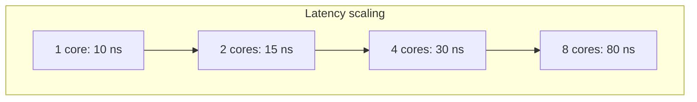

**Причина:** шина становится узким местом. При 8 ядрах она почти всегда занята, очередь растёт, latency растёт

**Что делать?** Переход на NoC — позволяет увеличить параллелизм

<!-- 
Связь с лекцией 7, подчёркиваем важность NoC.
-->

---

# Результаты: влияние размера кэша

<div class="mt-8"/>

Проведём эксперимент: меняем размер L1 кэша для двух ядер, нагрузка — streaming

| Размер L1 | Hit rate | Latency (ns) | Примечание |
|-----------|----------|--------------|------------|
| 8KB | 70% | 35 | Частые промахи |
| 32KB | 95% | 12 | Хороший баланс |
| 128KB | 98% | 9 | Уменьшение отдачи (diminishing returns) |

**Вывод:** Для последовательного доступа увеличение кэша даёт выигрыш, но после определённого размера отдача снижается, модель помогает найти оптимальный размер

<!-- 
Показать trade-off.
-->

---

# Измерение эффективности prefetch

<div/>

Для конфигурации с prefetch соберём метрики:

```cpp
class Prefetcher {
    int total_prefetches = 0;
    int useful_prefetches = 0;  // prefetch, данные которых были использованы
    int useless_prefetches = 0; // prefetch, данные которых были вытеснены или не использованы
};

void Prefetcher::on_miss(...) {
    // ...
    if (data_used) useful_prefetches++;
    else useless_prefetches++;
}

void Prefetcher::print_stats() {
    cout << "Coverage: " << (float)useful_prefetches / total_misses * 100 << "%" << endl;
    cout << "Accuracy: " << (float)useful_prefetches / total_prefetches * 100 << "%" << endl;
}
```

**Для stride:** Coverage 80%, Accuracy 70% (некоторые предсказания ошибочны)  
**Для случайного доступа:** Coverage 5%, Accuracy 2% (почти бесполезен)

<!-- 
Показать, как оценивать prefetch.
-->

---

# Собираем всё вместе: пример кода для L1 кэша с prefetch и когерентностью

```cpp
class L1Cache : public sc_module {
    tlm_utils::simple_target_socket<L1Cache> cpu_socket;
    tlm_utils::simple_initiator_socket<L1Cache> mem_socket;
    
    std::unordered_map<uint64_t, CacheLine> tag_store;
    StridePrefetcher prefetcher;
    tlm_utils::peq_with_get<tlm_gp> prefetch_queue;
    
    void b_transport(tlm_gp& trans, sc_time& delay) {
        uint64_t addr = trans.get_address();
        if (is_hit) { // ... проверка hit/miss с учётом MESI ...
            delay += hit_latency;
            trans.set_response_status(TLM_OK_RESPONSE);
            return;
        }
        // Промах и обработка когерентности (инвалидация других кэшей через шину) ...
        mem_socket->b_transport(trans, delay); // блокирующий вызов
        // После возврата данные в trans
        update_cache(addr);
        // Prefetch (асинхронно)
        prefetcher.on_miss(addr, core_id);
    }
};
```

<!-- 
Показать, как объединяются все механизмы.
-->

---

# Что даёт такой пример?

1. **Наглядность:** Студенты видят, как все компоненты работают вместе
2. **Практика:** Могут сами собрать систему, изменить параметры и наблюдать эффекты
3. **Понимание trade‑offs:** Увеличение кэша vs prefetch vs когерентность
4. **Связь с реальностью:** Такие модели используются в индустрии для архитектурного анализа

**Важно:** Модель остаётся на уровне TLM, поэтому она быстрая (часы симуляции, а не дни)

<!-- 
Подчеркнуть ценность для студентов.
-->

---

# Итоги по сборке системы

- Мы построили **полную иерархию** памяти: CPU → L1 → шина → DRAM
- Добавили **когерентность** (MESI) и **prefetcher**
- Провели серию экспериментов, показывающих влияние параметров на производительность
- Увидели, как **false sharing** и **случайный доступ** создают узкие места

<!-- 
Следующий шаг: верификация и калибровка моделей — как убедиться, что наша модель говорит правду.

Резюме, переход к следующей теме.
-->

---
layout: section
---

# Заключение по подсистеме памяти и мостик в будущее

---

# Что мы узнали сегодня?

<div/>

Сегодня мы прошли путь от простого кэша до полноценной многоядерной системы с когерентностью и предсказанием

<div class="grid grid-cols-2 gap-4 mt-8">
<div>

**Мы научились:**
- Строить модель кэша на основе **Tag Store**
- Различать **детерминированные**, **статистические** и **аналитические** модели
- Моделировать **когерентность** и **false sharing**
- Добавлять **prefetcher** и оценивать его эффективность
- Собирать систему из компонентов

</div>
<div>

**Главные выводы:**
- Кэш — это **устройство с состоянием**, влияющее на производительность
- Когерентность добавляет **служебный трафик**
- Prefetcher **скрывает задержки**, но может вызывать **pollution**
- Выбор модели — **компромисс** между точностью и скоростью

</div>
</div>

<!-- 
Краткое резюме. Подчеркнуть, что это был путь от простого к сложному.
-->

---
layout: two-cols-header
---

# Ключевые концепции

<div class="mt-16"/>

::left::

- **Tag Store** — основа детерминированной модели
- **Hit/Miss** — определяет задержку и дальнейшие действия
- **Replacement** — влияет на hit rate
- **Coherency** — добавляет служебный трафик и меняет состояния
- **Prefetcher** — улучшает hit rate, но требует осторожности

::right::

<div class="flex items-center justify-center w-full">
  <div class="w-full">

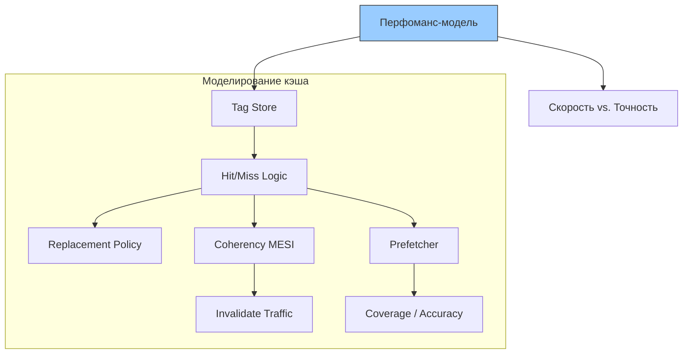

</div>
</div>

<!-- 
Обобщающая схема, показывающая взаимосвязи.
-->

---

# Иерархия моделей: когда что использовать?

| **Задача** | **Рекомендуемая модель** |
|------------|--------------------------|
| Запуск ОС / драйверов | Tag‑точная (с функциональностью) |
| Оценка производительности приложения | Статистическая (hit‑rate функция) |
| Исследование архитектурных параметров | Аналитическая или статистическая |
| Детальный анализ конфликтов (false sharing) | Tag‑точная + когерентность |
| Масштабирование до сотен ядер | Статистическая или гибридная |

**Гибридный подход:**  
- L1 — tag‑точная (точность важна для когерентности)
- L2/L3 — статистическая (скорость для большого объёма)

<!-- 
Практическая рекомендация, как выбирать уровень детализации.
-->

---

# Метрики, которые мы научились собирать

| Метрика | Что измеряет | Где используется |
|---------|--------------|------------------|
| **Hit rate** | Доля попаданий в кэш | Оценка эффективности кэша |
| **Miss rate** | Доля промахов | Нагрузка на нижележащие уровни |
| **Average latency** | Среднее время доступа | Конечная производительность |
| **Bus utilization** | Загрузка шины | Выявление узких мест |
| **Coverage / Accuracy** | Эффективность prefetcher | Оценка полезности prefetch |
| **Coherency traffic** | Объём служебных сообщений | Влияние на пропускную способность |

**Связь с реальностью:** Эти метрики напрямую используются в индустрии для анализа и оптимизации

<!-- 
Собрать все метрики в одном месте, подчеркнуть их важность.
-->

---

# От модели к реальному чипу: как мы проверяем?

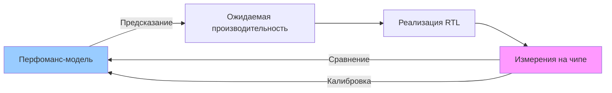

- **Калибровка:** Подгоняем параметры модели (задержки, hit rate) под измерения
- **Кросс-проверка:** Сравниваем с RTL-симуляцией (на небольших тестах)
- **Регрессия:** При изменении модели проверяем, что результаты не ухудшились


<!-- 
Без верификации модель — просто игра с цифрами.

Переход к следующей лекции (верификация и калибровка). Показать, что модель нужно проверять.
-->

---

# Следующая лекция: верификация и калибровка

<div class="mt-8"/>

**Вопросы, которые мы будем решать:**

<div class="mt-8"/>

1. **Как убедиться, что модель считает правильно?**  
   Сравнение с RTL, аналитическими формулами, реальными измерениями

2. **Что делать, если модель ошибается?**  
   Калибровка параметров, выявление скрытых допущений

3. **Как организовать регрессионное тестирование?**  
   Набор эталонных тестов, автоматическая проверка при изменениях

4. **Где кроются самые опасные ошибки?**  
   Упрощённые допущения (например, пренебрежение когерентностью, идеальная память)

<!-- 
Анонс следующей темы, чтобы студенты были готовы.
-->
