Моделирование вычислительных систем

# Верификация моделей производительности

<div class="abs-b">
Москва 2026
</div>

<div class="abs-br m-6 text-xl">
  <a href="https://github.com/cesarus777/perf-modeling-lectures" target="_blank" class="slidev-icon-btn">
    <carbon:logo-github />
  </a>
</div>

---
layout: section
---

# Почему модель не может быть «просто правильной»?

---

# Что значит «правильная модель»?

<div class="mt-8"/>

Два независимых измерения корректности:

| Измерение | Вопрос | Пример ошибки |
|-----------|--------|----------------|
| **Функциональная корректность** | Ответ такой, как у реального железа? | Модель вернула 0 вместо 42 при чтении |
| **Перфомансная корректность** | Задержка / пропускная способность совпадают с железом? | Модель показала 10 нс, а реально — 100 нс |

<div class="mt-8"/>

> **Важно**: можно быть функционально корректной, но перфомансно нет (и наоборот).

<!--
Студенты часто думают, что если модель «работает» (даёт те же данные), то она правильная. Нет, для перфоманс-модели главное — время. Указываем на разделение ответственности.
-->

---

# Функциональные ошибки: как они возникают в наших моделях?

<div class="mt-8"/>

Упрощения, которые мы вводили, могут сломать **функциональную** точность:

- **Лекция 5 (TLM 2.0)**: игнорирование порядка байтов (endianness) в `generic_payload`
- **Лекция 6 (DRAM)**: упрощённое отображение адреса → банк/строка (не совпадает с реальным контроллером)
- **Лекция 8 (кэш)**: политика замещения LRU вместо псевдо‑LRU → при определённых трассах модель может вытеснить не ту линию, и данные «потеряются»

<div class="mt-8"/>

> **Последствия**: при запуске ОС в модели система падает или работает некорректно, хотя на железе — нет.

<!--
Хорошо бы привести конкретный пример: неверное декодирование адреса DRAM приводит к тому, что два обращения к разным физическим банкам в модели попадают в один — функционально данные сохранятся, но времена будут не те. Но это уже перфомансная ошибка.
-->

---

# Ошибки производительности — самая коварная категория

<div class="mt-8"/>

Модель даёт **корректные данные**, но **некорректное время**

<div class="mt-8"/>

#### Типичные причины:
- Задержки — константа, а в реальности зависят от истории
- Нет учёта **обратного давления** при переполнении очередей
- Кэш — блокирующий, а в железе — неблокирующий

<div class="mt-8"/>

**Эффект**: Модель обещает latency = 10 ns, но на чипе — 100 ns из‑за скрытых конфликтов

<!--
Здесь важно подчеркнуть, что такие ошибки не видны при функциональной проверке. Нужны специальные перфоманс-тесты.
-->

---

# Индустриальный пример #1: Ошибка оценки row hit rate

<div class="mt-8"/>

**Ситуация**: 
- Модель DRAM-контроллера считала, что если адрес попал в открытую строку банка → **hit**
- В реальном железе после нескольких операций чтения-записи требуется **восстановительный цикл**

**Результат**:
- Модель предсказала пропускную способность **12 GB/s**
- Реальный чип дал **7 GB/s** (разрыв ~40%)

<!--
Хорошо бы добавить, что эта ошибка была в реальном проекте одного из производителей мобильных SoC. Источник можно не указывать, но пример сильный.
-->

---

# Индустриальный пример #2: Неучтённый false sharing

<div class="mt-8"/>

**Ситуация**:
- Модель кэша (лекция 8) — tag-точная, но без когерентности (MESI)
- Тестировали многопоточное приложение с двумя ядрами

**Результат модели**: 
- Miss rate = 2% → отличная производительность

**Реальность (чип с когерентностью)**:
- Из-за false sharing → miss rate = 40% → падение скорости в 3 раза

**Вывод**: Модель без когерентности даёт **оптимистичный**, но совершенно неверный прогноз для многопоточных нагрузок.

<!--
Напомнить про false sharing. Показываем его разрушительное влияние на доверие к модели.
-->

---

# Два пути исправления ошибок модели

<div class="mt-32"/>

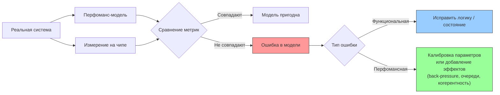

---
layout: section
---

# Уровни верификации: от модуля до системы

---

# Зачем нужна многоуровневая верификация?

<div class="mt-8"/>

Модель — это иерархия абстракций. Ошибка может быть **на любом уровне**.

```
CPU → Кэш L1 → Шина → DRAM-контроллер → DRAM
```

<div class="mt-8"/>

**Проблема**: если проверять только систему в сборе, невозможно локализовать, где именно ошибка.

<div class="mt-16"/>

### **Принцип**: Каждый уровень верифицировать изолированно, и только после — их взаимодействие

<!--
Аналогия: отладка программы, где всё сваливается в main() — без модульных тестов вы не найдёте баг.
-->

---

# Три уровня верификации перфоманс-модели

<div class="mt-8"/>

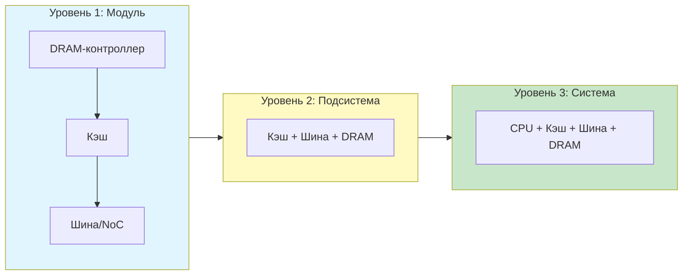

<!--
Каждый уровень требует своих тестов и метрик. Ошибка, не пойманная на уровне модуля, будет стоить в 10 раз дороже на системном уровне.
-->

---

# Уровень 1: Модульная верификация

<div/>

**Что проверяем**: отдельный модуль (например, DRAM-контроллер)

**Что нужно**:
- Изолированный тестовый стенд (testbench) для модуля
- Набор **микробенчмарков** для конкретного модуля

**Пример для DRAM-контроллера**:

| Тест | Что проверяет | Ожидаемое поведение |
|------|---------------|----------------------|
| Один запрос чтения | Базовый путь | latency = tCAS (если банк пуст) |
| Два запроса в один банк (разные строки) | Row miss, precharge | latency = tRP + tRCD + tCAS |
| Два запроса в разные банки | Параллелизм | перекрытие во времени |
| Переполнение очереди | Back-pressure | инициатор блокируется |

<!--
Студенты могут взять свои модели из предыдущих лекций и написать такие тесты. Это практическое задание.
-->

---

# Модульная верификация: схема тестового окружения

<div class="mt-16"/>

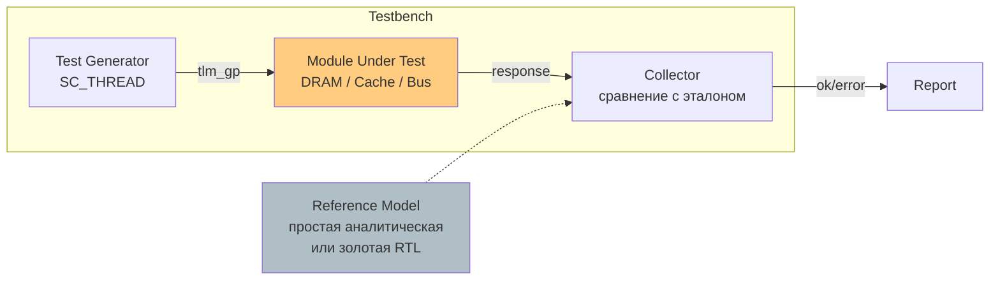

<!--
Reference model может быть очень простой (например, формула задержки) — не обязательно RTL.
-->

---

# Что проверяем на уровне модуля

| Аспект | Как проверить | Пример из наших лекций |
|--------|---------------|------------------------|
| **Временная детерминированность** | Прогнать один и тот же тест 100 раз | В стохастической модели кэша результаты могут плавать |
| **Отсутствие deadlock** | Стресс-тест с максимальной нагрузкой | Шина с фиксированным приоритетом может вызвать голодание |
| **Соблюдение таймингов** | Замерить интервалы между событиями | DRAM: tRC, tRAS |
| **Обратное давление** | Заполнить очередь, проверить блокировку | Любая модель с очередью |

<!--
Модульные тесты должны быть **автоматизированы** и запускаться при каждом изменении кода модели.
-->

---

# Уровень 2: Верификация подсистемы

<div class="mt-8"/>

**Пример подсистемы**: Кэш L1 + Шина + DRAM-контроллер (без CPU)

**Зачем**: 
- Модули могут быть по отдельности правильны, но их **взаимодействие** порождает новые эффекты

**Пример**:
Кэш генерирует запрос при промахе → шина арбитрирует → DRAM-контроллер считает задержку. Ошибка может быть в согласовании протоколов (например, кэш ждёт ответа, а шина его не возвращает)

**Метод**: 
- Подключаем модули друг к другу как в реальной системе
- Подаём **синтетические трассы** на вход кэша
- Сравниваем итоговую latency и трафик между модулями с эталоном (RTL или аналитикой)

<!--
Этот уровень часто пропускают, а зря. Ошибки интеграции — самые трудноуловимые.
-->

---

# Верификация подсистемы: пример с кэшем и DRAM

<div class="flex items-center justify-center w-full">
  <div class="w-65%">

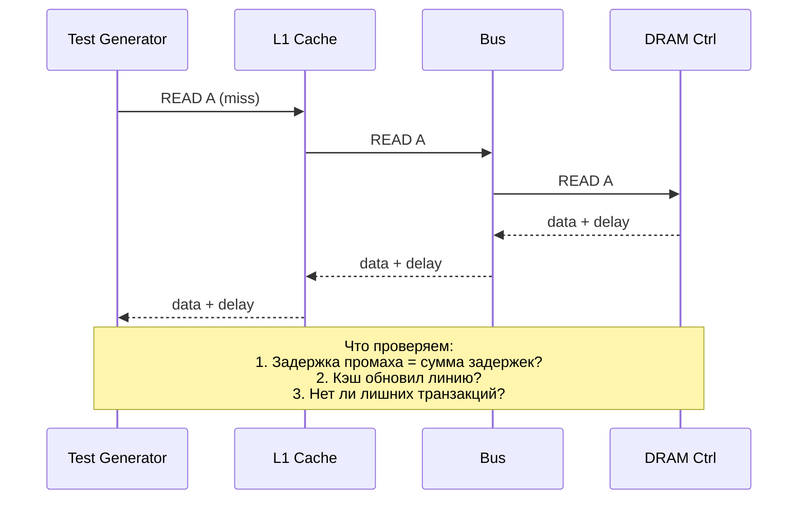

  </div>
</div>

<!--
Для такой проверки нужен «шпион» (probe) между модулями, который записывает все транзакции.
-->

---

# Уровень 3: Системная верификация

<div class="mt-8"/>

**Что проверяем**: полная система — CPU (генератор или реальный софт) + вся иерархия памяти.

**Особенности**:
- Невозможно проверить все пути (из-за комбинаторного взрыва)
- Используем **реалистичные рабочие нагрузки**
- Сравниваем с **RTL-моделью** на коротких трассах или с **реальным чипом** (post-si)

**Главный вопрос**: 
- Даёт ли модель те же **сквозные метрики** (средняя latency, пропускная способность, utilisation), что и железо?

<!--
На системном уровне мы уже не ищем мелкие функциональные баги, а проверяем, что модель пригодна для своих целей (например, оценки производительности).
-->

---

# Пирамида верификации: от быстрых тестов к медленным

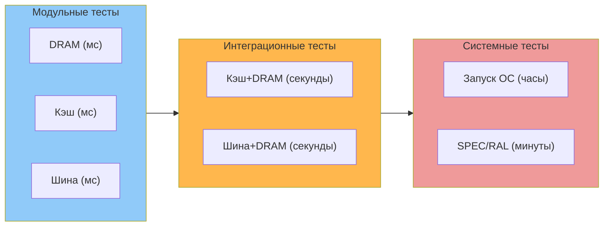

<!--
Чем выше уровень, тем дороже каждый тест. Поэтому большинство ошибок должны отлавливаться на нижних уровнях.
-->

---

# Что делать, если тест на системном уровне не проходит?

<div class="mt-8"/>

**Алгоритм локализации**:

1. **Воспроизвести** проблему на упрощённой трассе (минимальный пример)
2. **Спуститься на уровень подсистемы** — запустить ту же трассу, подавая её вручную на вход кэша
3. **Спуститься на модульный уровень** — изолировать подозрительный модуль
4. **Сравнить с эталоном** (RTL или аналитической моделью) на том же уровне

<div class="mt-8"/>

### **Логи, логи, логи и еще раз логи**

**Наблюдаемость** за эффектами внутри системы -- ключевой залог успешной (но не всегда легкой) отладки


<!--
Это похоже на git bisect, но для модели. Студенты оценят практичность.
-->

---

# Пример локализации: модель даёт завышенную пропускную способность

<div class="mt-8"/>

**Симптом**: система показывает 10 Gb/s, железо — 6 Gb/s

**Локализация**:
1. Логируем задержки на каждом уровне
2. Видим, что в модели шина даёт 1 нс на арбитраж, а в железе — 3 нс при загрузке >80%
3. Проверяем модуль шины изолированно: подаём два потока запросов с высокой частотой
4. Оказывается, в модели арбитр не учитывает **дополнительные такты ожидания** при конфликте

<div class="mt-8"/>

**Исправление**: добавляем задержку арбитража, зависящую от количества активных запросов

<!--
Такой пример можно прямо на лекции разобрать с кодом.
-->

---

# Метрики для каждого уровня верификации

<div class="mt-8"/>

| Уровень | Ключевые метрики | Допустимая погрешность |
|---------|------------------|------------------------|
| Модуль | Задержка на операцию, пропускная способность, количество состояний | ±1% (строго) |
| Подсистема | Сквозная latency для типовых паттернов, utilisation каналов | ±5% |
| Система | Средняя latency, перцентили (p50, p99), throughput | ±10% (для архитектурных решений) |

<!--
На системном уровне мы допускаем бóльшую погрешность, потому что там много других упрощений (CPU, ОС). Главное — чтобы модель правильно предсказывала **тренды** (увеличение кэша на 2x даст +N% производительности).
-->

---

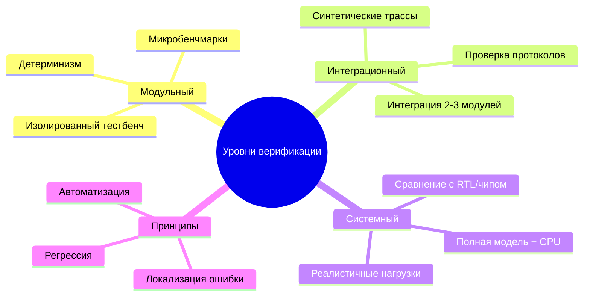

<!--
**Главная идея**: верификация — не одно большое действие, а **систематический процесс**, встроенный в разработку модели.
-->

---
layout: section
---

# Кросс-проверка с RTL и аналитическими моделями

---

# Зачем сравнивать с RTL, если у нас есть модель? 🤔

<div class="mt-8"/>

**RTL (Verilog/VHDL)** — золотой стандарт функциональной точности

<div class="mt-8"/>

**Проблема**: RTL-симуляция медленная (1–100 тыс. тактов/сек), но точная

<div class="mt-8"/>

**Решение**: прогонять на RTL только короткие фрагменты трасс, а результаты использовать для верификации TLM-модели

<div class="mt-8"/>

**Принцип**: TLM-модель должна давать **такой же ответ** и **близкую задержку** на тех же входных воздействиях

<!--
Для студентов, которые не знакомы с RTL: важно объяснить, что RTL — это «железо в симуляторе», а TLM — абстракция.
-->

---
layout: two-cols-header
---

# Проблема несовместимости: такты vs. транзакции


<div class="grid grid-cols-2 gap-4 mt-8">
<div>

**Ключевое различие**:
- RTL оперирует **тактами** и **сигналами**
- TLM оперирует **транзакциями** и **явным временем** (sc_time)

**Унификация**: привести оба мира к общему знаменателю — трассе событий с временными метками

</div>
<div class="flex items-center justify-center w-full mt-8">
  <div class="w-full">

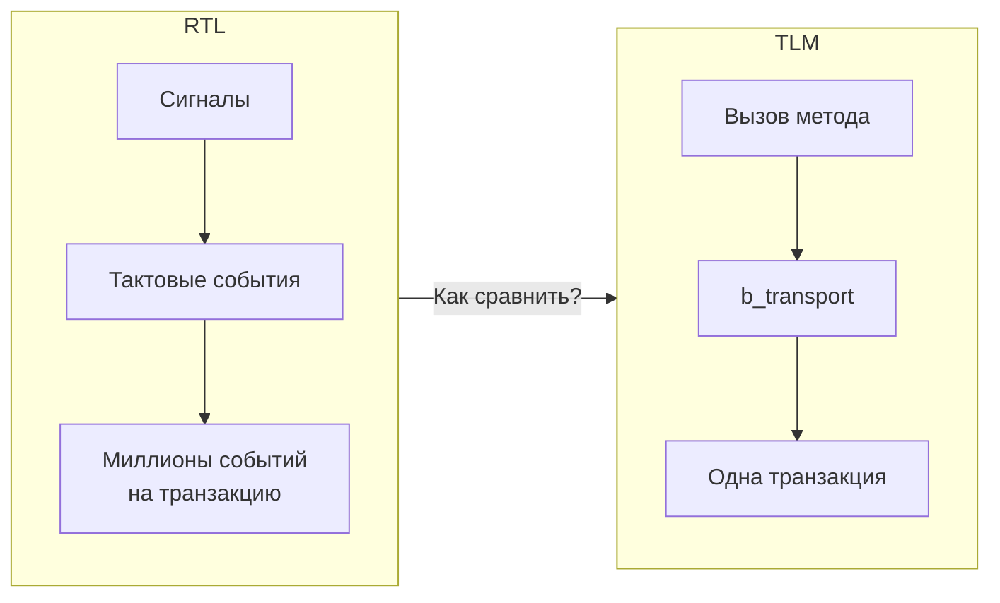
  
  </div>
</div>
</div>

<!--
Студенты уже знают TLM из лекции 5. Здесь показываем разрыв между двумя мирами.
-->

---

# Метод 1: Trace-driven comparison

<div class="mt-8"/>

**Алгоритм**:

1. Запустить RTL-симуляцию на коротком тесте (например, 1000 обращений к памяти)
2. Записать **трассу** — для каждого обращения: время (в тактах), адрес, команда, данные
3. Преобразовать такты в наносекунды: `time_ns = cycles * clock_period`
4. Подать эту трассу на вход TLM-модели (минуя CPU-генератор)
5. Сравнить: время ответа, данные, статус

<div class="mt-8"/>

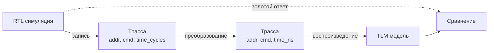

<!--
Этот метод требует некоторой инфраструктуры, но он самый надёжный.
-->

---

# Пример записи трассы из RTL (Verilog VPI)

<div class="mt-8"/>

```c
// В RTL-симуляторе через VPI/DPI-C
void log_memory_access(uint64_t addr, int cmd, uint64_t cycles) {
    static FILE* f = fopen("trace.csv", "a");
    fprintf(f, "%llu, %llu, %d\n", cycles, addr, cmd);
}

// Вызов из Verilog:
// always @(posedge clk) if (mem_valid) log_memory_access(mem_addr, mem_cmd, $time);
```

<div class="mt-8"/>

**Формат трассы (CSV)**:
```
cycle, address, command
1000, 0x1000, 1   # 1 = READ
1020, 0x1000, 1
1050, 0x2000, 0   # 0 = WRITE
```

<!--
Важно: в RTL время измеряется в тактах. Дальше нужно умножить на период.
-->

---

# Воспроизведение трассы в TLM-модели

```cpp
class TracePlayer : public sc_module {
    SC_CTOR(TracePlayer) { SC_THREAD(play); }
    tlm_utils::simple_initiator_socket<TracePlayer> socket;
    
    void play() {
        std::ifstream trace("trace.csv");
        uint64_t prev_cycles = 0;
        uint64_t cycles, addr;
        int cmd;
        while (trace >> cycles >> addr >> cmd) {
            uint64_t delta_cycles = cycles - prev_cycles;
            sc_time delta_time(delta_cycles * clock_period, SC_PS);
            wait(delta_time);   // дожидаемся момента отправки

            tlm_generic_payload trans;
            trans.set_address(addr);
            trans.set_command(cmd ? TLM_READ_COMMAND : TLM_WRITE_COMMAND);
            sc_time delay;
            socket->b_transport(trans, delay);
            // Проверка response_status
            prev_cycles = cycles;
        }
    }
};
```

<!--
Студенты увидят, как использовать wait() для точной синхронизации с RTL-временем.
-->

---

# Что именно сравнивать?

| Аспект | Как сравнивать | Допуск |
|--------|----------------|--------|
| **Функциональность** | Данные, возвращаемые при чтении | Должны совпадать побайтово |
| **Latency запроса** | Время ответа в TLM vs. RTL | ±1–2 такта (с учётом квантования) |
| **Порядок ответов** | Последовательность завершения транзакций | Должен совпадать |
| **Состояние кэша/банков** | Только для отладки — дамп после теста | Необязательно, но полезно |

**Инструмент**: скрипт, который читает оба лога и выдаёт расхождения

<!--
Latency в RTL — это количество тактов от принятия запроса до выставления готового ответа. В TLM — это delay, накопленный в b_transport.
-->

---

# Кросс-проверка с аналитическими моделями

<div class="mt-8"/>

**Зачем**, если есть RTL? Аналитические модели — **мгновенные** (результат за миллисекунды)

**Использование**:
- **Быстрая прикидка**: сравнить результат TLM-модели с формулой перед запуском RTL
- **Обнаружение грубых ошибок**: если модель даёт miss rate 5%, а аналитическая формула — 50%, что-то не так

**Ограничение**: аналитические модели работают только для регулярных паттернов (streaming, random) и не учитывают конфликты

<!--
Напомнить студентам формулу из лекции 8: miss_rate ≈ (1 - cache_size/working_set_size)^associativity.
-->

---

# Пример сравнения с аналитической моделью: DRAM

<div/>

**Аналитическая модель M/M/1 очередь** (для простого случая):
```
Средняя latency = t_service / (1 - utilization)
где utilization = arrival_rate * t_service
```

**Сравнение с TLM-моделью DRAM-контроллера**:

| Нагрузка (запросов/нс) | Аналитика (нс) | TLM модель (нс) | Расхождение |
|------------------------|----------------|-----------------|--------------|
| 0.01 (низкая) | 10.1 | 10.0 | 1% |
| 0.08 (средняя) | 12.5 | 14.2 | 13% |
| 0.095 (высокая) | 20.0 | 35.0 | 75% |

**Вывод**: при высокой нагрузке аналитика не учитывает row misses и back-pressure, TLM модель точнее

<!--
Показать, что аналитика хороша для оценки, но не для точного моделирования перегрузок.

M/M/1 расшифровывается так: первая M (Markovian или Memoryless) обозначает, что на вход в систему подаётся пуассоновский поток задач. Читай: сообщения приходят в случайные моменты времени с заданной средней скоростью $\lambda$ запросов в секунду — прямо как при радиоактивном распаде — или, более формально: время между двумя соседними событиями имеет экспоненциальное распределение. Вторая M обозначает, что обслуживание этих сообщений тоже имеет экспоненциальное распределение и в среднем обрабатывается μ запросов в секунду. И наконец, единица в конце обозначает, что обслуживание выполняется одним сервером.

-->

---

# Аналитическая модель кэша: проверка hit rate

```python
# Аналитическая формула для LRU кэша (аппроксимация)
def analytical_hit_rate(cache_size, working_set, associativity):
    return 1 - (1 - cache_size/working_set) ** associativity

# Запускаем TLM-модель на синтетической трассе (случайный доступ)
tlm_hit_rate = run_cache_model(trace)

analytical = analytical_hit_rate(32*1024, 100*1024, 8)
print(f"Аналитика: {analytical:.2f}, TLM: {tlm_hit_rate:.2f}")

# Если расхождение > 10% — ищем ошибку в TLM-модели
```

**Результат для случайного доступа**: расхождение обычно <5% (потому что случайный доступ хорошо описывается формулой)

**Для последовательного доступа**: расхождение может быть большим, потому что формула не учитывает пространственную локальность

<!--
Это хороший пример, где студенты видят границы применимости аналитики.
-->

---

# Когда какие модели использовать?

| Ситуация | Инструмент | Почему |
|----------|------------|--------|
| Быстрая проверка новой конфигурации кэша | Аналитика | Секунды, можно перебрать тысячи вариантов |
| Уточнение производительности после аналитики | TLM модель | Минуты-часы, но точнее |
| Финальная верификация перед тап-аутом | RTL (короткие тесты) | Дни, но золотой стандарт |
| Запуск драйвера или ОС | TLM модель (функционально точная) | RTL слишком медленный |

<!--
В индустрии часто так и делают: аналитика для ранних оценок, TLM для архитектурных исследований, RTL для финальной подгонки.
-->

---

# Проблема: как верифицировать стохастическую модель кэша?

<div class="mt-4"/>

**Стохастическая модель** — не детерминирована, даёт вероятностный hit rate

**Как сравнивать с детерминированным RTL?**
- Нельзя сравнить по одной трассе (случайность даст разные результаты)
- Нужно сравнить **распределение** hit rate на множестве трасс (или длинной трассе, разбитой на сегменты)

**Метод**:
1. Прогнать RTL на длинной трассе (например, 10 млн обращений)
2. Разбить трассу на 1000 сегментов по 10 тыс. обращений
3. Для каждого сегмента вычислить hit rate в RTL и в стохастической модели
4. Сравнить гистограммы (KS-тест, среднее, дисперсию)

<!--
Это продвинутая тема, но её можно упомянуть как предупреждение: стохастические модели верифицировать сложнее.

KS-тест -- тест Колмогорова-Смирнова
-->

---

# Сравнение гистограмм hit rate: пример

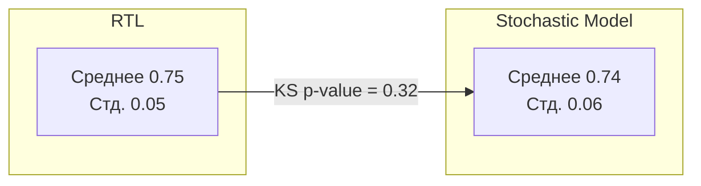

**Интерпретация**: если p-value > 0.05, распределения статистически неразличимы → модель верифицирована.

**Практический совет**: для большинства архитектурных задач достаточно сравнения средних с допуском ±5%.

<!--
Не нужно углубляться в статистику, но дать понимание, что есть методы.

KS-тест -- тест Колмогорова-Смирнова
-->

---

# Автоматизация кросс-проверки: CI для моделей

<div class="mt-8"/>

**Что автоматически должно проверяться**:
- Функциональное совпадение (данные)
- Временная погрешность не более X%
- Отсутствие регрессий (сравнение с предыдущим прогоном)

<!--
Показать, что верификация — это не разовое действие, а часть CI/CD.
-->

---

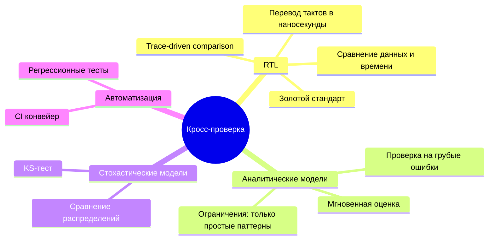

**Ключевой вывод**: ни один метод не идеален, используйте **комбинацию** RTL (точность), аналитики (скорость) и TLM (баланс)

<!--
Следующая часть лекции — калибровка по данным реального чипа.
-->

---
layout: section
---

# Калибровка по данным реального чипа (post‑silicon)

---

# Зачем калибровать модель по реальному чипу?

<div class="mt-8"/>

**RTL‑симуляция** точна, но медленна и недоступна до полной готовности RTL

**После выхода чипа** (post‑silicon) появляются реальные измерения — самый честный эталон

**Цель калибровки**:
- Подобрать параметры модели (задержки, размеры очередей, политики) так, чтобы её поведение совпадало с железом
- Учесть эффекты, которые невозможно смоделировать заранее (техпроцесс, разводка, тепловые эффекты)

**Главный риск**: перекалибровка — модель идеально совпадает на одном тесте, но врёт на других

<!--
Для студентов-компиляторщиков: калибровка позволяет вашим оптимизациям опираться на реалистичную модель, а не на "бумажную".
-->

---

# Что можно измерить на реальном чипе?

| Метрика | Как измерить | Пример |
|---------|--------------|--------|
| **Средняя latency** | Бенчмарк с микротимированием (rdtsc) | 50 нс на чтение из DRAM |
| **Перцентили (p50, p99)** | Гистограмма задержек | p99 = 200 нс |
| **Пропускная способность** | STREAM, RandomAccess | 25 GB/s |
| **Miss rate L1/L2/L3** | Perf-счётчики (`perf stat -e cache-misses`) | L1 miss = 10% |
| **Загрузка шины/NoC** | Специальные датчики (если есть) | 60% утилизация |
| **Энергопотребление** | Измерение тока по шунту | 2.5 Вт |

**Инструменты**: `perf`, `likwid`, Intel PCM, пользовательские модули ядра

<!--
Важно: не все метрики доступны на любом чипе. Для калибровки достаточно основных (latency, miss rate, throughput).
-->

---

# Схема калибровки: чёрный ящик

<div class="flex items-center justify-center w-full">
  <div class="w-40%">

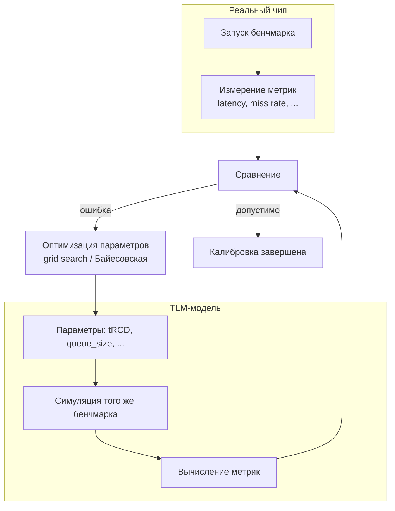

</div>
</div>

<!--
Калибровка — итеративный процесс. Обычно 5–10 итераций достаточно для сходимости.
-->

---

# Этапы калибровки: пошаговый алгоритм

<div/>

**Шаг 1**: Выбрать набор бенчмарков (обучающая выборка).
- Микробенчмарки: один запрос, поток запросов, конфликтный доступ.
- Макробенчмарки: реальное приложение (SPEC, PARSEC).

**Шаг 2**: Выбрать параметры модели для калибровки (2–4 параметра, иначе переобучение).
- DRAM: tRCD, tRP, tCAS, размер очереди.
- Кэш: hit_latency, miss_latency, размер линии.
- Шина: arbitration_delay, queue_depth.

**Шаг 3**: Запустить модель на сетке параметров или использовать оптимизацию (Bayesian, Simulated Annealing).

**Шаг 4**: Выбрать комбинацию, минимизирующую среднеквадратичную ошибку (MSE) на обучающей выборке.

**Шаг 5**: Проверить на валидационной выборке (бенчмарки, не участвовавшие в калибровке).

<!--
Никогда не калибруйте и не проверяйте на одних и тех же тестах — получите перекалибровку.
-->

---

# Пример калибровки DRAM-контроллера

<div/>

**Модель**: задержка зависит от row hit/miss

**Калибруемые параметры**: tRCD, tRP, tCAS

**Обучающий бенчмарк**: streaming read из одного банка

<div class="text-sm">

| tRCD (нс) | tRP (нс) | tCAS (нс) | Latency модели (нс) | Latency чипа (нс) | Квадрат ошибки |
|-----------|----------|-----------|---------------------|-------------------|----------------|
| 10 | 10 | 10 | 30 | 32 | 4 |
| 12 | 12 | 12 | 36 | 32 | 16 |
| 10 | 12 | 10 | 32 | 32 | 0 |
| 12 | 10 | 12 | 34 | 32 | 4 |

</div>

**Лучшая комбинация**: tRCD=10, tRP=12, tCAS=10

**Проверка на другом бенчмарке** (random access): модель даёт 40 нс, чип — 42 нс (ошибка 5%) — допустимо

<!--
Реальные чипы имеют специфицированные тайминги, но из-за разводки они могут отличаться. Калибровка их уточняет.
-->

---
layout: two-cols-header
---

# Проблема перекалибровки (overfitting)

<div/>

**Симптомы**:
- Модель отлично совпадает с обучающими тестами (ошибка <1%), но на новых тестах — расхождение >20%
- Калиброванные параметры физически нереалистичны (например, tRCD = 3 нс при реальном минимуме 10 нс)

::left::

**Причины**:
- Слишком много параметров (больше 4–5) при малом количестве тестов
- Шум в измерениях на чипе (температура, напряжение, работа ОС)
- Модель слишком гибкая (например, таблица задержек для каждого банка)

::right::

**Как бороться**:
- Использовать регуляризацию (штраф за отклонение от типовых значений)
- Увеличить количество обучающих тестов (минимум в 3 раза больше параметров)
- Проводить кросс-валидацию

<!--
Показать студентам график: ошибка на обучении падает, на валидации растёт — классический overfitting.
-->

---
layout: two-cols-header
---

# Визуализация перекалибровки

::left::

**Как обнаружить**: разбить данные на 3 части:
- Train (60%) — подбор параметров
- Validation (20%) — выбор лучшей модели
- Test (20%) — финальная оценка

Если на Train ошибка мала, а на Test велика → перекалибровка

::right::

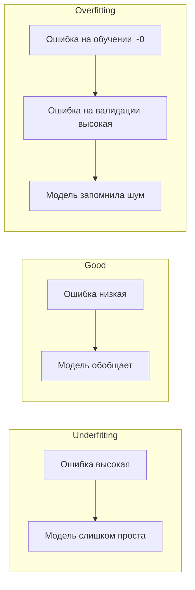

<!--
Для студентов: это те же принципы, что в машинном обучении. Модель производительности — тоже обучаемая система.
-->

---

# Практический совет: начинайте с физически обоснованных параметров

<div class="mt-8"/>

Не ищите tRCD = 5 нс, если спецификация чипа говорит о минимуме 10 нс

**Используйте априорные знания**:
- Для DRAM: tRCD, tRP, tCAS обычно лежат в диапазоне 10–20 нс для DDR4
- Для кэша: hit_latency = 1–4 такта, miss_latency = 10–50 тактов (в зависимости от уровня)
- Для шины: arbitration_delay = 1–2 такта

**Стратегия**: сначала зафиксировать параметры на типовых значениях, потом отпускать по одному и смотреть, улучшается ли ошибка

**Принцип бритвы Оккама**: из двух моделей с одинаковой ошибкой выбирайте ту, у которой меньше параметров или параметры ближе к спецификации

<!--
Это снижает риск перекалибровки и делает модель более предсказуемой.
-->

---

# Калибровка стохастических моделей кэша

<div class="mt-8"/>

**Стохастическая модель** имеет параметры, например, hit_rate = f(size, associativity, ...)

**Как калибровать**:
- Измерить hit rate на чипе через perf-счётчики для разных рабочих наборов (working sets)
- Подобрать коэффициенты функции f (например, методом наименьших квадратов)

**Пример**: модель вида `hit_rate = 1 - (working_set / cache_size)^α`
- α — параметр, зависящий от ассоциативности и паттерна доступа
- Измеряем hit rate для 3-4 разных working_set, находим α

**Важно**: стохастическая модель калибруется **на агрегированных данных**, а не на трассах

<!--
Студенты увидят, что даже "простая" hit-rate функция требует калибровки под реальное железо.
-->

---

# Калибровка с помощью микробенчмарков: пример

<div class="mt-8"/>

**Цель**: подобрать задержку арбитража в шине

**Микробенчмарк**:
- Два CPU одновременно посылают запросы в разные банки DRAM
- Измеряем latency каждого запроса на чипе

**Модель**: latency = t_dram + t_arbitration (если конфликт)

**Подбор**:
1. Запускаем модель с разными t_arbitration (0.5, 1.0, 1.5, 2.0 нс)
2. Сравниваем среднюю latency с чипом
3. Выбираем t_arbitration, при котором ошибка минимальна

**Результат**: на чипе конфликт добавляет 1.2 нс, в модели — подобрали 1.2 нс

<!--
Это конкретный пример, который студенты могут воспроизвести в своих моделях.
-->

---
layout: two-cols-header
---

# Валидация: как убедиться, что калибровка успешна?

<div class="mt-8"/>

**Проверка на отложенных тестах** (hold-out set):
- Тест 1: случайный доступ (не участвовал в калибровке)
- Тест 2: доступ с конфликтом в один банк
- Тест 3: реальное приложение (например, умножение матриц)

::left::

**Критерии успеха**:
- Средняя ошибка latency < 10% на всех тестах
- Ошибка пропускной способности < 15%
- Miss rate кэша отличается не более чем на 5 процентных пунктов

::right::

**Если валидация не проходит**:
- Вернуться к выбору параметров (возможно, нужен дополнительный параметр, например, влияние очередей)
- Увеличить обучающую выборку
- Пересмотреть архитектуру модели (может, не хватает какого-то эффекта)

<!--
Валидация — самый важный этап. Без неё калибровка бессмысленна.
-->

---

# Инструменты для автоматической калибровки

<div class="mt-8"/>

**Grid search** — прост, но медленный при >3 параметрах

**Bayesian optimization** (библиотеки: `scikit-optimize`, `hyperopt`) — эффективен для 5–10 параметров

```python
from skopt import gp_minimize

def objective(params):
    tRCD, tRP, tCAS = params
    model_latency = run_dram_model(tRCD, tRP, tCAS)
    return (model_latency - chip_latency)**2

res = gp_minimize(objective, [(10, 20), (10, 20), (10, 20)], n_calls=50)
print(res.x)  # оптимальные параметры
```

<!--
Для студентов: это уже уровень инженерной практики. Можно предложить как дополнительное задание.
-->

---

# Практические предостережения при калибровке


| Проблема | Решение |
|----------|---------|
| Шум в измерениях на чипе | Провести многократные замеры, усреднить, отбросить выбросы |
| Разные тактовые частоты (CPU может троттлить) | Зафиксировать частоту (отключить турбо, энергосбережение) |
| Влияние ОС (прерывания, планировщик) | Использовать изоляцию ядер (taskset), режим реального времени |
| Тепловые эффекты | Прогреть чип, проводить замеры в стационарном режиме |
| Детерминизм модели | Запускать с одинаковым seed для случайных чисел |

> **Золотое правило**: калибровка должна быть воспроизводимой, для этого записывайте все параметры окружения

<!--
Студенты-программисты оценят важность детерминизма и контроля окружения.
-->

---

# Что делать, если модель не удаётся откалибровать?

<div/>

**Причины**:
- Модель слишком упрощена (пропущен важный эффект, например, когерентность).
- Параметры модели не независимы (например, tRCD и tRP коррелируют).
- Измерения на чипе ненадёжны.

**Альтернативы**:
- Добавить в модель недостающий эффект (например, back-pressure из лекции 7).
- Использовать **гибридную калибровку**: часть параметров взять из спецификации, часть подобрать.
- Перейти на более детальную модель (например, с неблокирующим кэшем).

**Пример**: модель шины с фиксированной задержкой не калибруется → добавить зависимость задержки от загрузки (очереди).

<!--
Это честный ответ: не всегда калибровка возможна. Иногда нужно менять модель.
-->

---

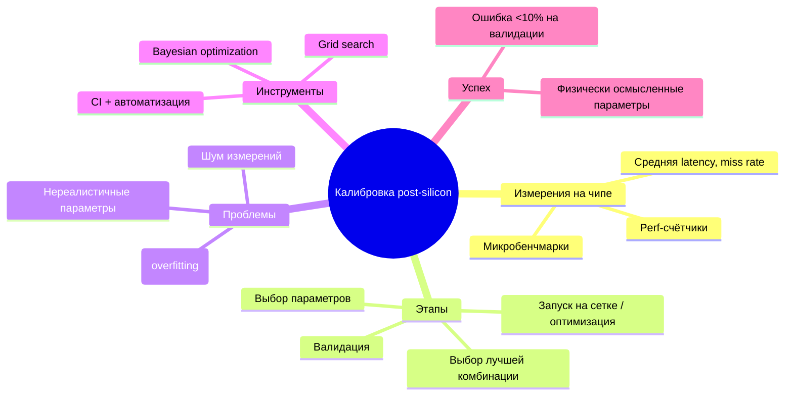

**Ключевой вывод**: калибровка — это не волшебство, а систематическая процедура. Без неё модель — лишь игрушка.

<!--
Следующая часть лекции — скрытая сложность и регрессионное тестирование.
-->
