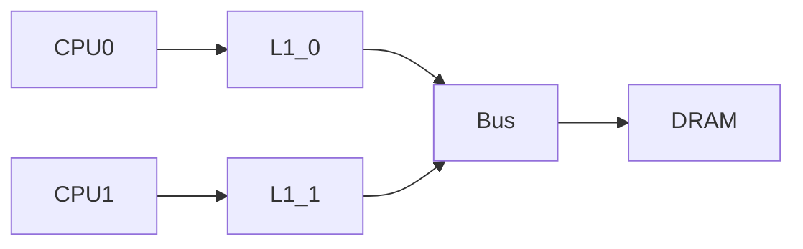
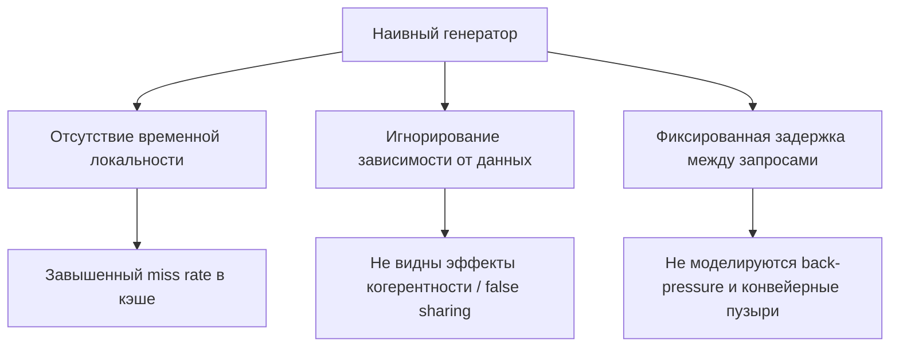
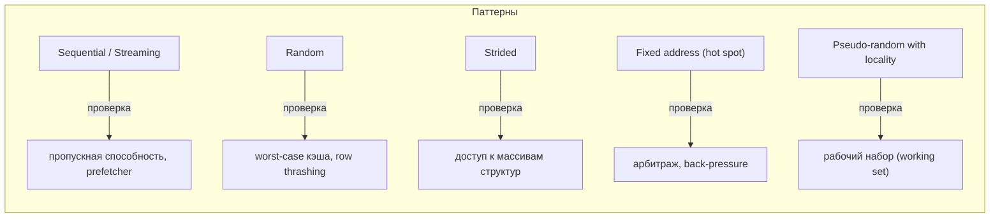
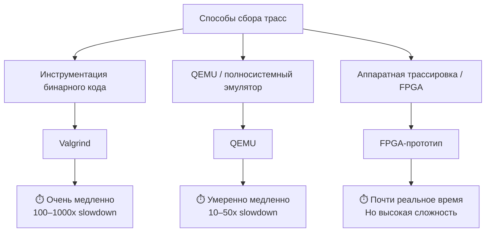
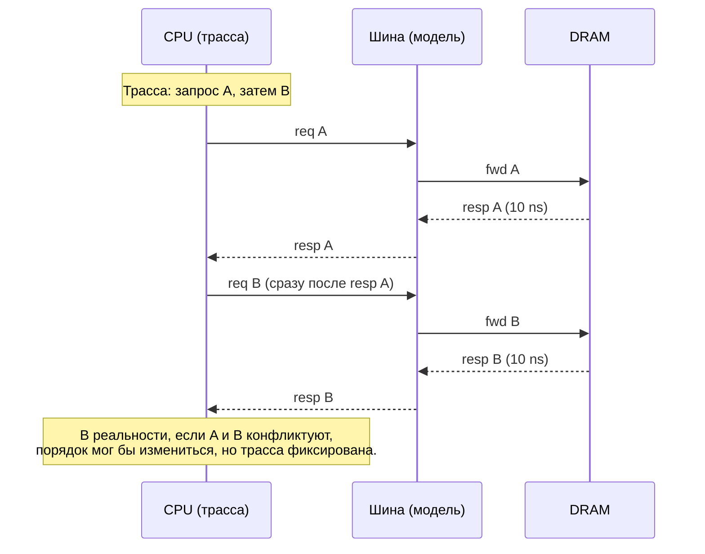
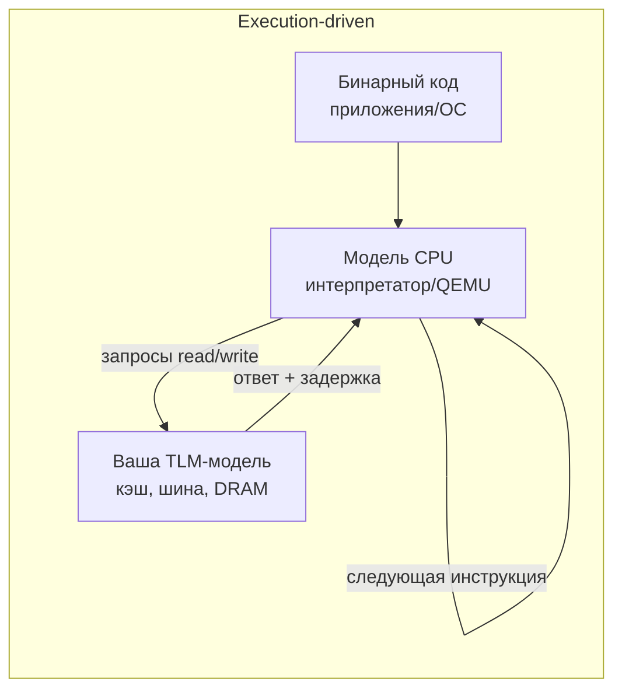
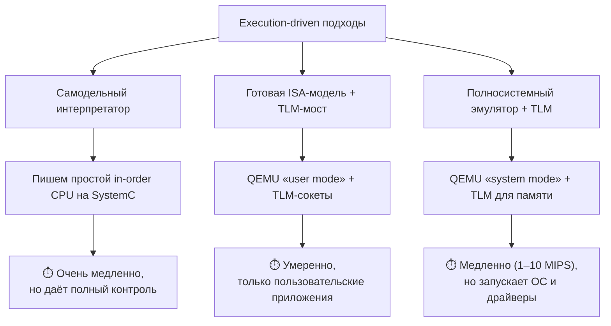
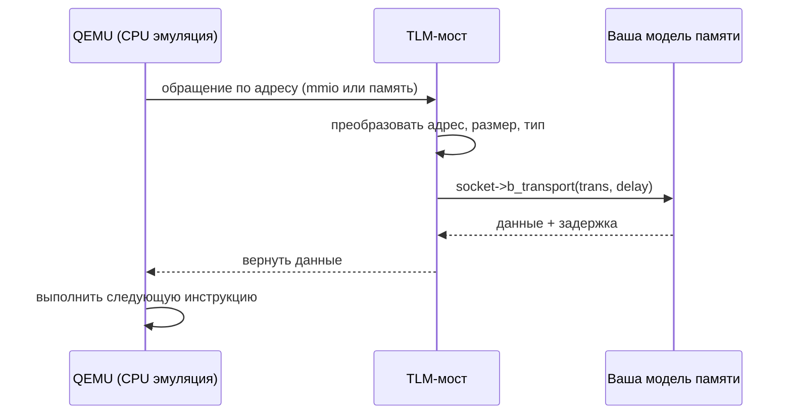
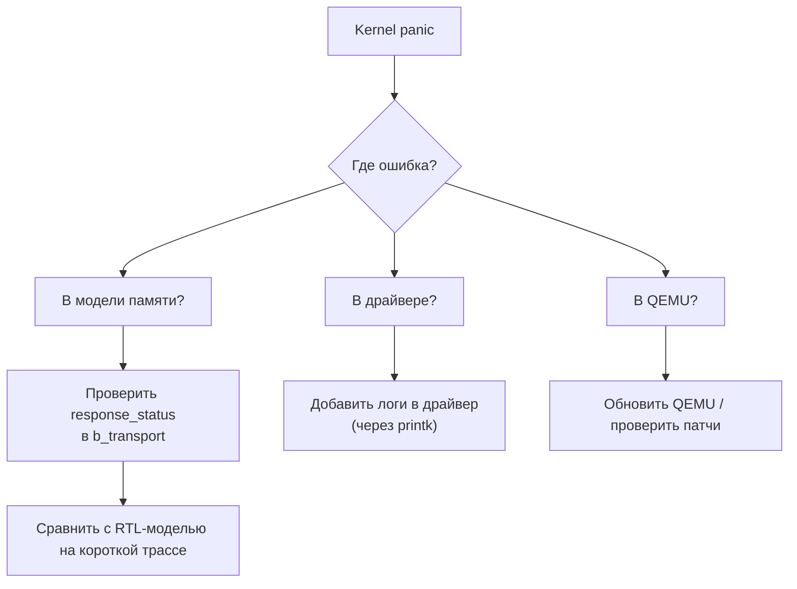

Моделирование вычислительных систем

# Подготовка рабочих нагрузок

<div class="abs-b">
Москва 2026
</div>

<div class="abs-br m-6 text-xl">
  <a href="https://github.com/cesarus777/perf-modeling-lectures" target="_blank" class="slidev-icon-btn">
    <carbon:logo-github />
  </a>
</div>

<!--
Мы уже умеем строить модели шины (лекция 7), кэша с когерентностью (лекция 8),
DRAM-контроллера (лекция 6). Но любая модель бесполезна без входных воздействий.
Сегодня поговорим о том, откуда брать запросы, и почему это критически влияет на выводы.
-->

---

# Повторение: система из двух ядер



**Эксперимент:** запускаем на модели простой цикл с `rand()`.
- Модель предсказала: **miss rate L1 = 70%**
- А на реальном приложении (например, умножение матриц) получаем **miss rate ≈ 20%**

<div class="mt-8"/>

### **Почему модель солгала?** 🥺


<!--
Здесь мы возвращаем студентов к знаниям из лекций 7-8. Они знают, что miss rate зависит от паттерна доступа.
rand() — худший случай для кэша (отсутствие локальности). Реальные приложения имеют пространственную и временную локальность.
Вывод: не любой генератор запросов репрезентативен.
-->


---

# Что мы можем подать на вход модели?

| Источник | Пример | Характер обращений |
|----------|--------|---------------------|
| **Синтетика** (микробенчмарк) | `for(i=0;i<N;i++) a[i]++` | Идеально регулярный |
| **Трасса** (trace) | Запись адресов реальной программы | Фиксированная последовательность |
| **Полный стек** (execution-driven) | QEMU + Linux на модели | Интерактивный, зависит от времени ответа |

**Ключевая идея:**  
> Результат моделирования — это **комбинация** модели и нагрузки  
> Ошибка в нагрузке == ошибка в выводе о результатах исследования


<!--
Студенты должны увидеть классификацию. У каждого подхода есть свои «слепые зоны».
Синтетика хороша для изоляции эффектов, но не для предсказания абсолютной производительности.
Трасса точна для заданного сценария, но не учитывает обратную связь.
Полный стек — максимально реалистичен, но медленен и сложен в отладке.
-->


---

# Проблемы «наивного» генератора



**Результат:**  
Модель показывает **заниженную производительность** (пессимистичный прогноз)  
или, наоборот, **завышенную** (оптимистичный), если генератор слишком «дружелюбен» к кэшу


<!--
Здесь мы подводим к необходимости осознанного выбора нагрузки.
Обратите внимание на пункт «фиксированная задержка»: в реальном процессоре
запрос может быть задержан из-за ожидания свободного места в буферах (back-pressure).
Наивный `wait(10, SC_NS)` этого не отражает.
Пример из лекции 7: при переполнении очереди шины, b_transport CPU блокируется.
-->


---

# Какую нагрузку выбрать для моей задачи?

| Хочу… | …использую |
|--------------|----------------|
| **Найти узкое место** (шина, банк DRAM) | Синтетический паттерн, нацеленный на этот ресурс |
| **Оценить влияние компиляторной оптимизации** | Трассу реального кода (или полный стек) |
| **Проверить, загрузится ли драйвер** | Полный стек (QEMU + модель памяти) |
| **Откалибровать задержки по реальному чипу** | Микробенчмарки + трассы коротких участков |

> **Золотое правило:**  
> Никогда не доверяйте модели, пока не проверили её на нагрузке, которая хотя бы отдалённо похожа на целевую рабочую нагрузку.


<!--
Этот слайд — резюме введения. Студенты должны унести мысль, что выбор нагрузки
не менее важен, чем точность самой модели. В следующих разделах лекции разберём
каждый тип нагрузки детально: его плюсы, минусы и подводные камни.
-->

---
layout: section
---

# Синтетические тесты (микробенчмарки)

<!--
Переход от введения: мы поняли, что наивный генератор врёт. Теперь разберём
инструмент, который позволяет резать точно — синтетические тесты.
Они дают контроль, но требуют понимания, какой именно паттерн мы моделируем.
-->

---

# Что такое синтетический тест в контексте TLM-модели?

<div/>

Полностью контролируемый генератор запросов, реализованный внутри `SC_THREAD` или `SC_METHOD` модуля-инициатора

```cpp
// Простейший пример — последовательный доступ
SC_THREAD(generate_stream);
void generate_stream() {
  uint64_t addr = BASE_ADDR;
  while (true) {
    tlm_gp trans;
    trans.set_address(addr);
    trans.set_command(TLM_READ_COMMAND);
    socket->b_transport(trans, delay);
    wait(INTER_REQUEST_DELAY);
    addr += LINE_SIZE;
  }
}
```

**Ключевое свойство:**  
Мы управляем **каждым параметром**: адрес, шаг, задержка, количество повторений

<!--
Студенты уже видели подобные генераторы в лекциях 6-7 (CPU, генерирующий запросы).
Здесь мы формализуем это как отдельный класс нагрузок.
Важно подчеркнуть: синтетика не требует эмуляции инструкций — это просто
последовательность вызовов b_transport с заданными адресами.
-->

---

# Классификация паттернов



<div class="text-3">

| Паттерн | Параметры | Что моделирует |
|---------|-----------|----------------|
| Sequential | `base`, `step=64`, `count` | линейный обход массива |
| Random | `min_addr`, `max_addr` | полностью непредсказуемый доступ |
| Strided | `base`, `stride`, `count` | обход колонки в БД, доступ к полям структуры |
| Fixed address | `addr`, `count` | блокировка, очередь к ресурсу |
| Pseudo-random with locality | `hot_set_size`, `hot_probability` | реальный working set программы |

</div>

<!--
Студентам-компиляторщикам будет полезно: strided доступ возникает при
vectorization, когда компилятор переставляет обход многомерных массивов.
Для архитекторов: random worst-case нужен, чтобы проверить, не "падает ли"
производительность в грязь при плохом паттерне.
-->

---

# Достоинства синтетических тестов

1. **Детерминизм**  
   Ошибка воспроизводится 100% — не зависит от прерываний, планировщика ОС, фазы луны

2. **Изоляция эффектов**  
   Хотите измерить цену row miss в DRAM?  
   → Два запроса в один банк, потом в разные банки. Разность latencies = tRP + tRCD

3. **Высокая скорость**  
   Нет накладных расходов на эмуляцию инструкций  
   → Миллионы транзакций в секунду

4. **Простота отладки**  
   Ожидаемое поведение можно рассчитать на бумаге  
   → Если модель даёт другое число — ошибка в модели, а не в нагрузке

<!--
Ключевой посыл: синтетика — это инструмент для верификации модели и
для измерения *потенциальной* пропускной способности компонента.
Но она не скажет, как поведёт себя реальное приложение.
-->

---

# Недостатки и скрытые сложности

| Проблема | Почему это плохо | Пример |
|----------|------------------|--------|
| **Идеализация паттерна** | Реальные компиляторы и префетчеры меняют доступ | `for(i=0;i<N;i++) a[i]++` → развёртка цикла, software prefetch |
| **Отсутствие обратной связи** | CPU не stall'ится, даже если память не отвечает | В реальности при miss может быть задержка на 100 нс, а генератор просто `wait(10)` |
| **Не учитывает когерентность** | Нет snoop-трафика, инвалидаций | Оценка false sharing будет невозможна |
| **«Слепой» арбитраж** | Генератор не реагирует на back-pressure | Очередь в шине переполняется, но генератор продолжает слать запросы (если нет `wait` на проверку) |

**Вывод:** Синтетика хороша для **измерения максимума**, но не для **предсказания реальности**

<!--
Здесь важно подчеркнуть для аудитории: если вы используете синтетику для оценки
ускорения от новой политики арбитра, вы получите *верхнюю границу*.
Но в реальном приложении ускорение может быть меньше из-за наложения других эффектов.
-->

---

# Пример из практики: измерение цены row miss в DRAM

<div/>

**Синтетический тест (последовательность запросов):**

1. **Row hit:** `read(0x1000)` → `read(0x1040)` (один и тот же банк, одна строка)
2. **Row miss:** `read(0x1000)` → `read(0x2000)` (разные строки, один банк)

**Код генератора (упрощённо):**
```cpp
// Измеряем latency второго запроса
uint64_t addr_hit = 0x1000;
uint64_t addr_miss = 0x2000;
...
sc_time delay1, delay2;

socket->b_transport(trans_hit, delay1); // первый запрос (разогрев)
socket->b_transport(trans_hit, delay2); // row hit
cout << "Hit latency: " << delay2.to_seconds()*1e9 << " ns" << endl;

socket->b_transport(trans_miss, delay1); // разогрев
socket->b_transport(trans_miss, delay2); // row miss
cout << "Miss latency: " << delay2.to_seconds()*1e9 << " ns" << endl;
```

**Результат:** Miss latency ≈ Hit latency + tRP + tRCD  
→ Мы откалибровали параметры DRAM за 5 минут, без RTL-симуляции

<!--
Этот пример студенты могут воспроизвести сами, используя готовую модель DRAM.
Он наглядно показывает силу синтетики: за пару строк кода мы измерили
фундаментальный параметр архитектуры.
-->

---

# Резюме по синтетическим тестам

| Когда применять | Когда НЕ применять |
|----------------|---------------------|
| Регрессионное тестирование модели | Предсказание абсолютной производительности приложения |
| Измерение максимальной пропускной способности | Оценка влияния когерентности / false sharing |
| Калибровка задержек (tRCD, tCAS, arbitration_latency) | Сравнение двух разных микроархитектур на реальном коде |
| Поиск узких мест в изоляции (шина, банк, очередь) | Отладка драйверов и ОС |

> **Общее правило:**  
> Синтетика отвечает на вопрос **«может ли модель выдать X?»**  
> Но не на вопрос **«даст ли реальная программа X?»**

<!--
Этим слайдом мы завершаем раздел о синтетике и готовим переход к трассам.
Важно донести: синтетика — необходимый, но не достаточный инструмент.
В следующих разделах увидим, как добавить реализма с помощью трасс и полного стека.
-->

---
layout: section
---

# Трассы реальных приложений

<!--
Переход от синтетики: мы умеем измерять максимум и калибровать задержки.
Теперь поднимем реалистичность на следующий уровень — запишем, что делает реальная программа.
Но и здесь есть подводные камни.
-->

---

# Что такое трасса?

<div/>

Последовательность событий, записанная во время выполнения реальной программы на эталонной системе (или в ISA-симуляторе)

Каждое событие обычно содержит:
- **Виртуальный или физический адрес**
- **Тип операции** (чтение / запись)
- **Размер данных** (байт, слово, кэш-линия)
- **Временную метку** (такт или наносекунды)

```csv
# Пример формата трассы (CSV)
clock, address, command, size
1000, 0x7f3a8c102040, READ, 64
1020, 0x7f3a8c102080, READ, 64
1050, 0x7f3a8c200000, WRITE, 64
```

<!--
Студенты уже видели упоминание трасс в лекции 9 (кросс-проверка с RTL).
Здесь мы фокусируемся на трассах как *нагрузке* для перфоманс-модели.
Важно: трасса — это «застывшая» история, без обратной связи.
-->

---

# Как получить трассу? Три основных метода



<!--
| Метод | Скорость | Точность адресов | Доступность |
|-------|----------|------------------|--------------|
| PIN/DynamoRIO | очень низкая | виртуальные | высокая |
| QEMU | средняя | виртуальные | высокая |
| Аппаратный | реальное время | физические | низкая (только в индустрии) |
-->

<!--
Студентам (особенно тем, кто не специализируется на low-level) не нужно углубляться в PIN API.
Достаточно понимать trade-off: точность vs. скорость vs. доступность.
Для курса идеально: использовать QEMU для сбора коротких трасс (несколько миллионов обращений).
-->

---

# Ключевая скрытая сложность: виртуальные vs. физические адреса

<div/>

**Проблема:**  
Программа работает с **виртуальными адресами**  
Ваша TLM-модель памяти оперирует **физическими адресами** (банки, строки DRAM)

**Если подать виртуальные адреса напрямую:**
- Два обращения к одному физическому адресу могут выглядеть как два разных виртуальных
- Модель кэша и DRAM даст **полностью неверный** hit/miss

**Что делать?**
1. **Собирать трассу на голом железе** (без ОС) — физические адреса с самого начала
2. **Моделировать трансляцию адресов** (TLB, page walker) внутри модели — сложно, но возможно
3. **Использовать трассу на уровне кэш-линий** с хэшированием, игнорируя страницы — грубое приближение

> Будем считать, что трасса уже содержит *физические адреса* (например, собрана в priv режиме или с выключенным MMU)

<!--
Это один из главных «камней преткновения» в индустрии.
Студенты-компиляторщики должны понять: их оптимизация по виртуальным адресам
может не дать эффекта на железе из-за трансляции.
-->

---

# Достоинства trace‑driven подхода

1. **Реалистичность паттерна**  
   Поведение кэша, DRAM, prefetcher соответствует реальному алгоритму программы (не синтетике)

2. **Воспроизводимость**  
   Одна и та же трасса даёт одинаковые результаты на разных моделях (позволяет сравнивать)

3. **Быстрее полного стека**  
   Нет эмуляции инструкций CPU, только «проигрывание» заранее записанных обращений  
   → До 1000x быстрее, чем QEMU + модель.

4. **Возможность длительных экспериментов**  
   Можно собрать трассу часы работы программы и прогнать через модель за минуты

<!--
Ключевое преимущество: мы отделяем *генерацию* нагрузки от *симуляции*.
Это позволяет быстро перебирать параметры архитектуры (размер кэша, политику арбитра)
на одной и той же реалистичной трассе.
-->

---

# Недостатки и ограничения

<div class="text-4 mb-4">

| Проблема | Описание | Последствия |
|----------|----------|--------------|
| **Статичность** | Трасса не меняется в зависимости от времени ответа модели | Если модель меняет порядок завершения транзакций, реальная программа повела бы себя иначе → ошибка |
| **Объём данных** | Миллиарды обращений → десятки гигабайт | Требует сжатия, бинарных форматов, не влезает в память |
| **Старение трассы** | Собрана на одной микроархитектуре | На другой может давать неверные хиты/промахи (из-за размера кэш-линии, политики замещения) |
| **Отсутствие обратной связи** | CPU не может stall'иться или генерировать prefetch | Не видно эффектов back-pressure, конвейерных пузырей |

</div>

> **Главный концептуальный недостаток:** Трасса — это *снимок прошлого*. Она не знает, как программа отреагирует на изменение задержек.

<!--
Это важно донести до аудитории. Многие инженеры ошибочно полагают, что трасса — «золотой стандарт».
На самом деле она лишь приближение, и для некоторых задач (арбитраж, back-pressure) неприменима.
-->

---

# Пример из практики: анализ влияния размера линии кэша

<div class="mt-8"/>

**Задача:** Оценить hit rate L1 кэша для умножения матриц при разных размерах линии (32B, 64B, 128B).

**Инструменты:**
1. Собрать трассу обращений (адреса) для функции умножения матриц (QEMU + скрипт)
2. Написать простой симулятор кэша (или использовать модель из лекции 8) в режиме trace‑driven
3. Прогнать трассу через модель с разными параметрами

---

# Пример из практики: анализ влияния размера линии кэша

<div class="mt-8"/>

**Результат (примерный):**
| Размер линии | Hit rate | Причина |
|--------------|----------|---------|
| 32B | 65% | Мало пространственной локальности |
| 64B | 85% | Оптимально для доступа по строкам матрицы |
| 128B | 82% | Снижение из-за загрязнения (pollution) |

<div class="mt-8"/>

**Вывод:** 64B — лучший выбор. Модель на синтетике (последовательный доступ) дала бы монотонный рост, что неверно.

<!--
Студенты видят практическую пользу: без трассы мы бы ошиблись с выбором размера линии.
При этом симулятор кэша пишется за вечер, а трасса собирается за час.
-->

---

# Промежуточный итог: когда использовать трассы?

<div class="text-3 mb-4">

| Сценарий | Подходит? | Почему |
|----------|-----------|--------|
| Оценка hit rate кэша для фиксированного алгоритма | ✅ Да | Трасса точно отражает паттерн |
| Сравнение политик замещения (LRU vs. Random) | ✅ Да | Порядок обращений фиксирован |
| Оценка влияния арбитража шины на latency | ❌ Нет | Нет обратной связи; реальный порядок ответов может измениться |
| Отладка когерентности (MESI) | ⚠️ Осторожно | Трасса не генерирует snoop-трафик; нужна execution‑driven |
| Калибровка задержек DRAM | ⚠️ Можно, но синтетика проще | Трасса даст смесь hit/miss; сложнее изолировать параметры |

</div>

> **Золотое правило:**  
> Трассы хороши для анализа *алгоритмических* свойств (локальность, повторяемость).  
> Они плохи для анализа *интерактивных* эффектов (арбитраж, back-pressure).

<!--
Этим слайдом подводим черту под trace‑driven и готовим переход к execution‑driven (полный стек).
Студенты должны запомнить: трасса — мощный инструмент, но не панацея.
-->

---
layout: two-cols-header
---

# Проблемы статичности трассы

::left::

**Что видит модель:** строгий порядок A → B
**Что было бы в реальности:** если путь B короче, он мог бы «обогнать» A при арбитраже. 

Трасса не позволяет исследовать такие эффекты

::right::

<div class="flex items-center justify-center w-112%">
  <div class="w-110%">



  </div>
</div>

<!--
Наглядная схема для студентов. Показывает, что трасса «замораживает» порядок.
Это ключевое ограничение, которое отличает trace‑driven от execution‑driven.
-->

---

# Итог: трассы реальных приложений

<div class="text-3">

| ✅ Сильные стороны | ❌ Слабые стороны |
|--------------------|-------------------|
| **Реалистичный паттерн доступа** | Статичность (нет обратной связи) |
| **Воспроизводимость** | Проблема виртуальных адресов |
| **Быстрее полного стека** | Огромные объёмы данных |
| **Позволяет перебирать параметры архитектуры** | Не подходит для арбитража и back‑pressure |

</div>

**Когда начинать с трассы:**  
- У вас есть конкретное приложение (или бенчмарк) и вы хотите оптимизировать кэш или prefetcher.
- Вы можете собрать трассу один раз и многократно использовать.

**Когда трасса не поможет:**  
- Вы меняете арбитр или добавляете очереди — нужен execution‑driven подход.

<!--
Завершаем третью часть. Переход к четвёртой (полный стек) будет логичным:
от «записанной истории» к «живому» выполнению.
-->

---
layout: section
---

# Запуск полноценного программного стека

<!--
Переход от трасс: мы уперлись в ограничение статичности.
Теперь поднимаемся на уровень выше — запускаем реальный бинарный код внутри модели.
Это максимально реалистичный, но и самый сложный подход.
-->

---
layout: two-cols-header
---

# Что такое execution‑driven подход?

<div/>

::left::

В TLM-модель встраивается **модель процессора** (интерпретатор инструкций или QEMU), которая выполняет реальный бинарный код и *на лету* генерирует запросы к памяти

**Ключевое отличие от трассы:**  
Программа «видит» задержки модели и может адаптироваться (например, крутить цикл ожидания, принимать прерывания)

::right::

<div class="flex items-center justify-center w-120% h-110%">
  <div class="">



  </div>
</div>

<!--
Студенты уже знакомы с QEMU из лекции 5 (упоминание ISA-моделей).
Здесь мы показываем, как QEMU может стать генератором нагрузки для нашей TLM-модели памяти.
-->

---

# Уровни интеграции



---

# Уровни интеграции

| Уровень | Скорость | Что можно запустить | Сложность реализации |
|---------|----------|---------------------|----------------------|
| Самодельный CPU | < 0.1 MIPS | Простые циклы, тесты | Высокая (пишем всё сами) |
| QEMU user + TLM | ~10 MIPS | Приложения без ОС (bare-metal) | Средняя (нужен мост) |
| QEMU system + TLM | 1–5 MIPS | Linux, драйверы, полный стек | Высокая (отладка MMU, прерываний) |

<!--
Для учебного курса рекомендуем второй вариант (QEMU user + TLM-мост).
Он позволяет запустить реальную программу (например, умножение матриц)
поверх вашей модели памяти, не погружаясь в эмуляцию периферии.
-->

---
layout: two-cols-header
---

# Как подключить QEMU к TLM-модели?

::left::

**Что нужно реализовать:**
1. Заглушить стандартные обращения QEMU к памяти (через callbacks)
2. Написать C++ класс-мост, который принимает адрес/данные и вызывает `b_transport`
3. Скомпилировать QEMU с этим мостом (или использовать динамическую библиотеку)

**Готовые решения:**  
- `qemu-systemc` (проект, который оборачивает QEMU в модуль SystemC)
- `tlm_memory` внутри QEMU (патчи)

::right::



<!--
Для студентов достаточно понимать принцип. Детали реализации можно дать как ссылку на open-source проекты.
Важно: такой подход требует пересборки QEMU, но это делается один раз.
-->

---

# Что мы получаем на этом уровне?

1. **Полноценную обратную связь**  
   CPU может stall'иться, если память не отвечает (моделируем `wait()` в цикле загрузки инструкции).

2. **Запуск ОС и драйверов**  
   Можно загрузить Linux, инициализировать UART, настроить таймеры — всё поверх вашей TLM-модели памяти.

3. **Реалистичные паттерны доступа**  
   Не синтетика и не застывшая трасса, а реальное поведение, зависящее от задержек модели.

4. **Обнаружение функциональных ошибок**  
   Если модель памяти ответит неверным статусом или данными — ядро упадёт (kernel panic) или программа даст сбой.

<!--
Этот уровень максимально приближен к реальному железу.
Именно такие виртуальные прототипы используются в индустрии для software bring-up.
-->

---

# Скрытая сложность #1: скорость симуляции

| Компонент | Ориентировочная скорость |
|-----------|--------------------------|
| QEMU без TLM (native) | ~100–200 MIPS |
| QEMU + TLM-мост (ваша модель памяти) | **1–10 MIPS** |
| Загрузка Linux (минимальная) | требует > 100 млн инструкций → часы симуляции |

**Почему так медленно?**
- Каждая инструкция → 1–4 обращения к памяти → каждый вызов `b_transport` (виртуальный, очередь, синхронизация).
- TLM-модель памяти может содержать `wait()` (задержки) → симулятор просыпается, перепланирует события.

---

# Скрытая сложность #1: скорость симуляции

<div class="mt-8"/>

**Как ускорить?**
- Использовать **LT (loosely‑timed)** модели памяти с большим квантом времени.
- Отключить детальное логирование.
- Запускать на многопоточном ядре SystemC (если модель потокобезопасна).

> **Вывод:** execution‑driven подходит для *функциональной отладки* и *приблизительной оценки*, но не для цикло-точного анализа производительности.

<!--
Студенты должны быть готовы к тому, что запуск даже простого «Hello World» на QEMU+TLM займёт минуты.
Это компромисс между реалистичностью и скоростью.
-->

---

# Скрытая сложность #2: детерминизм и воспроизводимость

<div class="mt-4"/>

**Проблема:**  
При запуске ОС или многопоточного приложения порядок событий зависит от:
- Прерываний (таймер, ввод-вывод)
- Планировщика ОС
- Относительных задержек в TLM-модели

**Результат:**  
Два прогона одной и той же программы на одной модели могут дать **разные трассы обращений** к памяти.

**Для моделирования производительности это катастрофа:**  
- Нельзя сравнивать две конфигурации архитектуры, если трассы разные.
- Трудно отловить регрессии (ошибка может проявляться только в 1 из 10 прогонов).

---

# Скрытая сложность #2: детерминизм и воспроизводимость

<div class="mt-8"/>

**Как бороться?**
- Фиксировать seed для генераторов случайных чисел (в модели и в QEMU).
- Отключать асинхронные события (например, моделировать прерывания только по явному вызову).
- Использовать **deterministic QEMU** (режим `-icount`).

<!--
Это неочевидная ловушка для новичков. Они ожидают, что модель — детерминированный автомат, а она — нет.
Важно предупредить, что для регрессионного тестирования нужны специальные усилия.
-->

---
layout: two-cols-header
---

# Скрытая сложность #3: отладка (kernel panic и не только)

::left::

**Симптом:**  
Вы запускаете Linux на своей модели, и через несколько секунд — паника ядра

**Главная проблема:**  
Ошибка может проявляться спустя миллиарды инструкций после первопричины

**Решение:** точечное логирование, контрольные точки (снапшоты), воспроизведение на упрощённой нагрузке

::right::



<!--
Для студентов-программистов это знакомый мир (отладка ядра).
Но теперь к ошибкам в коде добавляются ошибки в модели аппаратуры — диагностика усложняется.
-->

---

# Практический пример: запуск U-Boot на модели RISC-V + TLM DRAM

**Компоненты:**
- QEMU в режиме системной эмуляции (RISC-V, виртуальная платформа).
- TLM-модель DRAM-контроллера (лекция 6) и шины (лекция 7).
- Прошивка U-Boot (первые этапы загрузки).

**Что мы наблюдаем:**
1. U-Boot начинает выполнение с адреса 0x1000 (инструкции).
2. Первая же инструкция `lw` (загрузка слова) вызывает `b_transport` в TLM-модель.
3. Модель DRAM возвращает данные с задержкой (например, 50 нс).
4. QEMU stall'ится на это время (wait в потоке).
5. Далее инициализация UART, таймеров — все обращения проходят через TLM.

**Результат:**  
Мы можем изменить задержку в DRAM-модели и увидеть, как меняется общее время загрузки U-Boot.

<!--
Конкретный пример показывает, что execution‑driven — не абстракция, а рабочий инструмент.
Студенты могут взять готовый проект (например, qemu-systemc) и повторить эксперимент.
-->

---

# Сравнение трёх подходов к генерации нагрузки

| Характеристика | Синтетика | Трасса | Execution‑driven |
|----------------|-----------|--------|------------------|
| Скорость | Очень высокая | Высокая | Низкая (1–10 MIPS) |
| Реалистичность паттерна | Низкая | Средняя | Высокая |
| Обратная связь (stall, back-pressure) | ❌ | ❌ | ✅ |
| Запуск ОС / драйверов | ❌ | ❌ | ✅ |
| Детерминизм | ✅ | ✅ | ❌ (обычно) |
| Сложность реализации | Низкая | Средняя | Высокая |

> **Вывод:**  
> Execution‑driven — это «последний рубеж», когда синтетика и трассы уже не дают ответа.  
> Он незаменим для software bring‑up, но дорог и сложен для перфоманс‑анализа.

<!--
Сводная таблица помогает студентам быстро выбрать подход под свою задачу.
Подчёркиваем, что execution‑driven не отменяет синтетику и трассы, а дополняет их.
-->

---

# Резюме по execution‑driven

**Когда применять:**
- Проверка, что драйвер/ОС корректно работает поверх вашей модели памяти.
- Оценка влияния задержек на реальное поведение программы (с прерываниями, планировщиком).
- Обнаружение функциональных ошибок в модели (которые не видны на синтетике).

**Когда НЕ применять:**
- Быстрая итерация по архитектурным параметрам (размер кэша, политика арбитра) — слишком медленно.
- Цикло-точный анализ производительности — детерминизма нет, шум от ОС.

**Практический совет:**  
Начинайте с синтетики (грубая настройка), переходите к трассам (уточнение), и только если нужно проверить интерактивные эффекты — запускайте полный стек на коротких тестах (первые секунды загрузки).

> **Следующий раздел:** сравнительная таблица всех трёх подходов и интерактивная дискуссия «Поймай ошибку».

<!--
Завершаем четвёртую часть. Далее в лекции идёт сравнение и дискуссия,
но по заданию мы остановились на execution‑driven.
Если нужно, добавлю заключительные слайды (сравнение и дискуссия) отдельно.
-->
