Моделирование вычислительных систем

# Современные вызовы

<div class="abs-b">
Москва 2026
</div>

<div class="abs-br m-6 text-xl">
  <a href="https://github.com/cesarus777/perf-modeling-lectures" target="_blank" class="slidev-icon-btn">
    <carbon:logo-github />
  </a>
</div>

---
layout: section
---

# От CPU‑центричного мира к гетерогенным системам

<!--
Ключевой факт: **разные компоненты требуют разных уровней абстракции** — GPU нужен не RTL, но и не стандартный LT‑кэш.

Студенты уже знают TLM 2.0, блокирующие/неблокирующие транзакции, кэши, шины, арбитраж. Но всё это было в контексте однородной CPU‑системы.
Цель этого введения — показать, что реальные современные системы сломали старые допущения.
-->

---

# Проблема разнородности

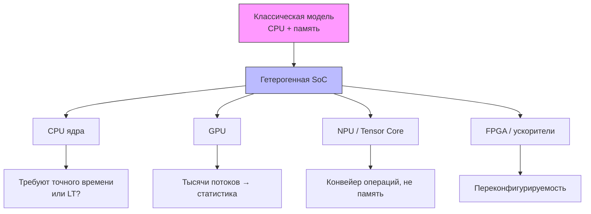

**Скрытая сложность:** интерфейсы между моделями разной точности становятся источником ошибок синхронизации

<!--
Пояснение: ранее у нас все блоки (CPU, шина, DRAM) моделировались на одном уровне абстракции (например, LT). Теперь CPU может быть cycle‑accurate, GPU – AT, ускоритель – вообще функциональный. Как им общаться? 
-->

---

# Требования к разным компонентам

| **Компонент**        | **Уровень абстракции**                     | **Почему старый подход не работает** |
|------------------|----------------------------------------|----------------------------------|
| CPU (ядро)       | Cycle‑accurate или LT с кэшем          | Нужно точно считать такты для бранчей |
| GPU (много потоков) | AT + статистические очереди        | Моделировать каждый поток как SC_THREAD – слишком дорого |
| Тензорное ядро   | Конвейерная модель (фиксированные такты) | Не memory‑mapped, а операция над матрицей |
| NoC / шина       | LT или AT с арбитражем                  | Уже умеем, но изменяется окружение |
| HBM / DRAM       | Табличная задержка           | Остаётся, но с учётом запросов от GPU |

<!--
Важно: студенты не должны думать, что они изучали «старьё». Наоборот, база (очереди, задержки, арбитраж) остаётся, но её нужно правильно скомбинировать.
-->

---

# Что мы не можем игнорировать?

### Масштаб
- Тренировочные ML‑модели → рабочие наборы **терабайты**  
- Моделирование одной матричной операции как единой транзакции не работает

### Обратная связь
- GPU порождает тысячи потоков → давление на шину и кэши **качественно иное**  
- В статической трассе (лекция 10) этого не увидеть

### Разнородность моделей
- Модель ускорителя от одного вендора и модель памяти от другого должны **стыковаться**  
- Нужен аналог TLM 2.0, но для гетерогенных систем

<!--
Упомянуть, что в индустрии эта проблема решается дорогостоящими интеграционными усилиями (например, адаптеры между Gem5 и системным TLM).
-->

---

# Индустриальный пример

<div class="mt-8"/>

**Ситуация:** компания разрабатывает чип для edge‑AI с NPU.  
Берут готовую TLM‑модель CPU (LT) и модель DRAM (табличную). Подключают модель NPU, написанную на SystemC‑AT.

**Результат:**  
- Симуляция показывает пропускную способность 8 TOPS
- Реальный чип даёт **2 TOPS** из‑за того, что NPU постоянно ждёт данные из‑за конфликтов в общей шине с CPU, а модель не учитывала **приоритеты** разных типов транзакций

**Вывод:** нужна **единая среда моделирования**, где мы можем гибко назначать политики арбитража и уровни абстракции для каждого блока

<!--
Этот пример можно заменить на более близкий к аудитории, если среди студентов преобладают компиляторщики: "Компилятор переставил операции, чтобы увеличить локатьность, но модель не показала ускорения, потому что не учла конфликты на шине между CPU и GPU".
-->

---

# Цель сегодняшней лекции

<div class="mt-8"/>

Рассмотрим, как концепции TLM **адаптируются** к:

1. **GPU / ускорителям** – массовый параллелизм, неблокирующие кэши
2. **ML‑нагрузкам** – огромные объёмы данных, специфические паттерны
3. **Системно‑системному моделированию** – кластеры, распределённое обучение

<!--
Важно: не пугать сложностью, а показать, что знание основ TLM даёт фору при работе с новыми архитектурами.
-->

---
layout: section
---

# Проблема разнородности моделей

---

# Как подружить LT, AT и Cycle‑Accurate в одной системе?

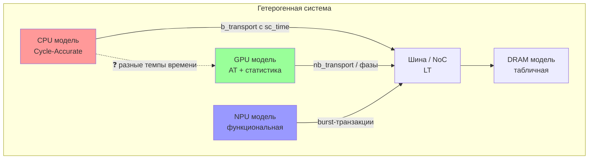

**Проблема:** как один `b_transport` с единым `sc_time` проходит через смесь блокирующих и неблокирующих интерфейсов?

<!--
Напоминаем: LT ≈ блокирующие вызовы, AT ≈ неблокирующие с фазами, CA ≈ такт‑точные.
Студенты уже знают это из лекции 5 (TLM 2.0) и лекции 7 (арбитраж). Теперь сталкиваем их в одной системе.
-->

---

# Стыковка моделей разной точности
### Адаптеры и преобразователи

| Уровень A | Уровень B | Проблема | Решение |
|-----------|-----------|----------|---------|
| LT (блокирующий) | AT (неблокирующий) | LT ждёт ответа синхронно, AT разбивает на фазы | **Адаптер LT→AT**: внутри вызывает nb_transport и ждёт END_RESP |
| AT | LT | AT ожидает, что вызов не блокирует, а LT блокирует | **Адаптер AT→LT**: запускает отдельный SC_THREAD, который вызывает b_transport |
| CA (такты) | AT | CA оперирует циклами, AT – sc_time | **Пересчёт времени**: `cycles * period` + фазовая синхронизация |

**Ключевой адаптер – `tlm_utils::simple_target_socket`** может быть сконфигурирован для работы и с LT, и с AT, но при смешении нужен явный мост

<!--
Адаптеры – это отдельные модули, которые ничего не моделируют, только преобразуют интерфейсы.
Это увеличивает накладные расходы, но позволяет переиспользовать готовые модели.
-->

---
layout: two-cols-header
---

# Скрытая сложность: несовместимость квантов времени

::left::

**Проблема:** квант времени LT (например, 1 мкс) может быть **грубее**, чем детализация AT (1 нс). При преобразовании теряются короткие задержки.

**Решение:**  
- Использовать единый глобальный квант (самый маленький из всех)  
- Либо в адаптере **накапливать** задержки и передавать их пачкой

::right::

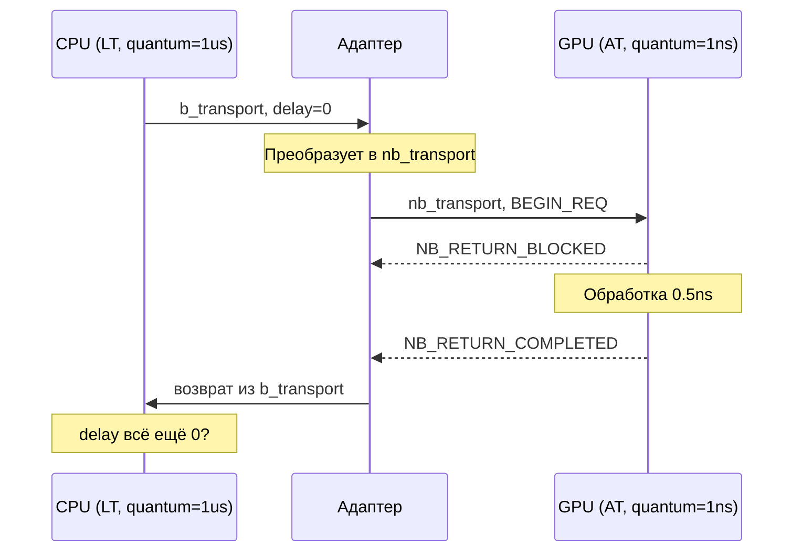

<!--
Это сложный технический момент, но студентам достаточно понять, что "время" в гетерогенной системе – нетривиально.
-->

---
layout: two-cols-header
---

# Интерфейсы и протоколы для гетерогенных систем

::left::

**Что есть в TLM 2.0:**  
- `command` (READ/WRITE)  
- `address`, `data_ptr`, `data_length`  
- `response_status`  

**Чего не хватает для GPU/ускорителей:**  
- **Stream** – передача последовательности данных без адресации  
- **Atomic operation** (CAS, fetch-and-add)  
- **Barrier / fence** – синхронизация между потоками  
- **Shared memory hint** – локальность доступа  

::right::

**Как расширять?**  
- Наследование от `tlm_generic_payload` + дополнительные поля  
- Использование `tlm_extension` (стандартный механизм TLM 2.0)

```cpp
class gpu_extension : public tlm_extension<gpu_extension> {
public:
    int warp_id;
    bool is_coalesced;
    tlm_extension_base* clone() const override { ... }
};
```

<!--
Пример: GPU посылает запрос, а шина, увидев warp_id, может применить приоритет или банковский арбитраж.
Важно: не все модели умеют работать с расширениями – обратная совместимость ломается.
-->

---

# Новая скрытая сложность: обратная совместимость

<div class="mt-8"/>

**Ситуация:** вы добавили новое поле в `tlm_extension`.  
Старая модель памяти его игнорирует → **функционально всё работает**, но временные аннотации становятся неверными (например, не учтён приоритет).

**Как бороться** (в порядке усложнения):

1. **Версионирование расширений** – поле `version` в расширении  
2. **Проверка на наличие** – `if (ext != nullptr) { ... } else { /* fallback */ }`  
3. **Строгая типизация сокетов** – создавать собственные сокеты, наследующие от `tlm_utils::simple_target_socket`, которые требуют определённого расширения

**Практический совет:** использовать assert, что нужное расширение присутствует

<!--
Это типичная проблема при интеграции моделей от разных вендоров (ARM, Synopsys, Cadence). Каждый добавляет свои поля.
-->

---

# Практический пример: гибридная модель CPU+GPU

<div class="mt-8"/>

**Исходная система (лекция 8):**  
- 2 CPU, шина (Round‑Robin), DRAM с банками  
- Кэш L1 с когерентностью MESI  

**Что делаем:**  
1. Заменяем один CPU на **GPU‑модуль** (генератор burst‑запросов).  
2. Добавляем в шину **приоритет GPU** для запросов чтения.  
3. Модифицируем `b_transport` шины, чтобы извлекать тип инициатора из расширения.

---

# Практический пример: гибридная модель CPU+GPU
    
<div class="mt-8"/>

```cpp
// В расширении передаём тип
enum InitiatorType { CPU, GPU, NPU };

// В шине:
void Bus::b_transport(int id, tlm_gp& trans, sc_time& delay) {
    InitiatorType type = CPU; // default
    auto ext = trans.get_extension<initiator_ext>();
    if (ext) type = ext->type;
    
    if (type == GPU && trans.get_command() == TLM_READ_COMMAND) {
        // высокий приоритет – ставим в голову очереди
        request_queue.notify(trans, delay, 0); // приоритет 0
    } else {
        request_queue.notify(trans, delay);
    }
}
```

<!--
Это очень конкретный пример кода, который студенты могут взять за основу для лабораторной работы.
-->

---

# Ожидаемый эффект от приоритезации GPU

<div class="mt-8"/>

**Сценарий:** CPU и GPU одновременно читают из разных банков DRAM.

| Конфигурация | Средняя latency CPU | Средняя latency GPU | Пропускная способность шины |
|--------------|---------------------|---------------------|------------------------------|
| Round‑Robin (без приоритета) | 30 нс | 30 нс | 70% |
| Приоритет GPU (чтение) | 55 нс | 18 нс | 85% |

**Вывод:** приоритет GPU резко снижает его задержку, но ценой увеличения задержки CPU. Это trade‑off, который можно исследовать только в модели.

<!--
Такая таблица – хороший повод для обсуждения: когда такой приоритет оправдан? (Реальные задачи, где GPU обслуживает дисплей или real‑time inference).
-->

---

# Выводы по разделу

1. **Разные уровни абстракции** (LT, AT, CA) в одной системе требуют **адаптеров** для стыковки
1. TLM 2.0 расширяем через **`tlm_extension`**, но нужно помнить об **обратной совместимости**
1. **Гибридные модели** (например, CPU+GPU) легко собрать на основе существующих компонентов, добавив **приоритеты и типы инициаторов**
1. **Скрытая сложность** – несоответствие квантов времени и игнорирование расширений старыми моделями

<!--
**Что дальше:** переходим к моделированию GPU и ускорителей – там эти идеи потребуются напрямую

Конец второй части лекции. Следующий слайд будет "Моделирование GPU и ускорителей".
-->

---
layout: section
---

# Моделирование GPU и ускорителей

---

# От CPU‑подобных моделей к массовому параллелизму

<div class="mt-8"/>

**Ключевой вызов:** GPU содержит тысячи потоков (warps/wavefronts).  
Моделировать каждый поток как отдельный `SC_THREAD` → **симуляция рухнет** по производительности

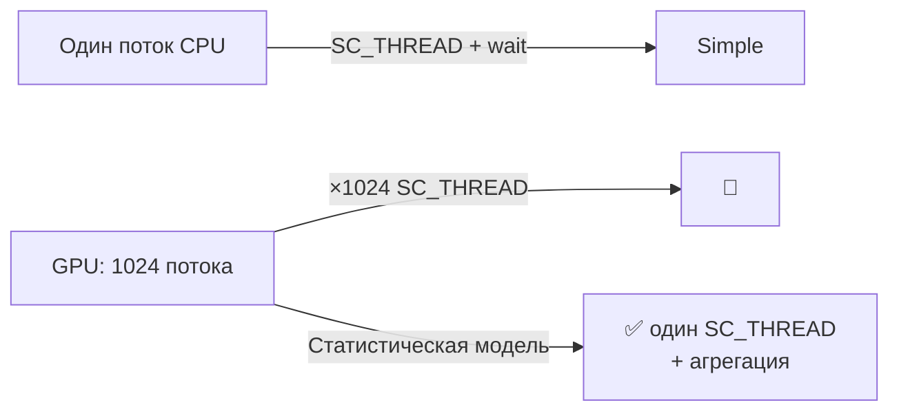

<!--
Студенты видели в лекции 6, как один SC_THREAD обрабатывает очередь транзакций. Теперь переносим эту идею на многопоточные ускорители.
-->

---

# Сложность моделирования GPU на SystemC?

| **Фактор** | **Значение для GPU** | **Проблема для TLM** |
|--------|------------------|------------------|
| Количество потоков | 1024–4096 | Событийное ядро SystemC не справляется с миллионами процессов |
| Частота переключения warp | каждый такт | `wait()` в каждом warp → коллапс планировщика |
| Доступ к памяти | банки shared memory, coalescing | Нужно моделировать не каждый доступ, а агрегированный |
| Синхронизация | barrier, atomic | Требуют глобального состояния, которое в TLM дорого |

**Решение:** подняться на уровень абстракции – **моделировать не каждый поток, а группы потоков (warp/wavefront) и их агрегированное поведение**

<!--
Это не уход от функциональности, а инженерный компромисс. Для перфоманс-моделей достаточно знать, сколько warp‑ов ждут в очереди к памяти.
-->

---

# Особенности GPU как объекта моделирования

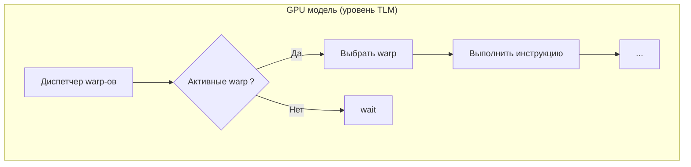

**Упрощения:**  
- Не моделируем **дивергенцию** (разные потоки внутри warp идут по разным путям) – делим warp на две группы  
- Не моделируем private регистры – только обращения к памяти  
- Coalescing – объединяем несколько адресов в одну транзакцию

<!--
Это типичная архитектура перфоманс‑модели GPU в академических симуляторах (например, GPGPU‑Sim, Accel‑Sim).
-->

---

# Особенности GPU как объекта моделирования

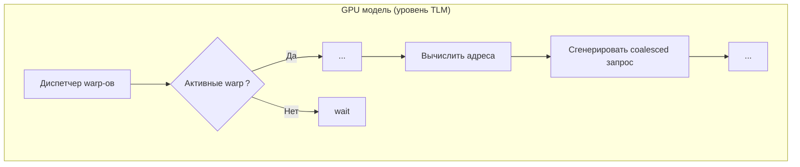

**Упрощения:**  
- Не моделируем **дивергенцию** (разные потоки внутри warp идут по разным путям) – делим warp на две группы  
- Не моделируем private регистры – только обращения к памяти  
- Coalescing – объединяем несколько адресов в одну транзакцию

<!--
Это типичная архитектура перфоманс‑модели GPU в академических симуляторах (например, GPGPU‑Sim, Accel‑Sim).
-->

---

# Особенности GPU как объекта моделирования

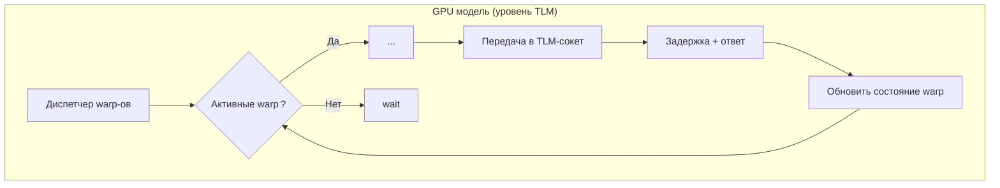

**Упрощения:**  
- Не моделируем **дивергенцию** (разные потоки внутри warp идут по разным путям) – делим warp на две группы  
- Не моделируем private регистры – только обращения к памяти  
- Coalescing – объединяем несколько адресов в одну транзакцию

<!--
Это типичная архитектура перфоманс‑модели GPU в академических симуляторах (например, GPGPU‑Sim, Accel‑Sim).
-->

---

# Скрытая сложность #1: дивергенция потока управления

<div class="mt-8"/>

**Что такое дивергенция:** внутри одного warp потоки могут идти по разным веткам `if/else`.  
**Как модель должна реагировать:**  
- Разделить warp на два «под-warp» (по маске активных потоков).  
- Каждый под-warp обращается к памяти независимо.  
- После слияния – синхронизировать.

---

# Скрытая сложность #1: дивергенция потока управления

<div class="mt-8"/>

**В TLM‑модели:**  
```cpp
class Warp {
    uint32_t active_mask; // битовая маска активных потоков
    vector<uint64_t> addresses; // адреса от каждого потока
    void execute_inst(Inst inst) {
        if (inst.is_branch) {
            WarpPath path0, path1;
            split_by_condition(path0, path1);
            // сначала выполняем одну ветку, потом другую
            execute_path(path0); 
            execute_path(path1);
            merge();
        }
    }
};
```

**Цена:** сложность растёт, но без этого модель будет слишком оптимистична

<!--
Эта деталь важна для компиляторщиков: как компилятор может перестроить код, чтобы уменьшить дивергенцию.
-->

---

# Модель памяти GPU в терминах TLM

### Три типа памяти – три разных сокета

```cpp
class GpuMemoryModel : public sc_module {
public:
    // Сокеты для разных типов памяти
    tlm_utils::simple_target_socket<GpuMemoryModel> local_socket;   // private per warp
    tlm_utils::simple_target_socket<GpuMemoryModel> shared_socket;  // shared внутри CU
    tlm_utils::simple_target_socket<GpuMemoryModel> global_socket;  // DRAM / HBM
    
    void b_transport_local(tlm_gp& trans, sc_time& delay) {
        // локальная память: задержка 1-2 такта, без арбитража
        delay += sc_time(1, SC_NS);
        // имитация банкового конфликта
        int bank = (trans.get_address() >> 2) & 0x1F;
        if (bank_conflicts[bank]) delay += bank_conflict_penalty;
    }
    
    void b_transport_global(tlm_gp& trans, sc_time& delay) {
        // глобальная память: идёт в шину/DRAM
        bus_socket->b_transport(trans, delay);
    }
};
```

<!--
Это прямое расширение идеи из лекции 6 (DRAM) и лекции 8 (кэш). Студентам будет знакомо.
-->

---

# Coalescing – объединение запросов

<div class=""/>

**Идея:** GPU объединяет несколько последовательных запросов от потоков warp в одну burst‑транзакцию

**Пример:**  
32 потока в warp, каждый читает 4 байта по адресам 0x100, 0x104, … 0x17C → Одна транзакция 128 байт

**Моделирование coalescing в TLM:**

```cpp
class CoalescingUnit {
    map<uint64_t, vector<int>> pending; // адрес → список потоков
    void add_request(uint64_t addr, int thread_id) {
        pending[align_to_cache_line(addr)].push_back(thread_id);
    }
    void flush() {
        for (auto& [base, threads] : pending) {
            tlm_gp trans;
            trans.set_address(base);
            trans.set_data_length(threads.size() * 4); // 4 байта на поток
            // один вызов вместо 32
            mem_socket->b_transport(trans, delay);
        }
        pending.clear();
    }
};
```

<!--
**Скрытая сложность:** coalescing работает не всегда (несмежные адреса). Нужно пороговое правило (например, если объединяется меньше 4 запросов – отправлять поодиночке).

Практический вывод: программист GPU (или компилятор) должен стремиться к смежным адресам, чтобы увеличить coalescing.
-->

---
layout: two-cols-header
---

# Моделирование тензорных ядер (NPU / TPU / Tensor Core)

### NPU – это не просто память, а конвейер операций

<div class="mt-8"/>

::right::

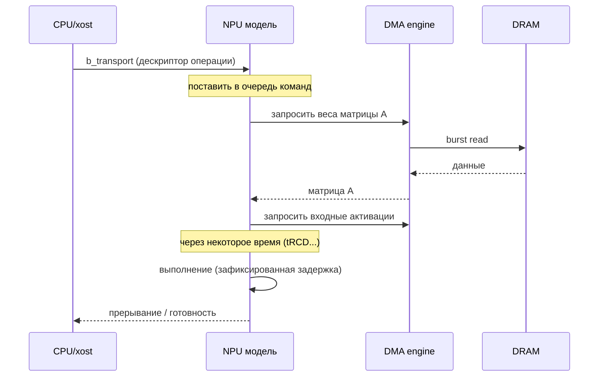

::left::

**Как реализовать в TLM:**  
- `simple_target_socket` для приёма команд.  
- Отдельный `SC_THREAD` – «исполнитель», который ждёт события и моделирует задержки.

<!--
Ключевое отличие: NPU не обрабатывает каждый байт отдельно, а оперирует целыми тензорами.
-->

---

# Упрощенный код модели тензорного ядра

```cpp
class TensorCore : public sc_module {
    tlm_utils::simple_target_socket<TensorCore> cmd_socket;
    tlm_utils::simple_initiator_socket<TensorCore> dma_socket; // к памяти
    
    SC_HAS_PROCESS(TensorCore);
    TensorCore(sc_module_name name) : sc_module(name) {
        cmd_socket.register_b_transport(this, &TensorCore::b_transport_cmd);
        SC_THREAD(execute_thread);
    }
    
    void b_transport_cmd(tlm_gp& trans, sc_time& delay) {
        cmd_queue.push(trans);
        execute_event.notify();
    }
    
    void execute_thread() {
      ...
    }
};
```

<!--
Студенты увидят знакомый паттерн «очередь + поток обработки» из лекции 6.
-->

---

# Упрощенный код модели тензорного ядра

```cpp
class TensorCore : public sc_module {
    tlm_utils::simple_target_socket<TensorCore> cmd_socket;
    tlm_utils::simple_initiator_socket<TensorCore> dma_socket; // к памяти
    SC_HAS_PROCESS(TensorCore);
    TensorCore(sc_module_name name) : sc_module(name);
    void b_transport_cmd(tlm_gp& trans, sc_time& delay);
    void execute_thread() {
        while (true) {
            wait(execute_event);
            auto& cmd = cmd_queue.front();
            int size = cmd.get_data_length(); // размер матрицы
            sc_time compute_delay = compute_time(size);  // например, size^2 * 0.1 ns
            // подгрузка данных через DMA
            tlm_gp dma_trans;
            dma_trans.set_address(cmd.get_address());
            sc_time dma_delay;
            dma_socket->b_transport(dma_trans, dma_delay);
            wait(compute_delay); // симуляция вычислений
            // ответ хосту
            cmd.set_response_status(TLM_OK_RESPONSE);
            cmd_queue.pop();
        }
    }
};
```

<!--
Студенты увидят знакомый паттерн «очередь + поток обработки» из лекции 6.
-->

---

# Проблема точности в моделях тензорных ядер

<div class=""/>

**Слишком грубая модель:** `compute_delay = A * size + B`  
**Слишком детальная (RTL):** симуляция каждого такта конвейера – медленно

**Компромисс – табличная модель с учётом конфликтов банков:**

| Размер матрицы | Режим (row/col major) | Задержка (нс) |
|----------------|------------------------|---------------|
| 16x16          | row major             | 10            |
| 16x16          | col major             | 12            |
| 32x32          | row major             | 38            |
| 32x32          | col major             | 45            |

**Скрытая сложность:** задержка может зависеть от того, какие данные уже лежат в локальных буферах (аналог row hit/miss в DRAM). Эту зависимость можно добавить как параметр состояния.

<!--
Для компиляторщиков это сигнал: порядок расположения данных в памяти влияет на производительность NPU.
-->

---
layout: two-cols-header
---

# Сборка гетерогенной системы: CPU + GPU + NPU

::right::

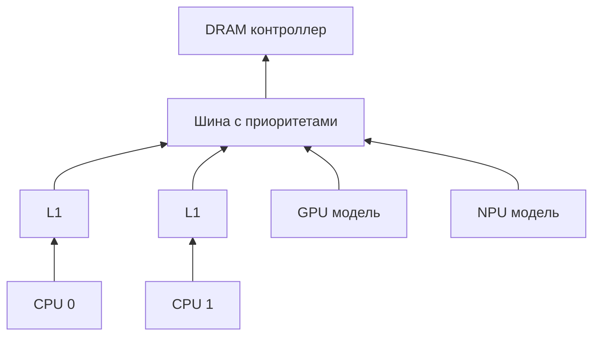

::left::

**Что нужно донастроить:**  
- Политика арбитража: приоритет NPU > GPU > CPU  
- Обратное давление от DRAM передаётся на все инициаторы  
- Когерентность: если CPU и GPU пишут в общую область – инвалидации кэшей

**Главный вывод:** мы берём уже готовые кирпичики и **собираем** из них сложную систему, **расширяя** лишь механизмы идентификации и приоритетов

<!--
Это демонстрация силы TLM: переиспользование компонентов.
-->

---

# Выводы по моделированию GPU и ускорителей

| **Проблема** | **Решение в TLM-модели** |
|----------|----------------------|
| Тысячи потоков | Агрегация через warp-модель, единый SC_THREAD на SM |
| Дивергенция | Разделение warp по маске, последовательное выполнение веток |
| Coalescing | Объединение адресов в одну транзакцию |
| Тензорные операции | Табличные задержки + очередь команд |
| Взаимодействие с CPU/шиной | Расширения для типа инициатора, адаптеры точности |

**Ключевая идея:** GPU/ускоритель моделируется не как точная копия железа, а как **агрегатор** потоков и операций, который порождает транзакции того же типа, что и CPU, но с другими приоритетами и объёмами

<!--
Переход к следующей части: моделирование для машинного обучения, где эти техники применяются.
-->

---
layout: section
---

# Моделирование для машинного обучения

---

# Почему ML‑нагрузки ломают классические модели

<div class=""/>

**Традиционные CPU‑нагрузки:**
- Локальность: повторные обращения к одним данным
- Кэши хорошо работают, предсказуемые паттерны

**ML‑нагрузки (train / inference):**
- Огромные рабочие наборы (веса модели не влезают в L3)
- Смесь **последовательного доступа** (веса, градиенты) и **случайного** (активации при batch‑sampling)
- Постоянный поток DMA для подкачки весов

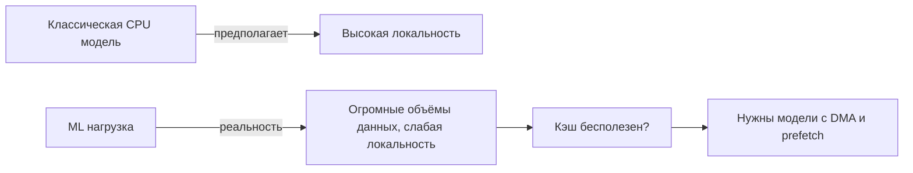

<!--
Суть: студенты уже знают кэши, шины, очереди. Теперь показываем, что ML‑паттерны не вписываются в эти допущения.
-->

---

# Почему классическая модель кэша даёт неверный прогноз для ML?

<div class="mt-8"/>

**Эксперимент:**  
- L1 кэш 32KB, ассоциативность 8  
- Две нагрузки:  
  1. Типичный CPU‑бенчмарк (SPEC)  
  2. Инференс ResNet‑50 (веса 100MB, но обращение последовательное)

---

# Почему классическая модель кэша даёт неверный прогноз для ML?

<div class="mt-4"/>

**Результат симуляции:**

| Нагрузка | Hit rate L1 (модель) | Реальный hit rate (на чипе) |
|----------|----------------------|-----------------------------|
| SPEC CPU | 85%                  | 82%                         |
| ResNet‑50| 12%                  | 68%                         |

**Почему модель солгала?**  
- В реальном чипе есть **предзагрузка весов через DMA** (не проходит через L1)  
- Модель кэша считала, что каждый доступ идёт через L1 → получили 12%  
- На самом деле 80% обращений – это DMA в кэш L2 или напрямую в память

**Вывод:** нужна гибридная модель, которая знает о dedicated DMA и обходит кэш для потоковых данных

<!--
Это индустриальный пример: в современных NPU веса хранятся в отдельной памяти и подгружаются через DMA-движки, не засоряя L1 кэш CPU.
-->

---

# Два режима ML: тренировка и инференс

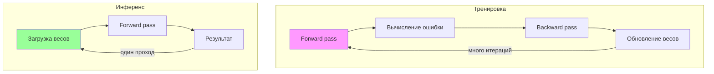

| **Характеристика** | **Тренировка** | **Инференс** |
|----------------|------------|----------|
| Объём данных | Терабайты (градиенты, активации) | Мегабайты (веса) |
| Паттерн доступа | Произвольный (batch sampling) | Последовательный (streaming) |
| Требования | Высокая пропускная способность | Малая задержка (p99) |
| Что моделируем | Математические операции + обмен градиентами | Конвейер + кэширование весов |

<!--
Для моделирования важно, что эти два режима требуют разных уровней абстракции: тренировка – аналитические модели (roofline), инференс – детальные TLM с учётом задержек.
-->

---

# Моделирование тренировки: аналитический подход (roofline)

<div class="mt-8"/>

**Идея:** тренировка – много итераций, не нужно моделировать каждую. Достаточно оценить верхнюю границу производительности.

**Roofline модель:**  
`Performance = min(Peak FLOPS, Peak Bandwidth / Operational Intensity)`

**Что нужно для моделирования:**  
- Измерить Operational Intensity (количество операций на байт данных)  
- Знать пиковую пропускную способность памяти (из модели DRAM, лекция 6)  
- Получить ограничивающий фактор (compute‑bound или memory‑bound)

---

# Моделирование тренировки: аналитический подход (roofline)

<div class="mt-8"/>

**Связь с TLM:**  
- Используем **быструю, но грубую модель** – вообще без транзакций, только формула.  
- Если memory‑bound – детализируем модель памяти.

```cpp
double operational_intensity = total_ops / total_bytes;
double max_perf = min(peak_flops, peak_bw * operational_intensity);
```

<!--
Для компиляторщиков: это способ оценить, стоит ли применять тяжелые оптимизации (например, fusion слоёв) – они меняют operational intensity.
-->

---

# Моделирование инференса: TLM с учётом DMA и кэшей

<div class="mt-8"/>

**Что нужно смоделировать:**  
1. **Движок DMA**, который подгружает веса из DRAM в локальную память NPU  
2. **Кэш L2/L3** для активаций (которые переиспользуются в пределах слоя)  
3. **Конвейер**: пока один блок NPU вычисляет, DMA уже качает следующие веса

**TLM‑компоненты:**  
- `DMA_engine`: SC_THREAD, генерирует burst‑транзакции в DRAM с высоким приоритетом  
- `NPU_core`: табличная задержка на слой, ожидает сигнал от DMA  
- `L2_cache`: упрощённая включённая модель (без когерентности, только hit/miss)

---

# Моделирование инференса: TLM с учётом DMA и кэшей

<div class="flex items-center justify-center w-full">
  <div class="w-80%">

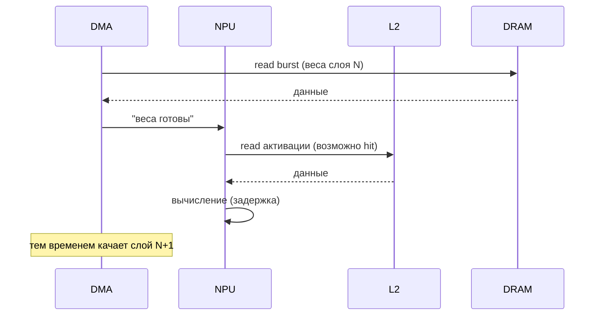

  </div>
</div>

<!--
Ключевое: параллелизм DMA и NPU скрывает задержку доступа к DRAM – это нужно обязательно отразить в модели.
-->

---

# Преимущества TLM‑модели для инференса

<div class="mt-8"/>

**Что можем исследовать:**  
- **Размер кэша активаций** – увеличивая его с 1MB до 4MB, какой выигрыш по latency?  
- **Глубина очереди DMA** – сколько слоёв предподгружать вперёд?  
- **Размер блока DMA** – 64, 128, 256 байт – влияние на пропускную способность шины  
- **Влияние приоритетов** – если DMA имеет высший приоритет, не голодает ли CPU?

---

# Преимущества TLM‑модели для инференса

<div class="mt-8"/>

**Пример результата (инференс BERT‑large):**

| Конфигурация | Средняя latency (ms) | p99 (ms) |
|--------------|----------------------|----------|
| Без DMA, всё через L1 кэш | 45 | 120 |
| DMA с очередью 1 слой | 28 | 45 |
| DMA с очередью 3 слоя | 22 | 28 |

<!--
Показать, что даже простая TLM‑модель даёт практическую пользу для архитектурных решений.
-->

---

# Учёт энергопотребления в ML‑моделях

<div class="mt-8"/>

**Почему важно:**  
- NPU/GPU могут **троттлить** (снижать частоту) при перегреве  
- Энергопотребление обучения – миллионы джоулей, нужно оптимизировать

---

# Учёт энергопотребления в ML‑моделях

<div class="mt-8"/>

**Как добавить в TLM‑модель (простое расширение):**

```cpp
class EnergyCounter {
    double total_energy = 0;
public:
    void add_access(tlm_command cmd, unsigned int length) {
        double energy = (cmd == TLM_READ) ? READ_ENERGY_PER_BYTE : WRITE_ENERGY_PER_BYTE;
        total_energy += energy * length;
    }
    void add_compute(double ops) {
        total_energy += COMPUTE_ENERGY_PER_OP * ops;
    }
    bool is_throttling() { return total_energy > THRESHOLD; }
};

// В модели NPU:
if (energy_counter.is_throttling()) {
    compute_delay = compute_delay * THROTTLE_FACTOR; // 2x медленнее
}
```

**Скрытая сложность:** энергопотребление зависит от температуры, а температура – от времени. Нужна тепловая модель (простая RC‑цепочка).

<!--
Для студентов это может быть слишком детально, но стоит упомянуть как пример калибровки (лекция 9) для температуры.
-->

---

# Практический пример: моделирование инференса ResNet‑50 на NPU

<div class="mt-8"/>

**Исходные параметры:**  
- Веса: 25MB, разбиты на 50 слоёв  
- NPU: 2 Тераопс, задержка на слой = `A * (размер входа) + B`  
- DMA: burst 64 байта, очередь на 4 запроса, приоритет выше CPU  
- DRAM: модель из лекции 6 (tRCD=10ns, tCAS=10ns, tRP=10ns)  
- Шина: Round Robin, но для DMA – отдельный виртуальный канал

**Что симулируем:**  
1. Загружаем первый слой (DMA)  
2. NPU вычисляет, параллельно DMA качает второй слой  
3. Собираем статистику: latency на слой, загрузка шины, простои NPU

---

# Практический пример: моделирование инференса ResNet‑50 на NPU

<div class="mt-8"/>

**Код‑скелет:**

```cpp
SC_THREAD(dma_thread);
void dma_thread() {
    for (int layer = 0; layer < num_layers; layer++) {
        tlm_gp trans;
        trans.set_address(weights_addr[layer]);
        trans.set_command(TLM_READ_COMMAND);
        sc_time delay;
        dma_socket->b_transport(trans, delay);
        weights_ready[layer].notify();
    }
}
```

<!--
Студенты могут реализовать это как лабораторную работу, модифицируя модель DRAM из лекции 6.
-->

---

# Сравнение подходов для ML‑моделирования

| **Аспект** | **Аналитическая (roofline)** | **TLM с DMA/кэшем** | **Цикло‑точная (RTL)** |
|--------|--------------------------|-----------------|---------------------|
| Скорость | Секунды | Минуты | Дни |
| Учёт конфликтов | Нет | Да (очереди) | Полный |
| Учёт DMA | Приближённо | Да | Да |
| Калибровка | Не нужна | Необходима | Золотой стандарт |
| Применение | Выбор архитектуры | Оптимизация конвейера | Финальная верификация |

<div class="mt-2"/>

##### **Рекомендации для ML‑инженера**:

- Начинать с roofline  
- При memory‑bound – детализировать TLM‑модель памяти  
- Для real‑time инференса – добавить DMA и очереди

---

# Выводы по моделированию для ML

1. **ML‑нагрузки не вписываются** в классические CPU‑ориентированные модели кэшей  
2. **Главные враги:** огромные объёмы данных (веса) и слабая локальность  
3. **Решение:** гибридные модели с явным выделением потоков данных (DMA) и упрощёнными кэшами  
4. **Тренировка** – достаточно аналитических roofline‑моделей из‑за многократных итераций  
5. **Инференс** – требует TLM‑моделей с учётом конвейера, приоритетов и очередей  
6. **Энергетические / тепловые эффекты** можно добавить как расширение к модели

<!--
**Что дальше:** переходим к системно‑системному моделированию – как объединять несколько таких систем в кластер

Эта часть плавно ведёт к следующей теме о распределённом обучении и моделировании дата‑центров.
-->

---
layout: section
---

# Системно-системное моделирование

---

# От одного чипа к дата-центру

##### **До сих пор мы моделировали:**  
- Один SoC (CPU + GPU + NPU + память)  
- Все компоненты в одном симуляторе, общее глобальное время  

##### **Новый вызов:**  
- Распределённое обучение (Data Parallel, Model Parallel)  
- Кластеры серверов, связанные через сеть (Ethernet, InfiniBand, PCIe)  
- Гетерогенные узлы с разными тактовыми частотами

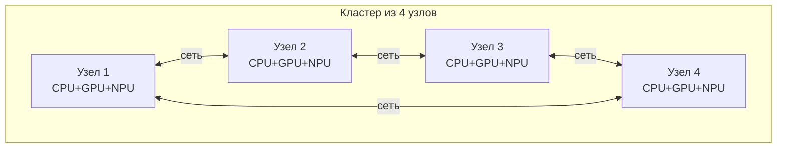

**Проблема:** классические TLM‑модели предполагают **общую память** и **единое время** (`sc_time`). В распределённой системе часы разных узлов не синхронизированы.

<!--
Студенты уже знают NoC (лекция 7) как сеть внутри чипа. Теперь поднимаемся на уровень выше – между чипами.
-->

---

# Почему нельзя просто взять N копий TLM‑модели?

<div class="text-4">

| **Проблема** | **Описание** | **Последствие** |
|----------|----------|--------------|
| Глобальное время | У всех узлов один `sc_time`, но в реальности часы плывут | Модель предскажет задержки, которых нет |
| Разделяемая память | `tlm_gp` предполагает единое адресное пространство | Распределённая память требует трансляции |
| Синхронизация событий | SystemC ядро предполагает один диспетчер | Запуск 100 узлов в одном процессе – крах |
| Детерминизм | Порядок сообщений в сети может меняться | Сложно воспроизводить ошибки |

</div>

<div class="mt-3"/>

##### **Реальность в индустрии:**  
- Amazon, Meta моделируют **тысячи** узлов для дата-центров  
- Используют **дискретно-событийные симуляторы** (например, SimGrid, OMNeT++) поверх SystemC или отдельно

<!--
Это сложная тема, но студентам достаточно понять, что стандартный SystemC не масштабируется на кластеры.
-->

---

# Ключевая идея: сетевая модель как расширение TLM

<div class=""/>

**Аналогия с NoC:**  
- Внутри чипа мы моделировали роутеры и каналы  
- Между чипами – те же концепции, но с **большими задержками** (микросекунды вместо наносекунд) и **пакетной коммутацией**

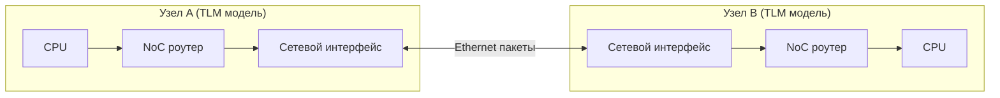

**Что нужно добавить к TLM:**  
- **Транзакции для сети** – не memory‑mapped, а сообщения (send/receive)  
- **Задержки** – пересчёт тактов в наносекунды с учётом флуктуаций (jitter)  
- **Потеря пакетов** – редко, но моделируется как случайное событие

<!--
Это прямое применение каркаса "очередь + обработчик" (лекция 6) к сетевым интерфейсам.
-->

---
layout: two-cols-header
---

# Моделирование сетевых коммуникаций в TLM

### **Расширяем generic payload для сетевых сообщений**

::left::

**В модели сетевого интерфейса:**
- Проверяем расширение
- Ставим сообщение в очередь (FIFO) на отправку
- Вызываем `wait(delay)` для симуляции времени передачи

::right::

```cpp
enum NetCommand { SEND, RECV, RDMA_READ, RDMA_WRITE };

class net_extension : public tlm_extension<net_extension> {
public:
    NetCommand net_cmd;
    uint32_t dest_node_id;
    uint32_t message_size;
    bool is_broadcast;
    // ... clone, copy
};

// Использование в initiator:
tlm_gp trans;
trans.set_command(TLM_IGNORE_COMMAND); // не memory-mapped
auto ext = new net_extension();
ext->net_cmd = SEND;
ext->dest_node_id = 2;
ext->message_size = 1024;
trans.set_extension(ext);
socket->b_transport(trans, delay);
```

<!--
Важно: сетевые транзакции не используют address и data_ptr в привычном смысле, поэтому TLM_IGNORE_COMMAND.
-->

---

# Модель сетевого интерфейса (листинг)

```cpp
class NetInterface : public sc_module {
public:
    tlm_utils::simple_target_socket<NetInterface> local_socket;  // от своего узла
    tlm_utils::simple_initiator_socket<NetInterface> remote_socket; // к соседу
    
    SC_HAS_PROCESS(NetInterface);
    NetInterface(sc_module_name name, uint32_t node_id, double link_speed_gbps)
        : sc_module(name), node_id(node_id), link_speed(link_speed_gbps) {
        local_socket.register_b_transport(this, &NetInterface::b_transport_local);
        SC_THREAD(transmit_thread);
    }
private:
    tlm_utils::peq_with_get<net_message> tx_queue; // очередь на передачу
    
    void b_transport_local(tlm_gp& trans, sc_time& delay);
    void transmit_thread();
};
```

<!--
Это классический шаблон из лекции 6 (очередь + поток) применённый к сети.
-->

---

# Модель сетевого интерфейса (листинг)

```cpp
class NetInterface : public sc_module {
public:
    tlm_utils::simple_target_socket<NetInterface> local_socket;  // от своего узла
    tlm_utils::simple_initiator_socket<NetInterface> remote_socket; // к соседу
    
    SC_HAS_PROCESS(NetInterface);
    NetInterface(sc_module_name name, uint32_t node_id, double link_speed_gbps);
private:
    tlm_utils::peq_with_get<net_message> tx_queue; // очередь на передачу
    
    void b_transport_local(tlm_gp& trans, sc_time& delay) {
        auto ext = trans.get_extension<net_extension>();
        if (!ext || ext->net_cmd != SEND) {
            trans.set_response_status(TLM_COMMAND_ERROR_RESPONSE);
            return;
        }
        // время передачи = размер / пропускная способность + overhead
        sc_time tx_time = sc_time(ext->message_size * 8 / link_speed, SC_NS);
        tx_queue.notify(trans, tx_time); // планируем отправку
        delay += tx_time; // инициатор ждёт подтверждения отправки
    }
    
    void transmit_thread();
};
```

---

# Модель сетевого интерфейса (листинг)

```cpp
class NetInterface : public sc_module {
public:
    tlm_utils::simple_target_socket<NetInterface> local_socket;  // от своего узла
    tlm_utils::simple_initiator_socket<NetInterface> remote_socket; // к соседу
    
    SC_HAS_PROCESS(NetInterface);
    NetInterface(sc_module_name name, uint32_t node_id, double link_speed_gbps);
private:
    tlm_utils::peq_with_get<net_message> tx_queue; // очередь на передачу
    
    void b_transport_local(tlm_gp& trans, sc_time& delay);
    
    void transmit_thread() {
        while (true) {
            auto& trans = tx_queue.get_next_transaction();
            // пересылаем соседнему узлу через remote_socket
            remote_socket->b_transport(trans, sc_time::zero);
            trans.set_response_status(TLM_OK_RESPONSE);
        }
    }
};
```

<!--
Это классический шаблон из лекции 6 (очередь + поток) применённый к сети.
-->

---

# Скрытая сложность: неопределённость задержки (jitter)

<div/>

**В реальной сети:**  
- Задержка меняется из-за очередей, повторов коллизий, маршрутизации
- TLM с фиксированным `sc_time` слишком оптимистичен

**Как добавить jitter:**

```cpp
#include <random>
std::default_random_engine rng;
std::normal_distribution<double> dist(0, 0.05); // 5% вариации

sc_time get_network_delay(sc_time base) {
    double factor = 1.0 + dist(rng);
    return sc_time(base.to_seconds() * factor, SC_SEC);
}
```

**Note:** необходимо фиксировать seed для генератора, если нужно сравнивать конфигурации

<!--
Студенты уже знают про детерминизм из лекции 10. Здесь просто напоминание.
-->

---
layout: two-cols-header
---

# Распределённое обучение: сценарий Data Parallel

::right::

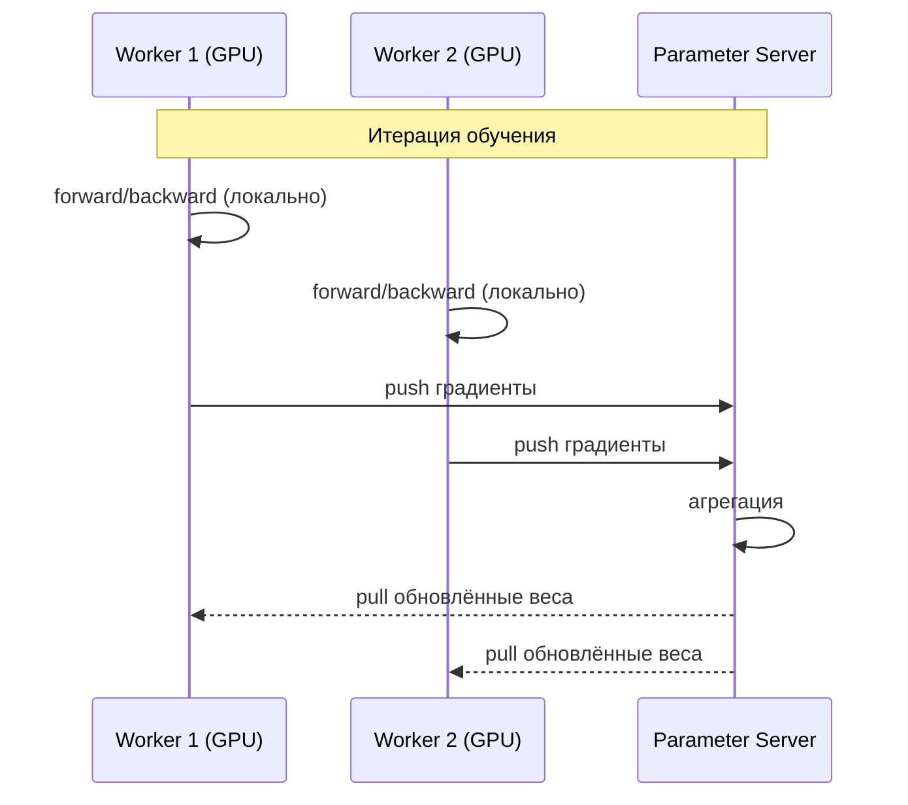

::left::

**Что моделируем в TLM:**  
- Каждый Worker – отдельный экземпляр TLM‑модели GPU+память  
- Parameter Server – модель с очередью запросов и задержкой агрегации  
- Сеть – модель из предыдущих слайдов

**Ключевая метрика:**  
- **время на итерацию** = `max(вычисление, коммуникация)`  
- Модель позволяет найти узкое место

<!--
Это можно дать как домашнее задание: собрать 2 worker + 1 PS на основе готовых модулей.
-->

---

# Проблема масштабирования: сколько узлов можно смоделировать?

<div class="mt-8"/>

**Эксперимент:** Запускаем N узлов (каждый со своей TLM-моделью CPU+DRAM) на одном компьютере.

| **N** | **Событий в секунду** | **Время симуляции 1 секунды реальной работы** | **Память** |
|---|------------------|-------------------------------------------|--------|
| 1 | 10M | 0.1 сек | 200 MB |
| 4 | 8M | 0.5 сек | 800 MB |
| 16 | 4M | 4 сек | 3 GB |
| 64 | 1M | 64 сек | 12 GB |
| 256 | 0.1M | 2560 сек (~42 мин) | 50 GB |

**Вывод:** больше 64 узлов на одном компьютере – уже трудно  

---

# Проблема масштабирования: сколько узлов можно смоделировать?

<div class="mt-8"/>

**Подходы из индустрии:**  
- Распределённая симуляция (несколько компьютеров, обмен сообщениями через MPI)  
- Снижение точности (статистические модели для кластеров)  
- Гибрид: детальная модель для одного узла + аналитика для сети

<!--
Это важно для понимания практических ограничений.
-->

---

# Инструменты для системно-системного моделирования

<div class="text-4">

| **Инструмент** | **Основа** | **Область применения** | **Совместимость с TLM** |
|------------|--------|--------------------|---------------------|
| **SystemC + TLM-2.0** | C++ | Один SoC | Родная |
| **SimGrid** | C, C++ | Кластеры, грид, P2P | Через адаптер (не прямая) |
| **OMNeT++** | C++ | Сети, дата-центры | Есть INET + SystemC интеграция |
| **ns-3** | C++ | Сети | Модуль ns3-systemc |
| **AWS Sim (Amazon)** | Проприетарный | Кластеры Trainium | Недоступен |

</div>

<div class="mt-4"/>

##### **Рекомендация для учебных проектов:**  
- До 4-8 узлов – используйте чистый SystemC с сетевыми адаптерами  
- Больше – переходите на SimGrid или OMNeT++

<!--
Студентам не нужно знать все инструменты, но полезно знать, что выбор есть.
-->

---

# Вызовы для стандартов и обратной совместимости

<div class="mt-8"/>

**Проблема:** TLM 2.0 не предусматривал сетевых транзакций  
- Каждый вендор добавляет свои расширения  
- Модели разных вендоров несовместимы

**Текущие инициативы:**  
- **SystemC AMS (Analog/Mixed-Signal)** – не про сеть  
- **FMI (Functional Mock-up Interface)** – ко-симуляция разнородных моделей, поддерживает сетевые интерфейсы  
- **DDS (Data Distribution Service)** – реальный транспорт, можно использовать как бэкенд для TLM

**Что нужно студентам знать:**  
- При интеграции чужих моделей проверяйте, как они общаются по сети  
- Если нет стандарта – пишите адаптеры

<!--
Это продолжение темы разнородности, теперь на уровне сетевого взаимодействия.
-->

---

# Практический пример: модель двух узлов, обменивающихся через Ethernet

<div class="mt-8"/>

**Цель:** измерить задержку передачи сообщения 1KB между двумя TLM‑моделями

**Компоненты:**  
- Узел A: генератор сообщений (`SC_THREAD`)  
- NetInterface A и B (модули выше)  
- Модель канала: фиксированная задержка 10 мкс + jitter 1 мкс  

---

# Практический пример: модель двух узлов, обменивающихся через Ethernet

<div class="mt-8"/>

```cpp
int sc_main(int argc, char* argv[]) {
    Node nodeA("nodeA");
    Node nodeB("nodeB");
    NetInterface netA("netA", 1, 1.0); // 1 Gbps
    NetInterface netB("netB", 2, 1.0);
    // Связываем локальные сокеты узлов с сетевыми интерфейсами
    nodeA.net_socket.bind(netA.local_socket);
    nodeB.net_socket.bind(netB.local_socket);
    // Соединяем интерфейсы друг с другом
    netA.remote_socket.bind(netB.local_socket); // модель симплексной связи
    netB.remote_socket.bind(netA.local_socket);
    
    sc_start(1, SC_MS);
    return 0;
}
```

**Результат симуляции:** задержка ~10.045 мкс (10 мкс + overhead).  
Можно менять скорость канала, добавлять потери.

<!--
Студенты могут легко собрать эту модель, используя код из предыдущих слайдов.
-->

---

# Выводы по системно-системному моделированию

| **Что узнали** | **Как это связано с предыдущими лекциями** |
|------------|----------------------------------------|
| Сеть между узлами – это расширение NoC | Те же очереди, арбитраж, но с другими задержками |
| Распределённое время требует jitter и несинхронных часов | Ломает детерминизм |
| Сетевые транзакции не являются memory‑mapped | Используем `tlm_extension` |
| Масштабирование ограничено ресурсами | Нужны распределённые симуляторы |
| Стандарты отсутствуют, каждый вендор своё | Адаптеры – общее решение |

**Главный вывод:**  
TLM‑подход работает и на уровне кластеров, если добавить сетевую модель как набор «очередей и обработчиков». Но его нельзя слепо масштабировать – нужны специальные инструменты.

<!--
**Что дальше:** обсудим современные тренды – как ML помогает ускорять моделирование и какие open‑source проекты стоит знать.

Завершаем пятую часть, переходим к обсуждению трендов (часть 6 лекции 11).
-->

---
layout: section
---

# Современные тренды и open‑source экосистема

---

# Как развивается моделирование сегодня

<div class="mt-8"/>

**Краткий обзор предыдущих частей:**  
- Мы научились моделировать CPU, GPU, NPU, сети и целые кластеры  
- Столкнулись с проблемами точности, масштабирования, гетерогенности  

**Теперь посмотрим, куда движется индустрия:**  
1. Стандартизация интерфейсов  
2. Использование ML для ускорения симуляции  
3. Open‑source проекты, которые можно взять за основу  

<!--
Цель: дать студентам картину "что будет через 3-5 лет" и ресурсы для самостоятельного изучения.
-->

---

# Тренд 1: Стандартизация интерфейсов для гетерогенных систем

<div class="mt-8"/>

**Проблема:** каждый вендор добавляет свои расширения к TLM → несовместимость

---

# Тренд 1: Стандартизация интерфейсов для гетерогенных систем

<div class="mt-4"/>

**Активные инициативы:**

| Название | Организация | Что стандартизует | Статус |
|----------|-------------|--------------------|--------|
| **CHIPS Alliance** | Linux Foundation | Open‑source модели периферии (UART, I2C, SPI) для TLM | Активен |
| **MLIR TLM Dialect** | LLVM | IR для описания транзакционных моделей ускорителей | Экспериментальный |

**Почему это важно:**  
- Снижает затраты на интеграцию  
- Позволяет комбинировать модели от ARM, Synopsys, Cadence в одной симуляции  

<!--
Студенты-компилярщики могут заинтересоваться MLIR TLM Dialect – это их поле.
-->

---

# Тренд 2: Использование ML для ускорения симуляции: "Суррогатное моделирование"

<div class="mt-8"/>

**Идея:** обучить нейронную сеть предсказывать задержку вместо полной симуляции

<div class="mt-16"/>

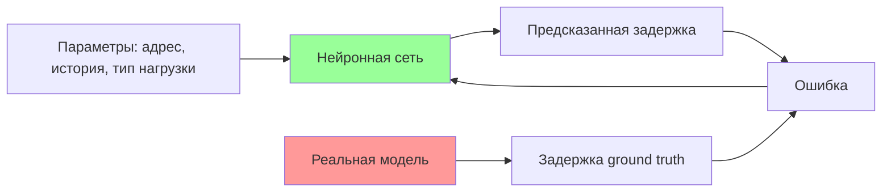

---

# Тренд 2: Использование ML для ускорения симуляции: "Суррогатное моделирование"

<div class="mt-8"/>

**Типичное применение:**  
- Предсказание hit/miss в кэше (вместо tag‑точной модели) – ускорение в 100x  
- Предсказание задержки DRAM с учётом банков – ускорение в 50x  

**Скрытая сложность:**  
- Нужна верификация – доказать, что ML‑модель не врёт  
- Для каждой новой архитектуры – требуется переобучение  

<!--
Пример из индустрии: Google использует ML-модели для симуляции TPU, Meta – для рекомендательных систем.
-->

---

# Тренд 2: ML для калибровки параметров

<div class="mt-8"/>

**Повторение:** вспомним калибровку задержек методом grid search или Bayesian

**ML улучшает калибровку:**  
- Используем **нейросетевой суррогат** вместо полной симуляции для оптимизации  
- Количество запусков сокращается с тысяч до сотен

```python
# Пример: Bayesian оптимизация с суррогатом (scikit-optimize)
from skopt import gp_minimize
def objective(params):
    # вместо полной симуляции – предсказание нейросети
    return surrogate_model.predict(params)
res = gp_minimize(objective, [ (10,20), (10,20) ], n_calls=50)
```

**Результат:** экономия времени при калибровке до 90%

<!--
Это уже используется в промышленных инструментах (например, Cadence Jasper).
-->

---

# Open‑source экосистема: обзор ключевых проектов

| Проект | Назначение | Лицензия | Интеграция с TLM |
|--------|------------|----------|------------------|
| **Gem5** | Системный симулятор, поддерживает ARM/RISC-V | BSD | TLM мост через `gem5-systemc` |
| **SST (Structural Simulation Toolkit)** | HPC, кластеры | BSD | Есть компоненты TLM |
| **QEMU + SystemC** (qemu-systemc) | Запуск ОС поверх TLM | GPL + SystemC Apache | Мост встроен |
| **Accel-Sim** | GPU‑моделирование на основе GPGPU‑Sim | MIT | Не напрямую, но может генерировать трассы |
| **PyRTL + SystemC** | Питон-генерация RTL и TLM | BSD | Экспериментальный |

<!--
Студентам полезно знать, куда смотреть, если они захотят сами написать модель.
-->

---

# Глубокий взгляд: Gem5 + SystemC TLM

<div class="mt-8"/>

**Gem5** – академический стандарт для моделирования процессоров (cycle‑accurate)

**Проблема:** медленные модели памяти  
**Решение:** подключаем TLM‑модель памяти вместо встроенной

```cpp
// Gem5-side code (C++)
class Gem5Bridge : public Gem5Object, public tlm_utils::simple_target_socket<Gem5Bridge>
{
    void b_transport(tlm_gp& trans, sc_time& delay) override {
        // преобразуем TLM запрос в Gem5 Packet
        PacketPtr pkt = convert(trans);
        // отправляем в Gem5 кэш или память
        gem5_cpu->sendRequest(pkt);
        // ждём ответа через событие Gem5
        wait(gem5_response_event);
    }
};
```

##### **Где используется:**  
- ARM Research – модели новых core с реальными TLM‑моделями памяти  
- Учебные курсы по компьютерной архитектуре

<!--
Это не обязательное знание, но показывает, как можно комбинировать инструменты.
-->

---

# Анализ open‑source проектов: плюсы и минусы

<div class="mt-8"/>

**Gem5**  
✅ Большое сообщество, множество готовых моделей CPU  
❌ Сложность добавления новых ускорителей  

**QEMU + SystemC**  
✅ Реалистичная загрузка ОС, драйверов  
❌ Медленная симуляция (лекция 10)  

**SST**  
✅ Масштабируется до тысяч узлов  
❌ Меньше готовых моделей  

**Accel-Sim**  
✅ Детальная модель GPU (тайминги)  
❌ Не поддерживает TLM напрямую, нужно писать адаптер  

**Вывод:** нет единого инструмента на все случаи. Обычно проекты используют **гибридные подходы** – комбинацию двух-трёх.

<!--
Это хороший ответ на вопрос "что учить?" – зависит от задачи.
-->

---

# Тренд 3: Моделирование для ИИ – симбиоз с ML

<div class="mt-8"/>

**Два направления:**  

1. **ML для ускорения моделирования** (о чём говорили)  
2. **Моделирование систем для ML** (часть 4)  

**Новый тренд:** **"ML‑in‑the‑loop"** – модель используется внутри обучения ML‑модели

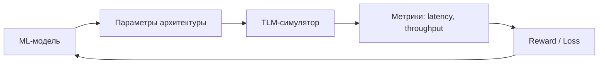

**Пример:**  
Поиск оптимального размера кэша L2 для NPU. ML-агент (RL) перебирает размеры, TLM‑модель считает latency. За неделю симуляции находят конфигурацию, на 30% быстрее, чем интуитивно.

<!--
Для студентов-компиляторщиков: это прямой путь к автоматической настройке компиляторных оптимизаций под железо.
-->

---

# Тренд 4: Моделирование чиплетных систем

<div class="mt-8"/>

**Чиплеты** – несколько кристаллов в одной упаковке (например, AMD EPYC, Intel Meteor Lake)  
**Моделирование:** каждый чиплет – отдельная TLM‑модель, они общаются через **межчиплетную шину** (UCIe, BoW)

<div class="flex items-center justify-center w-full">
  <div class="w-65%">

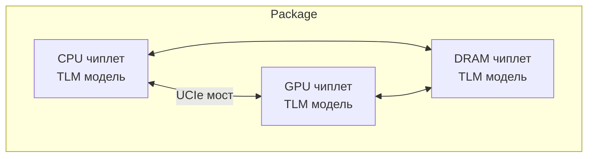

</div>
</div>

##### **Особенности:**  
- Задержки между чиплетами выше (десятки наносекунд vs единицы внутри)  
- Нужно учитывать **тепловое взаимодействие** – один чиплет греет соседа  
- Модели чиплетов могут быть от разных поставщиков → опять проблема разнородности

**Open‑source:** проект **Chiplet‑Sim** (UC Berkeley) на основе SystemC

<!--
Это выглядит как "NoC на стероидах" – знакомо по лекции 7.
-->

---

# Что остаётся за рамками

| **Область** | **Кратко** | **Почему не вошло в лекцию** |
|---------|--------|--------------------------|
| **Формальные методы верификации** | Доказательство свойств модели математически | Очень сложно, отдельный курс |
| **Энергетическое моделирование** (power) | За пределами простых формул | Требует знания электроники |
| **Моделирование надёжности** (FIT, MTBF) | Отказы компонентов | Редко в перфоманс-моделях |
| **Квантовые ускорители** | Пока экспериментально | Нет инженерной практики |

**Совет:** если эти темы интересны – смотрите open‑проекты (**M.submit**, **QuEST**)

<!--
Даём честную оценку: курс дал основу, но мир моделирования огромен.
-->

---

# Баланс между open‑source и коммерческими инструментами

| **Критерий** | **Open‑source** | **Коммерческие** |
|----------|--------------------------|---------------------------------------------------------------|
| Стоимость | Бесплатно | Десятки тысяч $/год |
| Скорость | Средняя | Высокая (оптимизированные ядра) |
| Готовые модели CPU | ARM, RISC-V, MIPS | ARM, ARC, Tensilica, RISC-V (более точные) |
| Поддержка | Сообщество | Инженеры вендора |
| Интеграция с RTL | Через адаптеры | «Из коробки» (например, Synopsys Virtualizer) |
| Когерентность | Неполная | Полная (MESI, MOESI) |

<!--
Честно: если студенты пойдут работать в Apple, nVidia или Huawei – они увидят коммерческие инструменты. Но знания из open‑source переносимы.
-->

---

# Резюме по трендам и экосистеме

1. **Стандартизация** постепенно решает проблему разнородности  
2. **ML ускоряет симуляцию** в 10‑100×, но требует верификации  
3. **Open‑source экосистема** богата (Gem5, QEMU, SST), но нет единого инструмента  
4. **Чиплеты** – новое поле применения TLM, похоже на NoC, но с тепловыми эффектами  
5. **Учебные ресурсы** доступны – сообщество активно

<!--
Моделирование вычислительных систем – не замёрзшая дисциплина. Оно активно развивается под давлением гетерогенности, ML‑нагрузок и масштаба. Знание TLM и перфоманс-моделей даёт вам **универсальный язык** для общения с разработчиками аппаратуры и оптимизации вашего кода (компилятора, ОС, ML‑фреймворка).

# Вопросы к аудитории (для обсуждения)

1. **Какой из трендов, по-вашему, окажет наибольшее влияние на компиляторные оптимизации через 5 лет?** (ML‑суррогаты? чиплеты?)  
1. **Какие ещё проблемы, не затронутые в курсе, вы видите в моделировании распределённых ML‑систем?**  
-->
