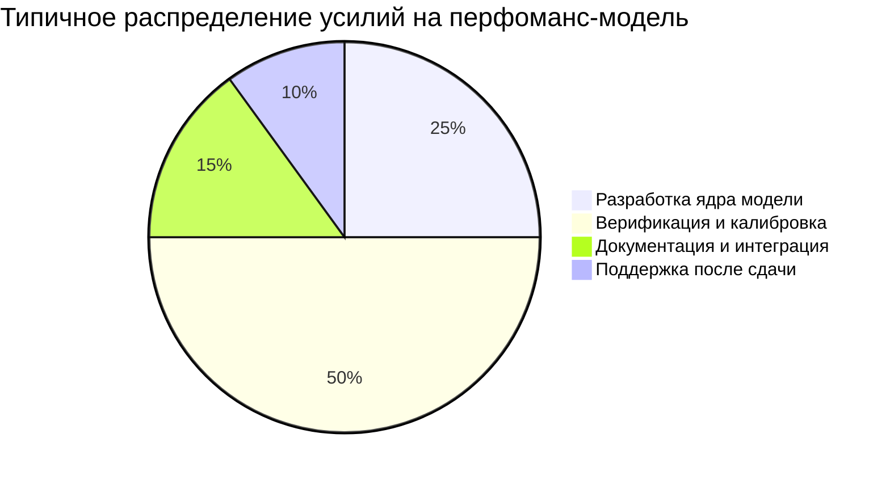
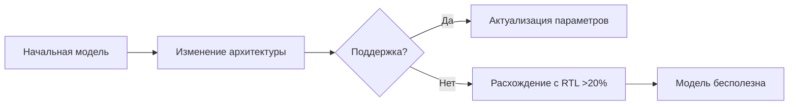
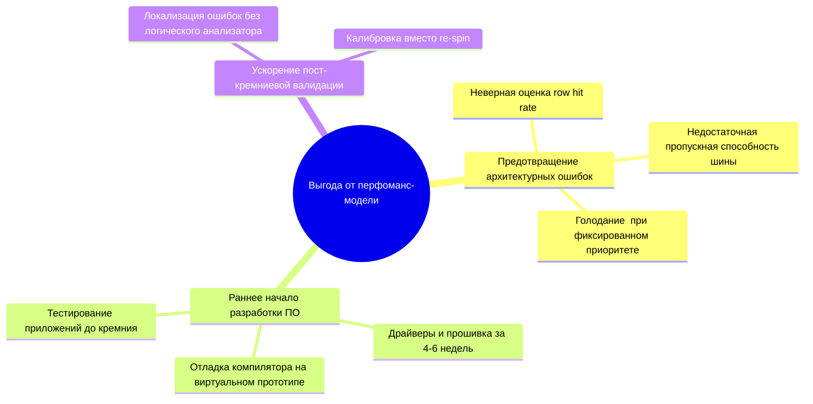
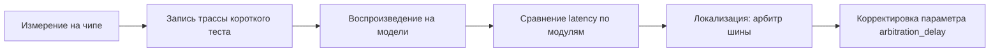
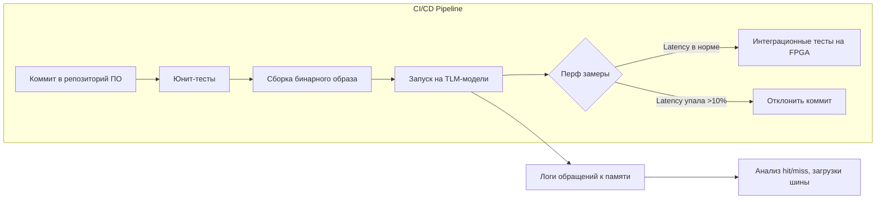
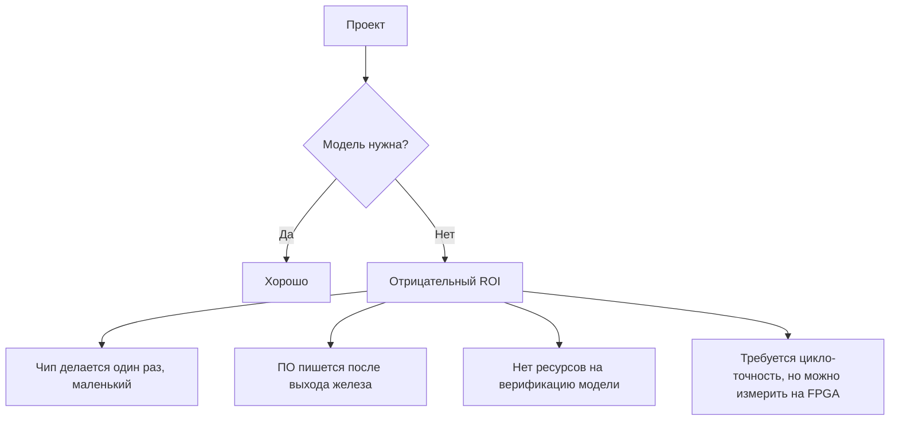

Моделирование вычислительных систем

# Экономика моделирования и встраивание моделирования в процессы разработки

Москва 2026

  <a href="https://github.com/cesarus777/perf-modeling-lectures" target="_blank" class="slidev-icon-btn">
    <carbon:logo-github />
  </a>

---
layout: section
---

# Стоимость создания модели

<!-- Заметка: Этот блок предназначен для копирования в slidev. Все слайды разделены горизонтальной чертой ---. Комментарии в формате HTML --!> для заметок докладчика. -->

---

# Почему экономика, а не такты?

**Модель производительности — это инвестиция**

- Не бывает «бесплатной» модели
- Затраты: время разработки, верификация, поддержка
- Выгода: предотвращение ошибок, ускорение выхода ПО

> «Самая насущная потребность — позволить разработчикам ПО начинать верификацию одновременно с разработкой аппаратуры»  
> *Wilf Corrigan, LSI Logic, 1999*

<!-- Заметка: Открываем лекцию с прагматичной ноты. Студенты-компиляторщики должны понять: даже если они не будут писать модели, они будут их *пользователями* или *заказчиками* внутри компании. -->

---

# Два главных вопроса лекции

| Вопрос | Что значит для архитектора / разработчика ПО |
|--------|------------------------------------------------|
| **Когда модель окупается?** | При каком объёме проекта, сложности, риске имеет смысл инвестировать в TLM? |
| **Как вписать модель в CI/CD?** | Как сделать модель частью ежедневной разработки, а не разовым артефактом? |

<!-- Заметка: Структурируем лекцию. Сначала экономика (ROI), потом практика (DevOps + модели). -->

---

# Стоимость создания модели (Cost side)

<!-- Заметка: Опираемся на лекцию 9 (верификация). Калибровка — самая дорогая часть. Без верификации модель может навредить (дать ложную уверенность). -->

---

# Трудоёмкость разных уровней абстракции

| Уровень модели (лекция 2) | Типичные человеко-месяцы | Пример из курса |
|---------------------------|--------------------------|------------------|
| **Loosely-Timed (LT)** | 0.5 – 2 | Модель памяти (лекция 6) |
| **Approximately-Timed (AT)** | 2 – 4 | Шина с арбитражем (лекция 7) |
| **Tag-точная модель кэша + MESI** | 2 – 6 | L1 с когерентностью (лекция 8) |
| **Гетерогенная (CPU+GPU+NoC)** | 6 – 18 | Гибридная система (лекция 11) |

<!-- Заметка: Цифры приблизительные, но дают порядок. Важно подчеркнуть: "бесплатно" бывает только если модель уже есть в open-source (Gem5, SST) — но тогда свои затраты на интеграцию. -->

---

# Скрытые затраты: верификация и калибровка

**Правило 20 — 80** (из лекции 9)

- 20% времени: написание функциональной части (b_transport, очереди, состояния)
- 80% времени: отладка, прогоны на RTL-трассах, подгонка параметров

**Пример из курса: DRAM-контроллер**

- Код модели: 1 день
- Подбор tRCD, tRP, tCAS под реальный чип: 1–2 недели (калибровка на микробенчмарках)

> **Вывод:** низкоточная модель может быть сделана быстро, но если нужна **количественная точность** (±10%), время растёт драматически.

<!-- Заметка: Напоминаем лекцию 9 — студенты уже знают про кросс-проверку с RTL и аналитикой. Здесь мы переводим это в деньги/время. -->

---

# Поддержка модели — главный «невидимый» расход

**Почему модель нельзя написать один раз и забыть?**

- Меняется RTL (добавили prefetcher — надо обновить модель кэша)
- Меняются нагрузки (новые паттерны доступа могут вскрыть ошибки)
- Меняется техпроцесс (другие задержки)

**Оценка:** поддержка отнимает 1–2 человеко-месяца в год даже для простой модели

<!-- Заметка: Здесь важно донести, что экономика моделирования — это total cost of ownership. Многие компании создают модель, а через год она умирает из-за отсутствия поддержки. -->

---

# Пример расчёта стоимости для учебного проекта

**Вы оцениваете создание LT-модели шины + DRAM**

| Статья затрат | Время (чел-нед) |
|---------------|------------------|
| Разработка | 2 |
| Верификация (сравнение с аналитикой) | 1 |
| Калибровка (подбор задержек по RTL-трассе) | 1 |
| Интеграция в общую систему | 0.5 |
| **Итого** | **4.5** |

При ставке $5k в неделю → **$22.5k**

<!--

**Вопрос аудитории:** Окупится ли такая модель, если она предотвратит один респин чипа? (Стоимость респина — от $500k до $2M)

Заметка: Студентам полезно самим прикинуть цифры. Для простоты можно сказать: 1 реальный инженер-разработчик в западной компании обходится ~$200k в год. -->

---

# Когда модель **заведомо** не окупается: примеры

- **Маленький проект** (ASIC на 50k вентилей, 2 разработчика ПО)  
  — Проще один раз оттестировать на FPGA-прототипе

- **Устаревшая архитектура** (через год чип снимается с производства)  
  — Модель не успеет окупиться

- **Нет ресурсов на верификацию** (модель никто не калибрует)  
  — Она будет врать, и разработчики ПО потеряют доверие

- **Слишком высокая детализация** (цикло-точная модель кэша для задачи выбора размера буфера)  
  — Проще использовать аналитическую формулу

> **Золотое правило:** Уровень абстракции должен соответствовать **минимально необходимой точности** для принятия решения

<!-- Заметка: Экономика — это не только плюсы, но и минусы. Честно сказать, где моделирование — излишество. -->

---
layout: section
---

# От затрат — к выгоде

---

<!-- Заметка: Используем уже изученные примеры из лекций 1, 6, 7, 8. Модель даёт выгоду там, где аппаратная итерация дорога или невозможна. -->

---

# Пример 1: Предотвращение архитектурной ошибки

**DRAM-контроллер**

- Инженеры предложили 2 банка памяти
- TLM-модель показала: при нагрузке от 4 ядер row hit rate падает до 40%, latency растёт на 80%
- Анализ: нужно 4 банка

| Решение | Latency (средняя) | Стоимость исправления |
|---------|------------------|-----------------------|
| 2 банка (ошибочное) | 45 ns | - |
| 4 банка (правильное) | 28 ns | $0 в модели, $2M в респине |

> **Вывод:** модель стоила $50k, сэкономила $2M → выгода x40

<!-- Заметка: Ссылка на лекцию 6 и лекцию 9 (где описан аналогичный кейс). Показать, что ошибку можно обнаружить за дни до того, как она попадёт в RTL. -->

---

# Пример 2: Ускорение разработки ПО

> «Самая насущная потребность — позволить разработчикам ПО начинать верификацию одновременно с разработкой аппаратуры»

| Этап | Без модели (ждать чип) | С TLM-моделью |
|------|------------------------|----------------|
| Первый запуск драйвера | 12 месяцев | 6 недель |
| Итерация оптимизации компилятора | 2 месяца (измерения на реальном чипе) | 10 минут (прогон на модели) |
| Обнаружение регрессии в производительности | после тейп-аута (катастрофа) | каждую ночь в CI |

> **Экономия:** 6 месяцев рынка → миллионы долларов упущенной прибыли при отсутствии модели.

<!-- Заметка: Особенно важно для студентов-компиляторщиков — они видят прямую выгоду для своей ежедневной работы. -->

---

# Пример 3: Ускорение пост-кремниевой отладки

 

**Проблема:** на реальном чипе шина работает медленнее на 20% при высокой загрузке.

**Без модели:** логический анализатор на 256 контактах → 3 недели.

**С TLM-моделью:**

- Затраты времени: 2 дня (модель уже есть)
- Стоимость инженерного времени: $5k
- Ранний выпуск продукта: неоценимо

<!-- Заметка: Здесь пересечение с лекцией 9 (верификация). Но фокус — на экономии недель работы. -->

---

# Практический порог окупаемости

**Модель окупается, если:**
- Помогает избежать **одного респина** ИЛИ
- Ускоряет выпуск ПО **хотя бы на 2 месяца** ИЛИ
- Её использует **более 10 инженеров ПО** ежедневно

<!-- Заметка: Пороги ориентировочные, но дают студентам простой критерий. Можно спросить: «В вашем проекте это выполнено?» -->

---

# Калькулятор ROI для разных типов проектов

| Тип проекта / компании | Стоимость модели | Ожидаемая экономия | ROI | Окупаемость |
|------------------------|------------------|--------------------|-----|--------------|
| Стартап, простой ускоритель | $30k | $150k (раннее ПО) | 4× | 2 месяца |
| Средний SoC (4 ядра + шина) | $120k | $2M (без респина) | 15× | 1 месяц |
| Крупный чип (гетерогенный, NoC) | $500k | $10M (ранний рынок) | 19× | 3 месяца |
| Одиночный проект малого объёма | $50k | $20k (экономии нет) | -0.6× | не окупается |

> **Важно:** ROI зависит не только от технической сложности, но и от **бизнес-контекста** (критичность времени выхода, стоимость респина).

<!-- Заметка: Таблица даёт реалистичные цифры. Студенты видят, что не всегда моделирование выгодно — это нормально. -->

---

# Моделирование как часть CI/CD для hardware‑dependent ПО

> **Ключевая идея:** TLM-модель становится **автоматизированным измерительным стендом** для каждого изменения в коде.

<!-- Заметка: Отсылка к лекции 10 (нагрузки) и лекции 9 (регрессия). Здесь мы просто переиспользуем эти концепции в конвейере. -->

---

# Роль модели в регрессионном тестировании компилятора (пример)

**Сценарий:** инженер-компиляторщик меняет порядок инструкций, надеясь улучшить локальность.

**Что происходит в CI/CD:**

1. Сборка компилятора
2. Компиляция бенчмарка (например, умножение матриц)
3. Запуск бинарника на **LT-модели памяти + кэш** (время прогона — 2 минуты)
4. Модель генерирует отчёт:

---

# Роль модели в регрессионном тестировании компилятора (пример)

| Метрика | Предыдущий коммит | Новый коммит | Изменение |
|---------|------------------|--------------|------------|
| L1 miss rate | 12% | 8% | ✅ -33% |
| Загрузка шины | 34% | 45% | ⚠️ +32% |
| Средняя latency | 28 ns | 31 ns | ❌ +11% |

**Решение:** откатить изменение (или принять, если важнее L1 miss).

> **Выгода:** 2 минуты вместо ожидания реального чипа/долгого запуска на RTL симуляторе.

<!-- Заметка: Прямой кейс для целевой аудитории — разработчики компиляторов. Показать, как TLM экономит их время. -->

---

# Технические требования для CI/CD с TLM-моделью

| Требование | Почему важно | Как обеспечить (ссылка на лекции) |
|------------|--------------|----------------------------------|
| **Детерминизм** | Иначе прогоны неповторимы (шум) | Фиксировать seed, отключать асинхронные прерывания (лекция 10) |
| **Скорость** | Каждый коммит — быстрый ответ | Использовать LT, big quantum, возможно, статистические модели (лекция 8) |
| **Воспроизводимость окружения** | Версия модели, RTL-параметры | Версионировать модель (git) и параметры (JSON) |
| **Логирование метрик** | Чтобы анализировать регрессии | Выводить structured log (CSV, JSON) из `sc_report` |

<!-- Заметка: Здесь мы опираемся на лекцию 9 (верификация) и лекцию 10 (нагрузки). Но фокус — на условиях для автоматизации. -->

---

# Проблемы и компромиссы при внедрении

**Проблема 1: скорость vs точность**

- Полная tag-точная модель кэша (лекция 8) — слишком медленна для CI/CD
- Решение: статистическая модель (hit-rate функция) для ранних стадий, tag-точная для ночных регрессий

**Проблема 2: поддержка модели в долгом проекте**

- Без dedicated инженера модель умирает через 6 месяцев
- Решение: включать поддержку модели в roadmap проекта как отдельную статью затрат

**Проблема 3: ложные срабатывания (flaky тесты)**

- Из-за недетерминизма (лекция 10) тест может упасть случайно
- Решение: запускать каждый тест 3 раза, брать медиану

<!-- Заметка: Честно говорим о сложностях — это повышает доверие. Студенты узнают реальные проблемы индустрии. -->

---

# Итоги по CI/CD

- **TLM-модель органично вписывается в конвейер разработки ПО**
- Она даёт **быструю обратную связь** о влиянии изменений на производительность
- Ключевые условия: детерминизм, скорость, автоматическая регрессия
- Модель становится таким же стандартным инструментом, как линтер или юнит-тест

<!--
> **Для студентов-программистов:** вы можете требовать от своей команды наличия виртуальной платформы. Это не роскошь, а **экономическая необходимость** при разработке hardware-dependent кода.

Заметка: Финальный посыл для скептиков. Модель — это не отвлечённая наука, а практический инструмент CICD. -->

---

# Когда моделирование **не** окупается (анти‑паттерны)

<!--
> **Золотое правило:** если вы не можете чётко ответить на вопрос «Какое решение примет архитектор на основе модели?» — модель избыточна.

Заметка: Завершаем раздел экономики. Добавляем долю здорового скепсиса. -->

---

# Итог всей лекции (повторение ключевых идей)

1. **Моделирование — это инвестиция с измеримым ROI.**
2. **Основные выгоды:** предотвращение респинов, раннее ПО, быстрая отладка.
3. **Основные затраты:** разработка, но главное — верификация и поддержка.
4. **Модель должна быть в CI/CD**, иначе она останется разовым артефактом.
5. **Выбирайте минимально достаточную точность** — не надо cycle-accurate там, где хватит LT.

**Для разработчика компилятора / ПО:** TLM-модель — это ваш стенд для измерения производительности задолго до появления чипа.

<!-- Заметка: Резюме, подходящее для финального слайда. Можно спросить «какой слайд вам показался самым полезным?» -->

---

# Вопросы для дискуссии

1. В каком из пройденных в курсе примеров (DRAM, шина, NoC, кэш, GPU) ROI был бы максимальным? Почему?
2. Приведите пример, где модель **снизила бы** качество принимаемых решений (ложная точность, переобучение).
3. Студент-компиляторщик: что вы ответите менеджеру, который говорит «мы сделаем модель, когда будет свободный инженер»?
4. Как бы вы организовали ночную регрессию производительности для компилятора на основе TLM-модели кэша (укажите хотя бы 2 технических решения)?

<!-- Заметка: Вопросы для оживления аудитории и проверки понимания. Они ссылаются на конкретные лекции курса. -->

---
